# OCR-to-Hash Claim Verification System


**Proof of concept** implementing the approach described in:
[OCR-to-Hash: A Simple Audit Trail for Physical Documents](https://paulhammant.com/2023/01/17/ocr-to-hash-simple-audit-trail-for-physical-documents/).
For now this is using Tesseract for OCR, and OpenCV for registration marker detection and de-skew for imperfect holding of the camera. iOS's **Live Text** feature (Camera app, iOS 15+) already has the core OCR capability - it just needs a few enhancements to recognize `verify:` URLs, normalize text, and compute hashes on-device. The technology is much closer to mainstream adoption than it might appear.

**⚠️ Project Status:** Incomplete because of imperfect OCR. I've a bug in Tesseract.js (actually two different alternates to Tesseract C++ made 
available for web/JavasScript via WASM) that is not in the most recent C++ version. [See proof](https://github.com/paul-hammant/verific/issues/1). 
Likely a jump to native Tesseract could fix the bug I list, and more. That reduces the ease of deployment/upgrades which is a factor for a solo
developer without funding. So for now, broken OCR tests are checked in.

## The Problem

**Claims to the authenticity of various printed or pictures of things are hard to verity:** One example that has a billion+ incidents a day is 
a **sales receipt** with an implicit **claim** that is genuine rather than fake. Here is one from wikimedia: 

. 

Is that real, or generated by [MakeReceipt.com](https://makereceipt.com/create-receipt1.php) and others. 

So expense fraud is a real thing, and verifying printed/scanned claims (like sales receipts, but there are many more) needs disruption:

- **❌ Calling organizations** - Slow, manual, business hours only, privacy-invasive
- **❌ Uploading to verification portals** - Cloud storage, data breach risk, vendor lock-in
- **❌ QR codes** - Hide what they verify, visual clutter, privacy-destroying (encoded data or public registries)
- **❌ Have to user cloud services** - Send your PII to third vendors who you're forced to trust have impregnable systems and are above board.
- **❌ Fake credentials** - Forged degrees, photoshopped receipts, counterfeit certifications cost billions annually

**Specific pain points:**
- **Employers:** Can't verify degrees without calling universities during business hours
- **Finance teams:** Can't detect photoshopped receipts reused across multiple expense reports
- **Hospitals:** Can't instantly verify medical licenses at point of care
- **Customs agents:** Can't verify product safety certifications from foreign suppliers (see MedPro fraud case)

## The Solution

**Example:** Four colleagues have lunch at In-N-Out Burger. One person pays, scans the receipt with their phone to verify it's authentic (not photoshopped, not altered), then submits it for expense reimbursement. Later, their company's expense system asks: *"Who attended? What percentage is billable to client projects? What percentage is reimbursable vs. company-paid?"* None of that detail concerns In-N-Out Burger - they just confirm: *"Yes, this receipt is authentic. Transaction occurred at this time, this amount, this location."* The receipt's SHA-256 hash has been verified. The company handles attribution, allocation, and approval internally.


See that "verify:" line ... we'll come back to that.

**This is OCR-to-hash verification:** A **100% client-side** web app that uses phone camera OCR to verify printed claims via SHA-256 hash validation against URLs printed on the documents themselves.

**Key benefits:**
- ✅ **Instant verification** - Seconds, not phone calls or portal uploads
- ✅ **Privacy-preserving** - Images never leave your phone, only hash is sent
- ✅ **Works offline** - OCR happens on-device, only hash lookup needs network
- ✅ **One app for everything** - Degrees, receipts, licenses, certificates, government IDs
- ✅ **Tamper-evident** - Any alteration changes the hash, verification fails
- ✅ **No cloud OCR** - No Google/AWS/Azure seeing your personal documents

## Quick Start

**Try it now:**
1. Visit **[https://paul-hammant.github.io/verific/](https://paul-hammant.github.io/verific/)** on your phone
2. Click "Start Camera"
3. Print a [training page](public/training-pages/bachelor-thaumatology.html) for the app to snap (or display the same on your computer screen).
4. Align the black registration marks in your phone's viewfinder
5. Click "Capture & Verify"
6. See ✅ **VERIFIED by paul-hammant.github.io** or ❌ **FAILS VERIFICATION**

Note: no serious production verification deployment of this technology would rest on `github.io`. I am only doing so 
because I am demonstrating how this works and GH-P is convenient, free, and static (proving the server-side can be almost absent) 
You'd see "VERIFIED BY bankofamerica.com' and alike for real prod deployments.

## What is a Claim?

A **claim** is any assertion that could be forged, altered, or reused fraudulently:

- **Till receipts** - Transaction occurred (could be photoshopped for duplicate expense claims)
- **Degree certificates** - Qualification earned (diploma mills, fake credentials cost employers millions)
- **Employment letters** - Work history (easily forged for background checks)
- **Safety certifications** - Product compliance (supplier fraud - billions in counterfeit certs)
- **Medical licenses** - Authorization to practice (or revocation - critical for patient safety)
- **Government IDs** - Identity verification (fake IDs for fraud, underage access)

Many more use cases documented below.

## How It Works

Is the "verify:" line in the receipt that is the clue to OCR that verification can happen:

### Verification Pipeline

```mermaid
flowchart TD
    Start([User captures<br/>document image]) --> Detect[Detect registration marks<br/>using OpenCV]
    Detect --> Transform[Apply perspective transform<br/>to straighten document<br/>handles off-angles like 85°/175°/265°]
    Transform --> Extract[Extract bordered region]
    Extract --> TryAllRotations[Try OCR at ALL 4 rotations:<br/>0°, 90°, 180°, 270°<br/>Tesseract.js on each]
    TryAllRotations --> CompareConfidence[Compare OCR confidence scores<br/>Pick rotation with highest confidence]
    CompareConfidence --> CheckConfidence{Best confidence<br/>good enough?}
    CheckConfidence -->|No - OCR failed all rotations| ShowOCRError[❌ OCR could not extract text<br/>Try better lighting/focus]
    ShowOCRError --> Start
    CheckConfidence -->|Yes| UseRotation[Use best rotation]
    UseRotation --> ParseVerify[Parse verify:domain.com/path from OCR text]
    ParseVerify --> FetchMeta[Fetch https://domain.com/.verific-meta.json<br/>for normalization hints]
    FetchMeta --> Normalize[Normalize text:<br/>- Strip leading/trailing spaces<br/>- Collapse multiple spaces<br/>- Remove verify: line<br/>- Apply domain-specific rules]
    Normalize --> Hash[Compute SHA-256 hash<br/>of normalized text]
    Hash --> BuildURL[Build verification URL:<br/>https://domain.com/path/hash]

    MetaURL[("https://domain.com/.verific-meta.json<br/>(normalization rules, custom status text)")] -.->|fetched earlier| FetchMeta
    VerifyURL[("https://domain.com/path/hash<br/>(verification endpoint)")] -.->|HTTP GET| Verify

    BuildURL --> Verify[HTTP GET request to verification URL<br/>static webserver or dynamic endpoint]
    Verify --> CheckHTTP{HTTP status?}
    CheckHTTP -->|404 Not Found| ShowNotFound[❌ FAILS VERIFICATION<br/>Hash not in database<br/>Re-frame and try again]
    ShowNotFound --> Start
    CheckHTTP -->|Network Error| ShowError[⚠️ VERIFICATION ERROR<br/>Cannot reach server]
    CheckHTTP -->|200 OK| CheckBody{Response body?}
    CheckBody -->|"OK" exact match<br/>or JSON status: OK/VERIFIED| ShowVerified[✅ VERIFIED<br/>by domain.com]
    CheckBody -->|Plain text or JSON<br/>other status| ShowNotOK[❌ Status from server<br/>REVOKED/SUSPENDED/EXPIRED/etc.]
    ShowVerified --> End([End])
    ShowNotOK --> End
    ShowError --> End

    style Start fill:#e1f5e1
    style End fill:#ffe1e1
    style ShowVerified fill:#90EE90
    style ShowNotFound fill:#FFB6C1
    style ShowNotOK fill:#FFB6C1
    style ShowError fill:#FFD700
    style Hash fill:#87CEEB
    style Normalize fill:#DDA0DD
    style Transform fill:#B8860B
    style TryAllRotations fill:#DDA0DD
```



Another day, we'll see if we can't get this working without a black border.

**Variable element:** Each verifiable document needs something unique - a date/time, person's name, serial number, transaction ID, or other changing value. This ensures each certificate has a unique hash and prevents reuse of the same verification across different claims or brute force guessing of valid hashes.

**Multi-page documents:** Documents like bank statements, contracts, wills, and multi-page reports can include a `verify:` line on **each page**. Each page gets its own hash verification. This allows:
- **Page-level verification:** Verify individual pages without needing the entire document
- **Tamper detection:** Altered/inserted/removed pages won't verify - only original pages from the issuer will have valid hashes
- **Selective disclosure:** Share only relevant pages (e.g., bank statement page 3 of 12) while maintaining cryptographic verification
- **PDF generation:** Each PDF page includes verification footer during document generation

**Example multi-page bank statement:**
```
Page 1: Account summary, balance $50,000  verify:chase.com/stmt
Page 2: Transactions 01-10              verify:chase.com/stmt
Page 3: Transactions 11-20              verify:chase.com/stmt
```
Each page's text (including page number) creates a unique hash. You can verify page 2 independently without possessing pages 1 and 3. Prevents "page substitution attacks" where attacker swaps pages from different statements.

**Critical transparency requirement:** The verification app MUST clearly display which domain/authority verified the claim. Not just "VERIFIED" but "VERIFIED by degrees.ed.ac.uk" or "VERIFIED by intertek.com". This is essential for trust - users need to see immediately who is vouching for the claim.

**Domain complexity:** Domains vary globally - `ed.ac.uk` is a domain (UK academic), `degrees.ed.ac.uk` is a subdomain (different authority), `foobar.com.br` is a domain (Brazil), `example.co.uk` is a domain. The verifying authority should be displayed as the full hostname from the verification URL (e.g., `degrees.ed.ac.uk`, not truncated to `ed.ac.uk`).

**Optional identity standard:** A future standard like `https://www.ed.ac.uk/~shortWhoIsThisPlainText` could provide human-readable authority information, but for now, showing the full hostname provides basic transparency about who is performing the verification.

The system allows anyone to verify these printed claims without requiring access to the issuer's internal databases.  It will work if you're scanning the same on a laptop/tablet or bigger screen, though you risk [moiré patterns](https://en.wikipedia.org/wiki/Moir%C3%A9_pattern).

Read about one way hash functions on [Wikipedia](https://en.wikipedia.org/wiki/Cryptographic_hash_function)

## OCR Limitations: What Works Today vs Future Needs

## Rationale

- I want to use my choice of Verification App to verify the item you are showing me, not yours. Vendors should not force a single proprietary verifier; open, URL-based verification lets anyone use a trusted app of their choosing.

**Current OCR technology (Tesseract.js v5)**

| Document Type                     | OCR Feasibility      | Why                                                                    |
|-----------------------------------|----------------------|------------------------------------------------------------------------|
| ✅ CV/resume text claims           | **Works now**        | Plain fonts (Arial, Times), simple layout, no decorations              |
| ✅ Employment verification letters | **Works now**        | Business letter format, standard fonts, clean layout                   |
| ✅ Till receipts                   | **Works now**        | Monospace fonts, structured format, thermal printing                   |
| ✅ Medical license wallet cards    | **Works now**        | Small but usually plain text, standard government fonts                |
| ✅ Simple certificates             | **Works now**        | If designed with OCR in mind - plain borders, standard fonts           |
| 🟡 Government IDs                 | **Could work maybe** | Can a text section be made that's separate to the photo/hologram       |
| ❌ Ornate degree certificates      | **Needs tech leap**  | Decorative fonts, calligraphy, seals, signatures, embossing, gold foil |
| ❌ Art authenticity certificates   | **Needs tech leap**  | Fancy typography, gallery branding, artistic layouts                   |
| ❌ Historical documents            | **Needs tech leap**  | Aged paper, faded ink, handwriting, non-standard fonts                 |

### The ornate certificate problem

Traditional university degrees, professional certifications, and art certificates are designed for **human prestige**, not machine readability:
- Gothic/blackletter fonts for institution names
- Cursive signatures from officials
- Embossed seals and raised ink
- Watermarks and security features
- Gold foil and decorative borders
- Multiple font sizes and styles
- Background patterns and imagery

**Tesseract chokes on these elements** - OCR accuracy drops from 95%+ (plain text) to <50% (ornate certificates).

**Practical solutions today:**

1. **Multi-representation claims** - The same credential can have MULTIPLE valid hashes (long-form, medium-form, short-form, etc.). See **[Multi_Representation_Verification.md](Multi_Representation_Verification.md)** for detailed explanation of how universities can support ornate wall certificates AND OCR-friendly CV claims AND social media profiles - unlimited representations of the same legal fact.

2. **OCR-optimized originals** - Organizations can print certificates with:
   - Registration marks around a plain-text verification box
   - Decorative elements OUTSIDE the scannable area (like the [bachelor-thaumatology-square.html](public/training-pages/bachelor-thaumatology-square.html) example with decoy text)
   - Standard fonts (Courier New, Arial) in the verification zone

3. **Manual text entry** - For ornate certificates, users could type the text manually rather than relying on OCR (loses convenience but maintains verification)

**Future improvements needed:**

- AI-powered OCR models trained on certificate layouts
- Pre-processing to detect and mask decorative elements
- Font-agnostic text recognition
- Integration with handwriting recognition
- Template-based extraction (if certificate format is known)

**Bottom line:** OCR-to-hash works **extremely well** for business documents, receipts, and plain-text credentials TODAY. For ornate certificates to work, either (a) issuers must design for OCR, or (b) OCR technology must quantum-leap forward.

## Privacy-First Architecture: Why Client-Side OCR Matters

**The privacy requirement:** OCR-to-hash verification **must** use client-side OCR. Sending document images to cloud OCR services (Google Cloud Vision, AWS Textract, Azure Computer Vision) would defeat the entire privacy model.

**What gets exposed to cloud services if using traditional OCR APIs:**
- ❌ Your degree certificate image (name, DOB, honors, university)
- ❌ Your medical license image (license number, specialization, photo)
- ❌ Your passport/driver's license (photo, DOB, address, ID numbers)
- ❌ Your salary receipt (employer, amount, transaction details, location)
- ❌ Employment verification letters (job title, dates, salary, manager names)
- ❌ All that PII flowing across networks, stored in cloud API logs, subject to subpoenas

**OCR-to-hash preserves privacy:**
- ✅ Image **never leaves your phone** - processed entirely on-device
- ✅ OCR happens locally using Tesseract.js (current) or on-device AI (future)
- ✅ Only the **SHA-256 hash** is computed and sent (one-way, can't reconstruct original text)
- ✅ Verification URL fetch (`https://example.com/hashes/abc123...`) reveals nothing about document content
- ✅ **Zero trust** in cloud providers, API vendors, or network intermediaries

**Current limitation (2025):** We use Tesseract.js because it runs client-side in the browser. It's a traditional computer vision algorithm from 2006 technology - excellent for plain text, struggles with ornate documents.

**Future evolution (2026-2027+):** On-device AI will transform this:

Modern phones already have neural processing units (NPUs) running sophisticated AI models **entirely on-device**:
- **Apple Intelligence** (iPhone 15 Pro+, A17 Pro chip) - vision models, document understanding
- **Google on-device Gemini** (Pixel 9+, Tensor G4 chip) - multimodal AI including OCR
- **Samsung Galaxy AI** (S24+, Snapdragon 8 Gen 3) - on-device vision processing
- **Qualcomm AI Engine** - NPUs in most modern Android phones

**iOS Live Text is already 90% there:** iPhone users (iOS 15+, released 2021) already have **Live Text** built into the Camera app - point your camera at any text and iOS extracts it instantly, on-device. For OCR-to-hash verification, we just need a few enhancements:
- Recognize `verify:` URLs in extracted text and trigger verification flow
- Apply text normalization rules (not just raw extraction)
- Compute SHA-256 hash on-device (Web Crypto API already available)
- Navigate to verification URL and display result

**The core OCR capability is already shipped and working on hundreds of millions of iPhones.** The "AI tweaks" needed are incremental feature additions, not fundamental technology development. Android's Lens feature offers similar capabilities.

**These on-device AI models can:**
- Match or exceed cloud OCR quality (GPT-4 Vision, Claude 3.5 Sonnet level)
- Handle ornate certificates, decorative fonts, calligraphy
- Process handwritten signatures and aged documents
- Understand multiple languages simultaneously
- Detect and mask decorative elements intelligently
- **Still 100% on-device** - images never leave the phone

**Tesseract becomes one tool in the AI's toolkit:**

```javascript
// Future API concept (illustrative)
async function extractTextForVerification(imageData) {
  // Try fast traditional OCR first
  let text = await Tesseract.ocr(imageData);

  // If confidence is low, ask on-device AI
  if (text.confidence < 0.85) {
    text = await OnDeviceAI.ocr(imageData, {
      mode: 'on-device-only',  // Privacy guarantee
      specialization: 'certificates',
      fallbackTools: ['vision-transformer', 'handwriting-recognition']
    });
  }

  return text;
}
```

**The privacy model stays identical:**
1. Image captured on phone
2. OCR processed on-device (Tesseract OR AI, never cloud)
3. Text normalized locally
4. SHA-256 hash computed locally
5. Only hash sent to verification endpoint
6. **No PII ever leaves the device**

**Why this matters for OCR-to-hash:**

Traditional verification systems require either:
- Calling the issuing organization (slow, manual, privacy-invasive)
- Uploading documents to verification portals (cloud storage, data breaches)
- Using cloud OCR APIs (third-party PII exposure)

OCR-to-hash verification offers a **fundamentally different privacy model:**
- No one sees your document except you
- No cloud service processes your PII
- Verification happens via cryptographic proof (hash lookup)
- Even the verifying organization doesn't receive document contents (just hash)

**On-device AI makes this practical for ALL document types:**
- Plain text receipts: ✅ Works today with Tesseract
- Business letters: ✅ Works today with Tesseract
- Wallet cards: ✅ Works today with Tesseract
- Ornate certificates: 🔜 Will work with on-device AI (2026+)
- Handwritten documents: 🔜 Will work with on-device AI (2026+)
- Historical documents: 🔜 Will work with on-device AI (2027+)

**The same privacy guarantees, just better OCR accuracy.**

**Analogy:** Apple's Face ID processes your face scan **entirely on-device** using the Secure Enclave. It never sends your face to Apple's servers. On-device AI for OCR-to-hash works the same way - sophisticated processing, zero cloud exposure.

**This is why client-side architecture is non-negotiable.** The entire security and privacy model depends on it. On-device AI simply makes the client-side approach practical for more document types.

## When OCR-to-Hash Verification Excels (vs QR Codes)

In short, if the claim is aimed at humans reading it and is printed on paper (or could be), it might be a candidate for this **non-blockchain** tech.

**Detailed use cases:** The following six scenarios demonstrate specific advantages of OCR-to-hash verification in real-world applications:

1. **[Education Credentials](Use_Cases/Educational_Degrees.md)** - degree/etc verification with privacy-preserving public registries
     

2. **[B2B Product Certifications](Use_Cases/Product_Labeling.md)** - Preventing supplier impersonation fraud (MedPro/Intertek case)

3. **[Receipt Verification](Use_Cases/Sales_Receipts.md)** - Eliminating duplicate expense claims across employers
      

4. **[Medical Licenses](Use_Cases/Medical_License.md)** - Revocable credentials with domain-binding security
   

5. **[Government ID Verification](Use_Cases/Government_IDs.md)** - Cryptographic checks on plain text aspects (hotel checkin, traffic stop, entering a pub/bar)
   

6. **[Voting Ballot Proof](Use_Cases/Voting_Proof.md)** - Verifiable vote counting with independent auditor confirmation

There are more potential OCR-to-Hash uses listed below.

QR and bar codes are much better for machine reading and might suit routing situations where authenticity does not need to be double checked by humans at every step.  An example would be a package already in the Fedex global distribution system. Where it is and needs to go next is the key piece aided by the QR/bar codes. It does not need to be validated over by humans. The printed destination is still on the label, but isn't used again until the last 100 meters or yards when the delivery associate has it in hand, and the recipient glances at it too for routing to individuals hopefully nearby.

## Decision Criteria: OCR-to-Hash vs QR Code

**OCR-to-Hash is BEST when:**

| Criterion                    | Why It Matters                                                       | CV Example                                                      |
|------------------------------|----------------------------------------------------------------------|-----------------------------------------------------------------|
| Human readability primary    | Document is for humans first, verification is secondary              | Interviewer reads "First Class Honours", verifies if suspicious |
| Professional appearance      | Visual clutter unacceptable                                          | CV must look polished, not technical                            |
| Multiple independent claims  | Each claim verified separately                                       | Degree + 3 employers + 2 certs = 6 verifications                |
| Privacy-preserving           | Hash should NOT be publicly visible                                  | No public registry of "who graduated where"                     |
| Authorized verification only | Only parties with physical doc should verify                         | Only interviewer with CV in hand can verify                     |
| Formal certificate format    | Ornate, bordered, human-readable                                     | Matches existing certificate design patterns                    |
| Text already exists          | Not adding verification to existing system, verification IS the text | The degree claim is the text itself                             |

**QR Code is BEST when:**

| Criterion                    | Why It Matters                                | Counter-example                      |
|------------------------------|-----------------------------------------------|--------------------------------------|
| Machine processing primary   | Humans don't need to read it                  | Shipping labels, inventory tags      |
| Space constrained            | Label too small for registration marks + text | Specimen tubes, tiny product labels  |
| Speed critical               | Instant scan, no OCR processing time          | Boarding passes, event tickets       |
| Already machine-focused      | Document already uses barcodes                | Retail receipts, package tracking    |
| Real-time status             | QR points to live page with current status    | Product recall page (status changes) |
| Public verification expected | Anyone should be able to verify               | Authenticity tags on luxury goods    |

## The Dividing Line

**Ask yourself:** *"Would a human need to read and understand this text for the document to serve its primary purpose?"*

- **YES** → OCR-to-hash (CV, certificate, legal document, driver's license, printed receipts for store purchases)
- **NO** → QR code (shipping label, inventory tag, boarding pass)

## Strong Use Cases for OCR-to-Hash

- ✅ Academic degrees/certificates
- ✅ Professional licenses (wallet cards - medical, legal, engineering)
- ✅ Employment verification letters
- ✅ Formal certifications (safety, medical, legal documents)
- ✅ Government IDs (driver's licenses, passports) - for non-government verifiers
- ✅ Birth/death certificates, legal documents
- ✅ Court documents, notarized attestations
- ✅ Tax receipts for expense claims (prevents double-expensing)

## Where QR Codes Are Actually Better

- ❌ Shipping labels - already uses barcodes, speed matters, machine-only, highly temporal
- ❌ Price tags - retail and shippers already has barcode infrastructure
- ❌ Event tickets - speed of entry critical
- ❌ Component traceability - tiny labels, machine scanning
- ❌ Gift cards - already use barcodes/magnetic stripe

## Technology Quick Start

**For Developers:**

**Run Locally:**
```bash
cd public
python3 -m http.server 8000
# Open http://localhost:8000
```

No `npm install` needed - pure HTML/CSS/JS with Tesseract.js from CDN.

**Deploy:**

This proof of concept uses GitHub Pages for convenience, but production deployments should use proper hosting (CDN, static site hosting, etc.):

```bash
git push origin main
# Enable GitHub Pages in repo settings → Pages → Source: /public
# Access at: https://YOUR_USERNAME.github.io/YOUR_REPO/
```

## Usage

1. Open app on phone, click "Start Camera"
2. Position registration marks around document text + URL
3. Click "Capture & Verify"
4. See ✅ green "VERIFIED" or ❌ red "FAILS VERIFICATION"

## For Organizations Creating Verifiable Documents

To create verifiable documents:

1. Generate certification text
2. Normalize it (Unicode normalization + whitespace rules - see NORMALIZATION.md)
3. Compute SHA-256 hash
4. Print text within registration marks + base URL: `verify:your-org.com/c` (use Courier New font)
5. Host verification endpoint at `https://your-org.com/c/{HASH}` returning HTTP 200 + "OK" for valid hashes
6. Optional: Host `.verific-meta.json` at `https://your-org.com/c/.verific-meta.json` with text normalization rules and OCR optimization settings

The `.verific-meta.json` file can provide document-specific normalization rules, custom response types, and OCR optimization:

```json
{
  "issuer": "Your Organization Name",
  "claimType": "Employment verification",
  "charNormalization": "éèêë→e àáâä→a ìíîï→i òóôö→o ùúûü→u ñ→n ç→c",
  "ocrNormalizationRules": [
    {
      "pattern": "CHF\\s+(\\d)",
      "replacement": "CHF$1",
      "description": "Remove space between CHF currency code and amount"
    }
  ],
  "parentAuthorities": [
    "https://accreditation-body.org/members/your-org",
    "https://regulatory-agency.gov/licensed/your-org"
  ],
  "responseTypes": {
    "OK": {
      "class": "affirming",
      "text": "This claim is verified and authentic",
      "link": "https://your-org.com/verification-info"
    },
    "REVOKED": {
      "class": "denying",
      "text": "This credential has been revoked",
      "link": "https://your-org.com/revocation-policy.html"
    },
    "SUPERSEDED": {
      "class": "denying",
      "text": "This document has been replaced by a newer version",
      "link": "https://your-org.com/verification-updates.html"
    }
  },
  "retentionLaws": [
    {
      "jurisdiction": "European Union",
      "law": "GDPR Article 5(1)(e)",
      "link": "https://gdpr-info.eu/art-5-gdpr/",
      "summary": "Personal data kept no longer than necessary; verification data retained only if strictly necessary for legal compliance"
    },
    {
      "jurisdiction": "United States",
      "law": "Your State Privacy Act",
      "link": "https://state.gov/privacy-act",
      "summary": "Verification records retained for 7 years for audit purposes; may be disclosed to government agencies under subpoena"
    }
  ],
  "tesseract": {
    "lang": "eng",
    "psm": 6,
    "oem": 1,
    "tessedit_char_whitelist": "ABCDEFGHIJKLMNOPQRSTUVWXYZabcdefghijklmnopqrstuvwxyz0-9 .,-/:()",
    "preserve_interword_spaces": "1"
  }
}
```

"SUPERSEDED" would not link to a replacement SHA-256 URL that'd have "OK", nor would HTTP's 302 do the same. The point is the requester should already know the the plain-text that would culminate in a verification lookup.

**Fields:**
- `issuer` (optional) - Name of the issuing organization
- `claimType` (optional) - Type of claim (e.g., "degree", "license", "certification")
- `parentAuthorities` (optional) - Array of URLs linking to parent/accrediting organizations that authorize this issuer
- `responseTypes` (optional) - Dictionary defining possible response statuses beyond "OK", each with:
  - `class` - Either "affirming" or "denying" (determines UI color/icon)
  - `text` - Human-readable explanation of what this status means
  - `link` - URL to a page with more information about this status
- `retentionLaws` (optional) - Array of governing laws/regulations for data retention and sharing, each with:
  - `jurisdiction` - Geographic region or legal system (e.g., "European Union", "California", "Japan")
  - `law` - Name/citation of the specific law or regulation
  - `link` - URL to the official text or authoritative explanation
  - `summary` - Plain-language explanation of retention period and sharing constraints
- `tesseract` (optional) - Tesseract.js configuration for improved OCR accuracy

The app will automatically fetch this file and use the Tesseract settings if initial OCR fails (404 response).

**Parent Authorities Examples:**

The `parentAuthorities` field establishes a chain of trust through simple URL links (no PKI required):

- **University degree** → Accreditation body (e.g., regional accreditor's member list)
- **Medical license** → State medical board registry
- **Professional certification** → Certifying organization's approved training providers list
- **Food safety cert** → Health department's licensed facilities page
- **Product certification** → Standards body's certified labs directory

Example for a university: See [github.com/paul-hammant/verific/blob/main/public/c/.verific-meta.json](https://github.com/paul-hammant/verific/blob/main/public/c/.verific-meta.json

**Why This Matters:**

Europe's GDPR's has a vague "if strictly necessary" clause, but many jurisdictions have specific, concrete retention periods and explicit rules about:

- **Retention duration**: How long the issuer must/may keep the data (e.g., 4 years, 7 years, 10 years, indefinitely)
- **Mandatory sharing**: Who the data **must** be shared with (government agencies, regulators, auditors)
- **Permissible sharing**: Who the data **may** be shared with (background check companies, other employers, researchers)
- **Prohibited sharing**: What the data **cannot** be used for (e.g., "will not be sold to marketers and alike")

The `retentionLaws` field makes these rules transparent to the person whose data is being verified.

### Hash Storage vs Full-Text Storage: Legal Implications

Companies storing aspects of the data behind verifications. 

**Storing the SHA-256 hash alone** (without the underlying text) is technically easy but **practically useless**:

- The hash proves nothing without the ability to verify it (i.e., without storing the original text). 
- You cannot reconstruct the original claim from the hash. Well, not without literal magic.
- There is no value in a database of orphaned hashes

**Storing the claim text** (with or without the hash) is what organizations actually do, and **retention/sharing laws apply to this stored text**, not the hash. The laws existed and applied before this idea to verify claims using a SHA-256 system.

### Worked Example: Recruitment Portal

**Scenario:** A candidate submits their CV/resume to a recruitment portal, which includes:

- Degree certificate from Edinburgh University (First-class honours) - verified via OCR-to-hash
- Employment letter from Microsoft - verified via OCR-to-hash

**What the recruitment portal stores:**

1. ✅ The full CV/resume text (including qualification and employment claims)
2. ✅ Maybe the SHA-256 hashes from the verified documents
3. ✅ The verification base URLs that proved the claims are authentic. At least with the SHA-256 they do.  The text to verification sequence could be redone at any stage of course.

**Legal permissions - What the portal CAN do:**
- ✅ Store the CV/resume (candidate gave consent when submitting)
- ✅ Share the CV/resume with specific clients (the hiring company) because the applicant was applying for a job through the portal - their entire purpose for uploading their CV/resume.
- ✅ Show verified status: "Degree verified ✓" and "Employment verified ✓" Both back to the candidate and to the prospective employer.

**Legal constraints - What the portal CANNOT do:**
- ❌ Share the CV/resume with Palantir Technologies (for example) no consent/legitimate interest.
- ❌ Sell the CV data to marketing companies
- ❌ Keep the CV indefinitely after the candidate withdraws consent (GDPR Article 17)

**Initial client conversation:**

Portal: "We have a matching candidate who graduated Edinburgh University
         with First-class honours (verified ✓) and is currently working
         at Microsoft (verified ✓). Are you interested in seeing their
         full CV?"

Client: "Yes, send over their details."

Portal: Shares the full CV. With or without verification proof - the client could or perhaps should redo the same verifications.

**What "verified ✓" means:**

- The candidate submitted physical documents (degree certificate, employment letter), OR scans there of OR the already-extracted and normalized text from the same.
- If physical scans, the portal scanned them using OCR-to-hash verification "OK" vs 404 response, etc
- The issuing organizations (Edinburgh University, Microsoft) confirmed authenticity via HTTP 200 + "OK" and that gets noted "claims made in CV all verified"

**Key insight:** The retention laws govern **the underlying text** (the CV, the degree claim, the employment history, the financial services contract/transaction), not the hash. The hash is merely a cryptographic proof that helps verify authenticity, but the legal obligations attach to the personal data being stored and shared.

## Verification Charges: Free vs Paid

Organizations must decide whether to offer free verification or charge for lookups. The marginal infrastructure cost is extremely low (≈$0.000005 per verification using serverless platforms), but strategic considerations vary:

- **Universities and public institutions** often offer free verification as part of their mission, funded by tuition/taxes
- **Commercial certification bodies** may charge to fund operations and prevent abuse
- **Hybrid freemium models** provide free access for individuals while monetizing commercial bulk verification

For detailed analysis of pricing models, implementation costs, the Bloomberg-style recurring revenue approach, and decision frameworks for issuers, see **[Verification_Charges.md](Verification_Charges.md)**.

## Larger List of Use Cases

This section documents all known and anticipated applications of OCR-to-hash verification of physical documents. Any combination of these techniques with OCR, hashing, computer vision registration marks, URL-based verification, and normalization is hereby disclosed as of **January 2025**.

### Additional Business & Commerce

| Use Case                                           | Volume vs Till Receipts | Retention Period                | Personal Data                                                  | OCR-to-hash vs QR code |
|----------------------------------------------------|-------------------------|---------------------------------|----------------------------------------------------------------|--------------------|
| Master service agreements and SOWs                 | Medium                  | Contract term + 7-10 years      | Parties, signatories                                           | **OCR-to-hash strong case:** Per-page hashes stop post-signature edits; change orders verifiable. |
| Purchase orders and delivery notes                 | Large                   | Fiscal year + 7 years           | Buyer/seller, order IDs                                       | **OCR-to-hash:** Three-way match evidence; tamper-evident GRNs/packing slips. |
| Board resolutions and written consents             | Small                   | Permanent                       | Directors, resolution text                                     | **OCR-to-hash:** Law firms host; diligence-ready without public registries. |
| Escrow and closing statements (M&A/real estate)    | Small                   | Permanent/transaction life      | Parties, settlement figures                                    | **OCR-to-hash:** Verifiable closing packets without revealing contents. |
| Non-disclosure agreements                          | Large                   | Term + survival period          | Parties, scope                                                | **OCR-to-hash:** Version-locked NDAs across counterparties; no QR clutter. |
| Franchise agreements and disclosure documents      | Small                   | Term + statutory retention      | Franchisor/franchisee, state addenda                          | **OCR-to-hash:** Ensures latest FDD/addenda in multi-state contexts. |

### Additional Manufacturing & Supply Chain

| Use Case                                               | Volume vs Till Receipts | Retention Period                   | Personal Data                                         | OCR-to-hash vs QR code |
|--------------------------------------------------------|-------------------------|------------------------------------|-------------------------------------------------------|--------------------|
| Bills of lading and sea waybills (short-form page)     | Medium                  | Shipment + 7-10 years              | Shipper/consignee names, ports, vessel               | **OCR-to-hash strong case:** Front-page critical fields verifiable at terminals. |
| Certificates of origin and preferential tariff docs     | Medium                  | Shipment + 7-10 years              | Exporter, origin criteria, chamber of commerce       | **OCR-to-hash:** Brokers/customs verify without exposing line items. |
| Dangerous goods declarations (IMO/ICAO short-form)      | Small                   | Shipment + 5-10 years              | Shipper name, UN numbers, class                      | **OCR-to-hash:** Port/airport safety checks; tamper-evident declarations. |
| Weight tickets and scale calibration                    | Medium                  | Shipment + 3-7 years               | Scale ID, operator                                   | **OCR-to-hash:** Roadside verification by enforcement; prevents altered tickets. |

### Additional Product Certifications & Compliance

| Use Case                                                                      | Volume vs Till Receipts | Retention Period                     | Personal Data                                          | OCR-to-hash vs QR code |
|-------------------------------------------------------------------------------|-------------------------|--------------------------------------|--------------------------------------------------------|--------------------|
| Manufacturer self-declarations of conformity (DoC)                            | Small                   | Product lifecycle (5-15 years)       | Manufacturer, model/part numbers, standards           | **OCR-to-hash:** Human-readable DoC; domain binding verifies issuer; tamper-evident vs QR redirects. |
| Calibration certificates (instruments, test rigs)                             | Medium                  | 3-10 years (audit cycles)            | Device ID, technician, facility                       | **OCR-to-hash:** Field verification by auditors; integrity without exposing readings. |
| Hazardous materials SDS summary sheets                                        | Medium                  | Active use + 30 years                | Product, hazard classes, contact                      | **OCR-to-hash:** Onsite binders verifiable where QR scans are impractical. |

### Additional Professional & Educational Qualifications

| Use Case                                           | Volume vs Till Receipts | Retention Period                | Personal Data                                                  | OCR-to-hash vs QR code |
|----------------------------------------------------|-------------------------|---------------------------------|----------------------------------------------------------------|--------------------|
| Bar admission and good-standing letters            | Very Small              | Current + 2-5 years             | Attorney name, bar number, jurisdiction                       | **OCR-to-hash:** Courts/agencies verify instantly; deters forged standing letters. |
| Teaching reciprocity/compact credentials           | Very Small              | License term                     | Teacher name, license IDs across states/provinces             | **OCR-to-hash:** Multi-state portability; state boards host endpoints. |
| Registrar/residency status letters                 | Medium                  | 1-4 years                        | Student name, status, term                                    | **OCR-to-hash:** Employers/insurers verify eligibility letters without portals. |

### Additional Financial Crime & Compliance

| Use Case                                           | Volume vs Till Receipts | Retention Period                | Personal Data                                                  | OCR-to-hash vs QR code |
|----------------------------------------------------|-------------------------|---------------------------------|----------------------------------------------------------------|--------------------|
| Sanctions/restricted party screening attestations  | Large                   | 5-7 years                       | Company, screening date/time, dataset versions                 | **OCR-to-hash:** Link attestations to shipments/deals; tamper-evident without exposing lists. |
| Bank proof-of-funds letters                         | Medium                  | 1 year (time-bound)             | Account holder name (no numbers)                               | **OCR-to-hash strong case:** Real estate/private placements; prevents forged PoF letters. |

### Additional Insurance and Claims

| Use Case                                               | Volume vs Till Receipts | Retention Period                   | Personal Data                                         | OCR-to-hash vs QR code |
|--------------------------------------------------------|-------------------------|------------------------------------|-------------------------------------------------------|--------------------|
| Surety bonds and performance guarantees                | Small                   | Bond term + 10 years               | Contractor name, project, bond number                 | **OCR-to-hash strong case:** Owners verify instantly; deters fake bonds. |
| Claims correspondence and EOBs                         | Large                   | Claim term + 7-10 years            | Claimant, provider                                    | **OCR-to-hash:** Prevents tampering in appeals; field verification by auditors. |
| Vehicle registrations and inspection reports           | Large                   | Registration cycle + 3-7 years     | Owner name, VIN                                       | **OCR-to-hash:** Roadside verification without backend queries; paper remains human-readable. |
| Contractor licensing and bonding certificates          | Medium                  | License term + 7 years             | Contractor, license number, bond                       | **OCR-to-hash:** Bid compliance checks; tamper-evident field copies. |
| Film completion bonds (additional)                     | Very Small              | Film lifecycle + 10 years          | Producer, bond amount, guarantor                       | **OCR-to-hash strong case:** Financing due diligence; deters forged bonds. |
| Protection & Indemnity (P&I) club certificates         | Small                   | Policy term + 10-20 years          | Vessel, owner, IMO number                              | **OCR-to-hash strong case:** Port state control verification; prevents fake P&I. |
| Independent adjuster field inspection reports          | Medium                  | Claim term + 10 years              | Adjuster, claimant, property/vehicle details           | **OCR-to-hash strong case:** Tamper-evident assessments; firm domain binding. |
| Chain-of-custody forms                                 | Medium                  | Claim term + 10 years              | Claimant, handler, timestamps                          | **OCR-to-hash:** Prevents alteration of custody steps. |

### Immigration, Civic, and Elections

| Use Case                                               | Volume vs Till Receipts | Retention Period                   | Personal Data                                         | OCR-to-hash vs QR code |
|--------------------------------------------------------|-------------------------|------------------------------------|-------------------------------------------------------|--------------------|
| Consular letters and attestations                      | Small                   | Case + 5-10 years                  | Applicant name, case identifiers                      | **OCR-to-hash:** Embassy/consulate domain binding; prevents forged letters. |
| Visa fee receipts and biometrics appointments           | Large                   | 3-7 years                          | Applicant name, receipt IDs                           | **OCR-to-hash:** Deters duplicate-fee fraud; kiosk/desk verification. |
| Voter registration confirmations                        | Medium                  | Election cycle + 2-4 years         | Voter name, precinct                                 | **OCR-to-hash:** Election offices host; quick precinct verification. |
| Poll worker appointment and training completion         | Medium                  | Election cycle + 2-4 years         | Worker name, training ID                              | **OCR-to-hash:** Onsite verification by supervisors; deters impersonation. |
| Ballot chain-of-custody transfer forms                  | Small                   | Election cycle + 2-4 years         | Custodians, timestamps                                | **OCR-to-hash:** Per-transfer page verification; prevents substitution/tampering. |
| Global Entry/Trusted Traveler support letters (short)   | Medium                  | 5 years                            | Member name, KTN                                     | **OCR-to-hash:** Field verification; privacy-preserving short-form text. |

### Real Estate and Land Records

| Use Case                                               | Volume vs Till Receipts | Retention Period                   | Personal Data                                         | OCR-to-hash vs QR code |
|--------------------------------------------------------|-------------------------|------------------------------------|-------------------------------------------------------|--------------------|
| Recording page abstracts (short-form)                   | Small                   | Permanent                          | Parties, instrument references                        | **OCR-to-hash:** Verifiable abstracts for long instruments; recorder hosts endpoint. |
| HOA bylaws and rule revisions                           | Small                   | Permanent                          | HOA name, community                                   | **OCR-to-hash:** Current-version verification for disputes; no portal needed. |

### Technology and Software

| Use Case                                               | Volume vs Till Receipts | Retention Period                   | Personal Data                                         | OCR-to-hash vs QR code |
|--------------------------------------------------------|-------------------------|------------------------------------|-------------------------------------------------------|--------------------|
| SBOM attestation pages                                 | Small                   | Release lifecycle + 3-7 years      | Project, version                                      | **OCR-to-hash:** Release docs remain human-readable; cryptographic authenticity. |
| Open source license compliance notices                  | Small                   | Release lifecycle + 3-7 years      | OEM, package list                                     | **OCR-to-hash:** Shipment-included notices verifiable offline; avoids QR redirection risks. |

### Product Certifications & Compliance

| Use Case                                                                      | Volume vs Till Receipts | Retention Period                     | Personal Data                                          | OCR-to-hash vs QR code |
|-------------------------------------------------------------------------------|-------------------------|--------------------------------------|--------------------------------------------------------|--------------------|
| Safety certifications (electrical, fire, structural, chemical)                | Small                   | 7-30 years (product lifecycle)       | Manufacturer name, facility location, inspector ID  x1 | **OCR-to-hash:** Domain binding prevents fake certifying bodies. Human-readable certificate format. Tamper-evident. |
| Medical device certifications (FDA, CE marking, ISO 13485)                    | Very Small              | 10-30 years (regulatory requirement) | Manufacturer, facility, QA personnel                   | **OCR-to-hash strong case:** Prevents MedPro-style fraud. Domain binding verifies legitimate certification body. High-stakes regulatory compliance. Similar to B2B Product Certifications detailed case. |
| Food safety certifications (HACCP, organic, kosher, halal, vegetarian, vegan) | Small                   | 2-7 years (audit cycles)             | Producer name, facility location, inspector            | **OCR-to-hash:** Domain binding prevents fake certification bodies. Consumer trust. Human-readable claims. |
| Environmental certifications (Energy Star, LEED, carbon neutral)              | Very Small              | 5-10 years (certification validity)  | Building owner, facility manager, auditor              | **OCR-to-hash:** Displayed certificates benefit from human readability. Domain binding verifies certifier. |
| Fair trade, ethical sourcing certifications                                   | Very Small              | 3-7 years (audit cycles)             | Producer cooperative name, farmer groups               | **OCR-to-hash:** Consumer verification. Domain binding prevents fake fair trade claims. Transparency. |

### Professional & Educational Qualifications

| Use Case                                                                  | Volume vs Till Receipts | Retention Period                     | Personal Data                                                       | OCR-to-hash vs QR code |
|---------------------------------------------------------------------------|-------------------------|--------------------------------------|---------------------------------------------------------------------|--------------------|
| Academic degrees (bachelor's, master's, doctorate, certificates)          | Small                   | Permanent (institutional records)    | Graduate name, date, degree field, honors                           | **OCR-to-hash strong case:** Privacy-preserving (hash not printed). Professional appearance (no QR clutter). Already detailed as CV/Education Credentials case. **Note:** Ornate degree certificates can have multiple representations - see [Multi_Representation_Verification.md](Multi_Representation_Verification.md) for multi-representation approach (ornate certificate, CV claim, LinkedIn profile, etc.). |
| Professional licenses (medical, legal, engineering, teaching) - revocable | Very Small              | Permanent (may show REVOKED status)  | Licensee name, license number, specialization, disciplinary history | **OCR-to-hash strong case:** Revocable status (SUSPENDED, REVOKED). Domain binding. Already detailed as Medical Licenses case. Wallet card format. |
| Continuing education credits (CME, CLE, CPE)                              | Small                   | 3-7 years (renewal cycles)           | Professional name, course completion, credits earned                | **OCR-to-hash:** Certificate format. Professional appearance. Verification for license renewal. |
| Vocational certifications (trade skills, technical training)              | Very Small              | 5-10 years (certification validity)  | Trainee name, skill area, certifying body                           | **OCR-to-hash:** Employment verification. Human-readable credentials. Domain binding verifies certifying body. |
| Industry certifications (IT, finance, construction)                       | Small                   | 3-10 years (renewal cycles)          | Certificate holder name, certification ID, specialization           | **OCR-to-hash:** Similar to CV credentials case. Professional appearance. Prevents fake certifications. |
| Training completion certificates (safety, compliance, skills)             | Small                   | 5-10 years (regulatory requirement)  | Trainee name, employer, training date, instructor                   | **OCR-to-hash:** Regulatory compliance. Employer verification. Human-readable format. |
| Apprenticeship and internship completion                                  | Very Small              | 7-10 years (employment verification) | Apprentice name, sponsor organization, dates, supervisor            | **OCR-to-hash:** Employment verification. Similar to CV employment history pattern. |
| Language proficiency certificates (TOEFL, IELTS)                          | Very Small              | 2-5 years (test validity)            | Test taker name, scores, test date, test center                     | **OCR-to-hash:** University admissions verification. Standardized certificate format. Privacy-preserving. |
| Accreditation of educational institutions                                 | Tiny                    | Permanent (institutional status)     | Institution name, accreditor, faculty lists (if detailed)           | **OCR-to-hash:** Domain binding verifies legitimate accreditor. Public trust. Displayed certificates. |
| Course transcripts and grade verification                                 | Medium-Small            | Permanent (academic records)         | Student name, courses, grades, enrollment dates                     | **OCR-to-hash:** University transfer verification. Privacy-preserving. Similar to degree verification pattern. |

### Manufacturing & Supply Chain

If not too small to print and subsequently scan - or maybe this all works with microscopes too.

| Use Case                                               | Volume vs Till Receipts | Retention Period                   | Personal Data                                         | OCR-to-hash vs QR code |
|--------------------------------------------------------|-------------------------|------------------------------------|-------------------------------------------------------|--------------------|
| Quality control inspection reports                     | Medium-Small            | 5-15 years (warranty/liability)    | Inspector name, QA manager, facility location         | **OCR-to-hash:** Full report format needs human readability. Warranty claims. Domain binding verifies manufacturer. |
| Calibration certificates for instruments               | Small                   | 5-10 years (re-calibration cycle)  | Technician name, lab certification number             | **OCR-to-hash:** Certificate format. Scientific/medical equipment verification. Regulatory compliance. |
| Material test reports (chemical composition, strength) | Small                   | 10-30 years (structural integrity) | Test engineer name, lab technician, approver          | **OCR-to-hash:** Long-term structural safety. Report format. Domain binding verifies testing lab. |
| Warehouse receipts and inventory records               | Medium-Small            | 3-7 years (financial audit)        | Warehouse manager, receiving clerk, inventory counter | **QR code may be better:** High-volume machine scanning. Speed critical. Already in barcode ecosystem. |

### Financial & Legal Documents

Some of these might not be needed.

| Use Case                                           | Volume vs Till Receipts | Retention Period                | Personal Data                                                  | OCR-to-hash vs QR code |
|----------------------------------------------------|-------------------------|---------------------------------|----------------------------------------------------------------|--------------------|
| Invoices and billing statements                    | Similar                 | 7-10 years (tax/legal)          | Buyer name, seller name, billing address, payment details      | **QR code may be better:** High volume. Already digitized. Machine processing primary. |
| Purchase orders and quotes                         | Medium                  | 5-10 years (contract disputes)  | Buyer, seller, approver names, pricing                         | **QR code may be better:** High volume. Already in digital procurement systems. |
| Warranty documents and service agreements          | Medium                  | Product lifetime + 3-10 years   | Customer name, address, product serial, service history        | **OCR-to-hash:** Consumer-facing document. Human-readable terms important. Prevents tampering. |
| Stock certificates and share transfer documents    | Small                   | Permanent (ownership records)   | Shareholder name, address, certificate numbers, transfer dates | **OCR-to-hash strong case:** Ornate certificate format. High-value assets. Prevents forgery. Domain binding verifies legitimate issuer. |
| Promissory notes and loan documents                | Medium-Small            | Loan term + 7-10 years          | Borrower name, lender, SSN/tax ID, loan amount, collateral     | **OCR-to-hash:** Legal document format. Prevents tampering with loan terms. Domain binding. |
| Property deeds and title documents                 | Small                   | Permanent (chain of title)      | Owner names, addresses, legal descriptions, liens              | **OCR-to-hash strong case:** Permanent legal records. Prevents property fraud. Chain of title verification. Human-readable. |
| Notarized documents and attestations               | Medium-Small            | 7-20 years (legal validity)     | Signatory names, notary details, witness names                 | **OCR-to-hash:** Notary stamps/seals suit OCR. Legal validity. Domain binding verifies notary. See detailed Notary Services section for specific notarization types. |
| Affidavits and sworn statements                    | Small                   | 10-30 years (legal proceedings) | Affiant name, address, statement details                       | **OCR-to-hash:** Legal document format. Court proceedings. Tamper-evident. |
| Power of attorney documents                        | Small                   | Duration + 10 years             | Principal name, agent name, scope of authority                 | **OCR-to-hash:** Legal authority verification. Prevents forgery. Human-readable terms critical. |
| Wills and estate documents (may return SUPERSEDED) | Small                   | Permanent (estate records)      | Testator name, beneficiaries, executor, asset details          | **OCR-to-hash strong case:** SUPERSEDED status for updated wills. Prevents forgery. Estate disputes. Human-readable. **Note:** Full wills are typically multi-page documents - each page can have `verify:` line with per-page hash (see Multi-page Documents in How It Works). Prevents page substitution attacks. Witness signature blocks particularly benefit from OCR-to-hash verification. |
| Probate documents and estate proceedings           | Small                   | Permanent (estate records)      | Deceased name, executor, heirs, court jurisdiction, asset inventory | **OCR-to-hash strong case:** Court-issued probate orders. Domain binding verifies court jurisdiction. Prevents forged estate documents. Permanent legal records. Estate disputes. Human-readable court orders. |
| Tax forms and receipts                             | Medium                  | 7-10 years (audit statute)      | Taxpayer name, SSN/tax ID, income, deductions                  | **OCR-to-hash:** Already detailed as Receipt Verification case. Tax fraud prevention. |
| Audit reports and financial statements             | Small                   | 7-10 years (regulatory)         | Company officers, auditor names, financial details             | **OCR-to-hash:** Formal report format. Regulatory compliance. Domain binding verifies auditor. |

### Notary Services

Notarizations, acknowledgments, jurats, apostilles, certified copies, and other notarial acts that authenticate signatures and documents.

| Use Case                                                   | Volume vs Till Receipts | Retention Period                    | Personal Data                                                                      | OCR-to-hash vs QR code                                                                                                                                                                                                                                                                         |
|------------------------------------------------------------|-------------------------|-------------------------------------|------------------------------------------------------------------------------------|------------------------------------------------------------------------------------------------------------------------------------------------------------------------------------------------------------------------------------------------------------------------------------------------|
| Acknowledgments (real estate deeds, powers of attorney)    | Large                   | Permanent (legal records)           | Signer name, DOB, notary name/commission, document type, acknowledgment statement  | **OCR-to-hash strong case:** Prevents forged acknowledgments. Domain binding verifies notary public/commission. Permanent real estate records. Prevents deed fraud. Notary seal/stamp format suitable for OCR. State notary databases verify commission.                                      |
| Jurats (affidavits, sworn statements, depositions)         | Large                   | 7-20 years (legal proceedings)      | Affiant name, DOB, notary name/commission, sworn statement, oath administration    | **OCR-to-hash strong case:** Prevents forged sworn statements. Domain binding verifies notary commission. Court proceedings. Prevents perjury fraud. Witness testimony verification. Notary seal format suitable for OCR.                                                                     |
| Certified copies (birth certificates, passports, diplomas) | Large                   | Copy purpose + 7-10 years           | Document holder name, original document details, notary certification, copy date   | **OCR-to-hash strong case:** Prevents fake certified copies. Domain binding verifies notary commission. Immigration applications (passport copies). School enrollment (diploma copies). Employment verification. Prevents document fraud.                                                      |
| Apostille certifications (Hague Convention)                | Medium-Small            | Document lifetime + permanent       | Document holder, issuing authority, apostille certificate, destination country     | **OCR-to-hash strong case:** Prevents fake apostilles. Domain binding verifies Secretary of State/competent authority. International document authentication. Hague Convention compliance. Prevents cross-border fraud. **Multi-page:** Apostille + underlying document multi-page.           |
| Oaths and affirmations                                     | Large                   | 7-20 years (legal validity)         | Affiant name, oath text, notary name/commission, oath administration date          | **OCR-to-hash strong case:** Prevents forged oaths. Domain binding verifies notary commission. Court testimony. Government applications. Security clearance affidavits. Witness oaths.                                                                                                        |
| Protests (negotiable instruments - checks, promissory notes)| Small                  | 7-10 years (commercial law)         | Instrument details, payee, protest reason, notary certification                    | **OCR-to-hash strong case:** Prevents forged protests. Domain binding verifies notary. UCC Article 3 compliance. Dishonored check documentation. Commercial liability. Prevents payment fraud.                                                                                                |
| Signature witnessing (contracts, agreements, wills)        | Large                   | Document lifetime + 10-20 years     | Signer name, witness name, notary name/commission, document type, witnessing date  | **OCR-to-hash strong case:** Prevents forged witness certifications. Domain binding verifies notary. Will execution verification. Contract authenticity. Estate disputes. Prevents forgery fraud.                                                                                             |
| Copy certifications (true copy attestations)               | Large                   | Copy purpose + 7-10 years           | Document holder, original document, notary certification, copy attestation         | **OCR-to-hash strong case:** Prevents fake copy certifications. Domain binding verifies notary. Business records. Financial documents. Legal proceedings. Prevents altered copy fraud.                                                                                                        |
| Notarial wills (holographic wills, statutory wills)        | Small                   | Permanent (estate records)          | Testator name, will provisions, witnesses, notary certification                    | **OCR-to-hash strong case:** Prevents forged wills. Domain binding verifies notary commission. Estate disputes. Permanent legal records. Will execution requirements. **Multi-page:** Wills multi-page - per-page verification prevents page substitution.                                    |
| Travel consent letters (minor children)                    | Medium                  | Travel + 7-10 years                 | Parent/guardian names, child name/DOB, travel details, notary certification        | **OCR-to-hash strong case:** Prevents fake travel consent. Domain binding verifies notary. Border crossing verification. Prevents child abduction. International travel requirement. Parental consent authentication.                                                                         |
| Advance healthcare directives (notarized living wills)     | Small                   | Permanent (end-of-life care)        | Patient name, medical wishes, witnesses, notary certification                      | **OCR-to-hash strong case:** Prevents forged healthcare directives. Domain binding verifies notary. End-of-life decisions. Hospital verification. Permanent legal records. Prevents family disputes.                                                                                          |
| Corporate resolutions and board minutes                    | Medium-Small            | 7-10 years (corporate records)      | Corporation name, officers, resolution text, notary certification                  | **OCR-to-hash strong case:** Prevents forged corporate resolutions. Domain binding verifies notary. Bank account opening. Real estate transactions. Corporate authority verification. Prevents unauthorized resolutions.                                                                      |
| Fingerprint certifications (background checks)             | Large                   | Background check + 3-7 years        | Applicant name, fingerprints, notary certification, purpose (FBI, employment)      | **OCR-to-hash strong case:** Prevents fake fingerprint certifications. Domain binding verifies notary. FBI background checks. Security clearances. Employment screening. Prevents identity fraud.                                                                                             |
| Document translations (certified translations)             | Medium                  | Translation purpose + 7-10 years    | Translator name/credentials, original language, translation, notary certification  | **OCR-to-hash strong case:** Prevents fake certified translations. Domain binding verifies translator/notary. Immigration applications (USCIS). Court proceedings. Legal document translation. Prevents translation fraud. **Multi-page:** Translations multi-page.                           |
| Remote online notarizations (RON)                          | Large                   | 10 years (state retention laws)     | Signer name, video session recording, notary commission, electronic journal        | **OCR-to-hash strong case:** Prevents fake RON certifications. Domain binding verifies RON platform/notary. COVID-19 accelerated adoption. Electronic journal verification. Prevents remote notary fraud. Audio/video recording authentication.                                                |
| Safe deposit box access logs                               | Medium-Small            | Access + 7-10 years                 | Box holder name, access date/time, notary/bank officer witness                    | **OCR-to-hash:** Prevents altered access logs. Domain binding verifies bank. Estate disputes (post-death access). Prevents unauthorized box access fraud. Witness verification.                                                                                                               |

**Why notary services need OCR-to-hash:**

1. **Prevents forged notarizations:** Fake notary seals/stamps enable document fraud (forged deeds, fake powers of attorney, forged wills)
2. **Notary commission verification:** Domain binding verifies notary public is commissioned by state - prevents fake notaries
3. **State notary databases:** Many states maintain online notary commission databases - OCR-to-hash enables cryptographic verification against database
4. **High-stakes documents:** Real estate deeds (permanent ownership), wills (estate disputes), powers of attorney (financial authority), apostilles (international fraud)
5. **Tamper-evident seals:** Notary seal impressions suitable for OCR - prevents seal alteration or reproduction
6. **Long retention periods:** Permanent records for deeds/wills, 10-20 years for legal proceedings
7. **Cross-border fraud:** Apostilles authenticate documents internationally - prevents fake Hague Convention certifications
8. **Remote online notarization (RON):** Electronic notarizations need cryptographic verification - prevents RON platform fraud

**Real-world fraud examples:**

- **Forged deed notarizations:** Criminals forge notary seals on fake property deeds, steal real estate ownership ($billions in property fraud)
- **Fake power of attorney:** Elderly victim's signature forged, fake notarization enables financial exploitation ($30bn+ annual elder fraud)
- **Fake apostilles:** Fraudulent apostille certifications on fake diplomas for immigration/employment ($100M+ visa fraud)
- **Unauthorized notary practice:** Non-notaries create fake notary seals, provide illegal notary services (criminal prosecution in all states)
- **Backdated notarizations:** Notaries backdate acknowledgments to meet filing deadlines (notary commission revocation)
- **Fake certified copies:** Immigration fraud using fake certified passport copies, fake diploma copies
- **Notario fraud (immigration):** Unauthorized practitioners impersonate notaries, provide fake immigration services ($billions targeting immigrant communities)
- **Fake travel consent letters:** Child abduction using forged parental consent with fake notarization

**Regulatory frameworks:**

- **State notary commissions:** Every state regulates notaries public - commission requirements, bonding, surety bonds, continuing education
- **Uniform Law Commission:** Revised Uniform Law on Notarial Acts (RULONA) - model state legislation
- **National Notary Association (NNA):** Professional standards, best practices, notary education
- **Hague Convention (Apostille):** Treaty for international document authentication (abolishes legalization requirement)
- **Remote Online Notarization (RON):** State-specific RON enabling laws (Virginia first in 2012, now 40+ states)
- **Criminal penalties:** Unauthorized notary practice (misdemeanor/felony), forged notarization (felony fraud), commission violations (revocation + fines)

**State-specific notary requirements:**

- **Commission term:** 4 years (most states), 10 years (Colorado)
- **Surety bond:** $1,000-$15,000 required (California $15,000, Texas $10,000)
- **Journal requirements:** Mandatory in California, Florida, Nevada, Pennsylvania - optional in most states
- **Notary seal:** Embosser or rubber stamp (state-specific requirements)
- **RON authorization:** 40+ states authorize remote online notarization (as of 2023)

### Financial Crime Prevention & Compliance

Focus on KYC (Know Your Customer), AML (Anti-Money Laundering), sanctions compliance, and fraud prevention.

| Use Case                                                      | Volume vs Till Receipts | Retention Period                      | Personal Data                                                                | OCR-to-hash vs QR code                                                                                                                                                                                                                                                                                |
|---------------------------------------------------------------|-------------------------|---------------------------------------|------------------------------------------------------------------------------|-------------------------------------------------------------------------------------------------------------------------------------------------------------------------------------------------------------------------------------------------------------------------------------------------------|
| KYC identity verification documents                           | Medium                  | 5-10 years post-relationship          | Customer name, DOB, address, ID numbers, nationality, PEP status             | **OCR-to-hash strong case:** Prevents fake identity documents for account opening. Domain binding verifies document issuer (government, notary). Bank scans government ID, verifies cryptographically. Tamper-evident. Regulatory compliance (BSA, CDD rules). Privacy-preserving (no cloud upload). |
| KYC proof of address documents (utility/phone/credit card bills) | Large                   | 5-10 years post-relationship          | Customer name, address, account number, billing period, service provider     | **OCR-to-hash strong case:** Proves current residence for account opening, identity verification. Domain binding verifies utility company, telecom, credit card issuer. Prevents fake bills (easily forged via Photoshop). Common KYC requirement alongside government ID. **PDF or printed:** Works for both printed statements and PDFs. Regulatory compliance (BSA, CDD rules). Privacy-preserving (no cloud upload of full bill). |
| Beneficial ownership declarations                             | Small                   | 5-10 years post-relationship          | UBO names, ownership percentages, corporate structure, control relationships | **OCR-to-hash:** Corporate registry verification. Domain binding verifies registry authority. Prevents shell company fraud. Regulatory compliance (FinCEN CDD Rule, EU AML directives). Human-readable corporate structure.                                                                           |
| Source of funds/wealth declarations                           | Small                   | 5-10 years post-relationship          | Customer name, income sources, asset origins, employment history             | **OCR-to-hash:** Employment letters, tax returns, sale agreements verify wealth origin. Domain binding verifies each source (employer, tax authority, notary). Prevents money laundering via fake wealth sources. AML compliance.                                                                     |
| Sanctions compliance certificates                             | Very Small              | 7-10 years (audit trail)              | Screened party name, screening date, OFAC/UN list version, compliance officer| **OCR-to-hash strong case:** Proves sanctions screening occurred. Domain binding verifies screening provider. Tamper-evident audit trail for regulators. Prevents backdated compliance certificates. OFAC/EU sanctions compliance.                                                                     |
| Suspicious Activity Reports (SARs) - internal documentation   | Very Small              | 5-7 years (regulatory requirement)    | Subject names, transaction details, suspicion basis, filing date             | **OCR-to-hash:** Internal compliance records (not filed SARs themselves, which are confidential to FinCEN). Domain binding verifies compliance department. Tamper-evident internal audit trail. Proves SAR filing occurred.                                                                           |
| Currency Transaction Reports (CTRs) - customer copies         | Small                   | 5 years (IRS requirement)             | Customer name, transaction amount, date, financial institution               | **OCR-to-hash:** Customer receives verifiable copy of CTR filing. Domain binding verifies financial institution. Tamper-evident transaction record. IRS BSA compliance. Prevents disputes over reported amounts.                                                                                      |
| Wire transfer documentation                                   | Medium-Small            | 5-10 years (audit trail)              | Sender, recipient, amounts, originator/beneficiary bank, purpose             | **OCR-to-hash:** Tamper-evident wire transfer records. Domain binding verifies sending bank. Prevents alteration of transfer details. AML compliance (Travel Rule). Audit trail for regulators.                                                                                                       |
| Broker-dealer licenses and registrations                      | Very Small              | Permanent (may show REVOKED status)   | Licensee name, FINRA CRD number, registration date, disciplinary history     | **OCR-to-hash strong case:** Revocable status (SUSPENDED, REVOKED, BARRED). Domain binding verifies FINRA/SEC. Prevents fake broker credentials. Investor protection. BrokerCheck integration. Wallet card format for client meetings.                                                               |
| Investment advisor certifications (RIA, IAR)                  | Very Small              | Permanent (may show REVOKED status)   | Advisor name, SEC/state registration, ADV filing, disciplinary history       | **OCR-to-hash strong case:** Revocable credentials. Domain binding verifies SEC/state regulator. Prevents fake advisor credentials. Investor protection. IAPD integration. Client due diligence.                                                                                                      |
| Trade finance: Letters of credit                              | Small                   | 7-10 years (transaction lifecycle)    | Issuing bank, beneficiary, amount, terms, expiry date, documents required    | **OCR-to-hash strong case:** Prevents forged LCs. Domain binding verifies issuing bank. High-value international trade. Tamper-evident payment terms. UCP 600 compliance. Prevents trade-based money laundering.                                                                                      |
| Trade finance: Bills of lading                                | Medium-Small            | 7-10 years (shipment + disputes)      | Shipper, consignee, carrier, goods description, port details                 | **OCR-to-hash:** Prevents forged BLs (major trade fraud vector). Domain binding verifies carrier. Tamper-evident cargo documentation. Title document verification. Prevents trade finance fraud. ICC Uniform Rules compliance.                                                                        |
| Trade finance: Certificates of origin                         | Small                   | 7-10 years (customs/trade disputes)   | Exporter, importer, goods description, origin country, chamber certification | **OCR-to-hash strong case:** Prevents fake origin certificates (tariff evasion, trade agreement abuse). Domain binding verifies chamber of commerce. Customs clearance verification. Preferential trade agreement compliance. Anti-dumping enforcement.                                               |
| Trade finance: Commercial invoices                            | Medium                  | 7-10 years (tax/customs audit)        | Exporter, importer, goods, value, incoterms, payment terms                   | **OCR-to-hash:** Prevents invoice fraud (over-invoicing for money laundering, under-invoicing for tax evasion). Domain binding verifies exporter. Customs valuation verification. Trade-based money laundering prevention.                                                                            |
| Insurance policy documents                                    | Medium-Small            | Policy term + 7-10 years              | Policyholder name, coverage amounts, terms, insurer, policy number           | **OCR-to-hash:** Prevents fake insurance policies (mortgage fraud, contractor fraud). Domain binding verifies insurer. Tamper-evident coverage terms. Certificate of insurance verification. Prevents coverage inflation.                                                                             |
| Insurance claims adjuster reports                             | Small                   | Claim term + 7-10 years               | Claimant name, adjuster name, damage assessment, claim amount, photos        | **OCR-to-hash:** Prevents forged adjuster reports (inflated claims). Domain binding verifies adjusting firm. Tamper-evident damage assessment. Fraud investigation documentation. Audit trail for SIU (Special Investigations Unit).                                                                  |
| Mortgage employment verification letters                      | Small                   | 7-10 years (loan term + disputes)     | Borrower name, employer, job title, salary, employment dates, HR contact     | **OCR-to-hash strong case:** Prevents fake employment letters (mortgage fraud, stated income fraud). Domain binding verifies employer. Tamper-evident income verification. Prevents occupancy fraud. QM/ATR compliance (Ability-to-Repay rules).                                                      |
| Mortgage income verification (W-2, pay stubs)                 | Medium-Small            | 7-10 years (loan term + disputes)     | Borrower name, employer, gross income, withholdings, YTD earnings            | **OCR-to-hash strong case:** Prevents fake pay stubs (massive mortgage fraud vector). Domain binding verifies employer/payroll provider. Tamper-evident income documentation. Prevents stated income fraud. DTI ratio verification.                                                                   |
| Bank statements for loan applications                         | Medium                  | 7-10 years (loan term + disputes)     | Account holder name, account number, transactions, balances, bank details    | **OCR-to-hash strong case:** Prevents fake bank statements (easily forged via Photoshop). Domain binding verifies financial institution. Tamper-evident asset verification. Prevents asset fraud. Reserves/liquidity verification. **Multi-page:** Each statement page includes `verify:` line - prevents page substitution attacks (swapping pages from different months/accounts). |
| Cashier's checks and money orders                             | Medium-Small            | 3-7 years (payment disputes)          | Payee, amount, issuing institution, check number, date                       | **OCR-to-hash strong case:** Prevents fake cashier's checks (common fraud - check clears, then reverses days later). Domain binding verifies issuing bank. Real-time verification before accepting payment. Prevents check fraud schemes.                                                             |
| Proof of funds letters (real estate, business transactions)   | Small                   | 3-7 years (transaction period)        | Party name, account balance, bank officer signature, date, bank details      | **OCR-to-hash strong case:** Prevents fake proof of funds letters (real estate fraud, business deal fraud). Domain binding verifies financial institution. Tamper-evident financial capacity. Prevents wire fraud schemes.                                                                            |
| Third-party verification letters (employment, income, assets) | Small                   | 5-10 years (transaction + audit)      | Subject name, verified information, verifier credentials, date               | **OCR-to-hash:** Prevents fake third-party verifications. Domain binding verifies verification service (The Work Number, Equifax, etc.). Tamper-evident verified data. Background check integrity. Lending fraud prevention.                                                                          |

**Real-world fraud examples:**

- **Mortgage fraud epidemic (2005-2008):** Fake employment letters, inflated pay stubs, forged bank statements enabled billions in fraudulent loans. OCR-to-hash would have detected forgeries instantly via domain binding verification.
- **Trade-based money laundering:** Over/under-invoicing for goods, fake certificates of origin, forged bills of lading enable $2-5 trillion annual illicit financial flows (UN estimate). OCR-to-hash domain binding prevents document forgery.
- **Fake cashier's checks:** "Overpayment scams" where victim receives fake cashier's check, deposits it (clears initially), sends refund, then check reverses days later. OCR-to-hash verification would reveal fake check before victim loses money.
- **Bernard Madoff Ponzi scheme:** Fake brokerage statements for decades. If statements had OCR-to-hash verification from actual custodian banks, fraud would have been detected by any investor verifying their balance.

**Regulatory drivers:**

- **USA:** Bank Secrecy Act (BSA), Patriot Act, FinCEN CDD Rule, OFAC sanctions, Dodd-Frank, SEC/FINRA regulations
- **EU:** AML Directives (5AMLD, 6AMLD), GDPR (conflicts with KYC retention), MiFID II, PSD2
- **Global:** FATF recommendations, Basel AML Index, Wolfsberg Principles, UCP 600 (trade finance)

### Actuarial & Insurance Mathematics

Actuarial opinions, pension valuations, insurance reserve calculations, and mortality/morbidity certifications. These documents underpin trillions of dollars in insurance liabilities and pension obligations.

| Use Case                                                   | Volume vs Till Receipts | Retention Period                      | Personal Data                                                                      | OCR-to-hash vs QR code                                                                                                                                                                                                                                                                                                               |
|------------------------------------------------------------|-------------------------|---------------------------------------|------------------------------------------------------------------------------------|--------------------------------------------------------------------------------------------------------------------------------------------------------------------------------------------------------------------------------------------------------------------------------------------------------------------------------------|
| Pension plan actuarial valuation reports                   | Very Small              | 7-30 years (ERISA/plan lifetime)      | Plan actuary name, plan sponsor, participant demographics (aggregated), liabilities | **OCR-to-hash strong case:** Prevents fabricated pension funding reports. Domain binding verifies credentialed actuary (FSA, EA, FIA). ERISA compliance. Multi-billion dollar pension obligations. IRS audit trail. Prevents underfunding fraud. **Multi-page:** Valuation reports are multi-page technical documents - per-page verification prevents page substitution.                      |
| Life insurance reserve certifications                      | Very Small              | 7-30 years (policy lifetime)          | Actuary name, insurance company, reserve amounts, mortality assumptions            | **OCR-to-hash strong case:** Prevents fraudulent reserve reports (enables insolvency fraud). Domain binding verifies credentialed actuary. State insurance regulators require. Multi-billion dollar liabilities. Policyholder protection. **Critical:** Actuarial opinion of reserves (AOR) required by NAIC Model Audit Rule.                                                               |
| Annuity pricing and rate certifications                    | Very Small              | 7-30 years (contract lifetime)        | Actuary name, insurance company, pricing assumptions, mortality/interest rates     | **OCR-to-hash strong case:** Prevents fraudulent annuity pricing (enables mis-selling). Domain binding verifies credentialed actuary. Contract lifetime retention. Consumer protection. High-value products ($100K+ typical). State insurance department oversight.                                                                    |
| Mortality and morbidity table certifications               | Tiny                    | Permanent (industry standards)        | Actuary name, certifying body (SOA, AAA), table version, population basis          | **OCR-to-hash strong case:** Prevents fake mortality tables (undermines all insurance pricing). Domain binding verifies actuarial standards body (Society of Actuaries, American Academy of Actuaries). Permanent industry standards. Used for decades across entire insurance industry.                                              |
| Loss reserve opinions (property/casualty insurance)        | Very Small              | 7-15 years (claims settlement)        | Actuary name, insurance company, reserve ranges, loss development assumptions      | **OCR-to-hash strong case:** Prevents fraudulent loss reserves (enables insurer insolvency). Domain binding verifies credentialed actuary (FCAS, ACAS). State regulatory compliance. Multi-billion dollar claim liabilities. Protects policyholders from insurer failure.                                                             |
| Social Security benefit statements                         | Small                   | 7-10 years (retirement planning)      | Worker name, SSN (masked), earnings history, projected benefits                    | **OCR-to-hash strong case:** Prevents fake Social Security statements (used for loan fraud). Domain binding verifies SSA (ssa.gov). Government forms suitable for OCR. Retirement planning. Loan applications. **Multi-page:** Benefit statements are multi-page - per-page verification prevents altering earnings history.          |
| Disability insurance benefit calculations                  | Small                   | Policy term + 7 years (claims)        | Actuary name, claimant name (if individual), disability assumptions, benefit amounts | **OCR-to-hash strong case:** Prevents fraudulent disability benefit calculations. Domain binding verifies insurance company/actuary. High-value long-term claims ($50K-500K+ total). Prevents benefit inflation fraud. Consumer protection.                                                                                           |
| Workers' compensation reserve certifications               | Small                   | 10-20 years (claim lifetime)          | Actuary name, employer, jurisdiction, reserve amounts, claim development            | **OCR-to-hash strong case:** Prevents fraudulent workers' comp reserves (enables employer underfunding). Domain binding verifies credentialed actuary. State regulatory compliance. Long claim tails (lifetime medical). Injured worker protection.                                                                                   |
| ERISA compliance and audit reports                         | Very Small              | 7-10 years (DOL audit)                | Plan actuary, plan sponsor, compliance status, funding requirements                | **OCR-to-hash strong case:** Prevents fabricated ERISA compliance reports. Domain binding verifies enrolled actuary (EA). DOL/IRS audit trail. Multi-billion dollar pension plans. Participant protection. Criminal penalties for false statements.                                                                                  |
| Health insurance rate filing certifications                | Very Small              | 5-10 years (rate approval)            | Actuary name, insurer, rate increases, medical cost trends, MLR compliance         | **OCR-to-hash strong case:** Prevents fraudulent rate justifications. Domain binding verifies credentialed actuary. State insurance department approval required. ACA Medical Loss Ratio compliance. Consumer protection from excessive rate increases. **Multi-page:** Rate filings are multi-page technical documents.              |
| Reinsurance treaty actuarial opinions                      | Very Small              | 7-20 years (treaty term)              | Actuary name, ceding company, reinsurer, treaty terms, pricing assumptions         | **OCR-to-hash strong case:** Prevents fraudulent reinsurance pricing (enables insurer insolvency). Domain binding verifies credentialed actuary. Multi-billion dollar risk transfers. International reinsurance market. Protects ceding company from inadequate coverage.                                                             |
| Long-term care insurance reserve certifications            | Very Small              | 30-50 years (policy lifetime)         | Actuary name, insurance company, reserve amounts, lapse/morbidity assumptions      | **OCR-to-hash strong case:** Prevents fraudulent LTC reserves (enables insolvency). Domain binding verifies credentialed actuary. Extremely long policy lifetimes (30-50 years). Multi-billion dollar liabilities. State regulatory oversight. Policyholder protection from insurer failure.                                          |
| Catastrophe modeling and PML reports                       | Very Small              | 5-10 years (capital planning)         | Actuary/modeler name, insurance company, PML estimates, catastrophe scenarios      | **OCR-to-hash:** Domain binding verifies catastrophe modeling firm (RMS, AIR, CoreLogic) or credentialed actuary. Multi-billion dollar capital requirements. Regulatory compliance (AM Best, S&P ratings). Prevents underestimation of catastrophe risk.                                                                              |
| Actuarial audit opinions (peer review)                     | Very Small              | 7-15 years (professional standards)   | Reviewing actuary, original actuary, audit findings, compliance with ASOP          | **OCR-to-hash strong case:** Prevents fabricated peer review reports. Domain binding verifies credentialed reviewing actuary. Actuarial Standards of Practice (ASOP) compliance. Professional liability protection. State regulatory requirements.                                                                                   |

**Why actuarial documents need OCR-to-hash:**

1. **Multi-billion dollar liabilities:** Pension plans, insurance reserves represent trillions in obligations
2. **Credential verification:** Domain binding confirms actuary holds FSA, FCAS, EA, FIA credentials
3. **Regulatory compliance:** ERISA, NAIC, state insurance departments require actuarial certifications
4. **Fraud prevention:** Prevents fabricated valuations enabling pension/insurance insolvency
5. **Long retention periods:** 7-50 years for policy lifetimes and regulatory audits
6. **Technical complexity:** Multi-page reports with tables, assumptions - per-page verification prevents tampering
7. **Consumer protection:** Prevents fraudulent benefit calculations, rate justifications, reserve inadequacies

**Real-world fraud examples:**

- **Equitable Life collapse (UK, 2000):** Inadequate actuarial reserves for guaranteed annuity rates led to insolvency, £4bn+ losses
- **Penn Treaty insurance failure (USA, 2017):** Fraudulent long-term care insurance reserves, state takeover
- **Social Security statement fraud:** Fake SSA statements used for loan applications, inflated earnings history
- **Pension underfunding:** Fraudulent actuarial valuations enable employers to underfund pension obligations
- **Rate increase fraud:** Inflated medical cost trend assumptions justify excessive health insurance rate increases

**Regulatory frameworks:**

- **USA:** ERISA (pension plans), NAIC Model Audit Rule (insurance reserves), Actuarial Standards Board (ASOPs), state insurance departments
- **Credentialing bodies:** Society of Actuaries (FSA, ASA), Casualty Actuarial Society (FCAS, ACAS), Enrolled Actuaries (EA - IRS/DOL), Institute and Faculty of Actuaries (FIA - UK)
- **International:** International Actuarial Association (IAA), Solvency II (EU insurance), IAIS (global insurance standards)

### Insurance Policies & Claims

Consumer and commercial insurance policies, certificates of insurance, claims documentation, and surety bonds. These documents are frequently subject to fraud (fake certificates, inflated claims, forged policies).

#### Personal Lines Insurance

| Use Case                                                   | Volume vs Till Receipts | Retention Period                    | Personal Data                                                                      | OCR-to-hash vs QR code                                                                                                                                                                                                                                                                         |
|------------------------------------------------------------|-------------------------|-------------------------------------|------------------------------------------------------------------------------------|------------------------------------------------------------------------------------------------------------------------------------------------------------------------------------------------------------------------------------------------------------------------------------------------|
| Auto insurance policies and declarations pages             | Medium                  | Policy term + 7 years (claims)      | Policyholder name, address, VIN, drivers, coverage limits, premium                 | **OCR-to-hash strong case:** Prevents fake auto insurance (common fraud for uninsured motorists). Domain binding verifies insurer. State regulatory compliance (SR-22 verification). Prevents coverage inflation. **Multi-page:** Declarations + policy terms multi-page - per-page verification. |
| Auto insurance ID cards (proof of insurance)               | Large                   | 6-12 months (card validity)         | Policyholder name, vehicle VIN, policy number, coverage dates, insurer             | **OCR-to-hash strong case:** Prevents fake insurance cards (traffic stops, accidents, registration). Domain binding verifies insurer. Real-time verification by police/DMV. Short card lifetime (6 months typical). **Critical:** Uninsured motorist fraud = $14bn annual USA cost.            |
| Named driver insurance policies and certificates           | Medium                  | Policy term (1 year typical)        | Policyholder name, named drivers (with license details), vehicle, coverage, insurer | **OCR-to-hash strong case:** Prevents unlisted driver fraud (claiming named driver status when not on policy). Domain binding verifies insurer. Police verification at accidents. UK/EU common (named driver policies cheaper than any driver policies). Prevents fronting fraud (parent lists as main driver, child actually drives). |
| Temporary/short-term car insurance certificates            | Medium-Large            | 1-28 days (temp coverage period)    | Driver name, license number, vehicle, coverage dates, insurer, certificate number  | **OCR-to-hash strong case:** Prevents fake temporary insurance (common for borrowed cars, test drives, car sharing). Domain binding verifies insurer. Real-time police verification. Very short validity (1-28 days). UK/EU common for occasional drivers. Prevents uninsured borrower fraud. |
| Additional driver endorsements and cover notes             | Medium                  | Endorsement validity period         | Policyholder name, additional driver name/license, vehicle, effective dates        | **OCR-to-hash strong case:** Prevents forged additional driver endorsements. Domain binding verifies insurer. Police verification that additional driver is actually covered. Common fraud: claiming spouse/child is covered when they're not. UK/EU "driving other cars" endorsement verification. |
| International motor insurance (Green Card)                 | Small                   | Trip duration + 1 year              | Policyholder name, vehicle, covered countries, insurer, policy number              | **OCR-to-hash strong case:** Prevents fake Green Cards (EU cross-border motor insurance). Domain binding verifies insurer. Border crossing verification. Required for driving in non-EU countries. Prevents uninsured cross-border accident liability. |
| Auto insurance claims and repair estimates                 | Medium                  | Claim term + 7 years                | Claimant name, vehicle VIN, accident details, repair estimate, adjuster            | **OCR-to-hash strong case:** Prevents inflated repair estimates. Domain binding verifies body shop/adjuster. Tamper-evident damage assessment. Fraud investigation. Prevents prior damage fraud (claiming old damage as new).                                                                  |
| Homeowners/renters insurance policies                      | Medium-Small            | Policy term + 10 years (claims)     | Policyholder name, property address, coverage amounts, deductibles, premium        | **OCR-to-hash strong case:** Prevents fake homeowners insurance (mortgage fraud). Domain binding verifies insurer. Mortgage lender verification. Prevents coverage inflation. **Multi-page:** Declarations + endorsements multi-page.                                                          |
| Homeowners/renters claims documentation                    | Medium                  | Claim term + 7-10 years             | Claimant name, property address, loss details, estimate, adjuster report           | **OCR-to-hash strong case:** Prevents fraudulent claims (arson, inflated losses). Domain binding verifies adjuster/restoration company. Tamper-evident damage estimates. SIU fraud investigation. **Multi-page:** Adjuster reports, contractor estimates multi-page.                           |
| Life insurance policies (term, whole, universal)           | Small                   | Policy lifetime (50+ years)         | Insured name, DOB, beneficiaries, coverage amount, premium, underwriting class     | **OCR-to-hash strong case:** Prevents forged life insurance policies. Domain binding verifies insurer. Extremely long policy lifetime (decades). Beneficiary verification at death. Estate planning. **Multi-page:** Policy + riders multi-page - per-page verification prevents tampering.     |
| Life insurance claims and death benefit applications       | Small                   | 7-10 years post-claim               | Deceased name, beneficiary names, death certificate, claim amount, policy details  | **OCR-to-hash strong case:** Prevents fraudulent death claims. Domain binding verifies insurer/funeral home. High-value claims ($100K-$1M+ typical). Prevents beneficiary fraud. Estate settlement verification.                                                                               |
| Health insurance policies and summary of benefits (SBC)    | Medium                  | Policy term + 7 years               | Policyholder name, dependents, coverage details, deductibles, copays, network      | **OCR-to-hash strong case:** Prevents fake health insurance (employment verification, medical care). Domain binding verifies insurer. ACA Summary of Benefits standardized format. Prevents coverage misrepresentation. **Multi-page:** SBC is multi-page standardized document.               |
| Health insurance Explanation of Benefits (EOB)             | Large                   | 7-10 years (tax/audit)              | Patient name, provider, services, charges, insurance payment, patient responsibility | **OCR-to-hash strong case:** Prevents fraudulent EOBs (FSA/HSA fraud). Domain binding verifies insurer. Tax deduction verification (medical expenses). Prevents billing disputes. **Multi-page:** EOBs are multi-page - per-page verification prevents claim alteration.                        |
| Disability insurance policies (individual)                 | Small                   | Policy lifetime + 10 years          | Insured name, occupation, benefit amount, elimination period, benefit period       | **OCR-to-hash strong case:** Prevents forged disability policies. Domain binding verifies insurer. Long policy lifetime. High-value claims ($50K-500K+ total). Prevents policy fraud (claiming coverage that doesn't exist).                                                                   |
| Umbrella/excess liability policies                         | Small                   | Policy term + 10 years              | Policyholder name, underlying policies, excess coverage limits, premium            | **OCR-to-hash:** Domain binding verifies insurer. High-value coverage ($1M-$5M typical). Prevents fake umbrella policies (contractor fraud, asset protection fraud). Verifies underlying coverage requirements.                                                                                |

#### Commercial Lines Insurance

| Use Case                                                        | Volume vs Till Receipts | Retention Period                    | Personal Data                                                                      | OCR-to-hash vs QR code                                                                                                                                                                                                                                                                         |
|-----------------------------------------------------------------|-------------------------|-------------------------------------|------------------------------------------------------------------------------------|------------------------------------------------------------------------------------------------------------------------------------------------------------------------------------------------------------------------------------------------------------------------------------------------|
| Commercial general liability (CGL) policies                     | Medium-Small            | Policy term + 10 years              | Business name, insured parties, coverage limits, operations, premium               | **OCR-to-hash strong case:** Prevents fake CGL policies (contractor fraud). Domain binding verifies insurer. Certificate of insurance verification. Prevents coverage inflation. **Critical:** Contractor fraud = businesses hiring uninsured contractors.                                     |
| Certificates of insurance (COI) for contractors/vendors         | Large                   | Contract term + 3-7 years           | Certificate holder, insured contractor, coverage types/limits, policy numbers      | **OCR-to-hash strong case:** Prevents fake certificates of insurance (extremely common fraud). Domain binding verifies insurer. Real-time verification by certificate holder. Short COI lifetime (project duration). **Critical:** COI fraud enables uninsured contractor liability exposure. |
| Professional liability/E&O insurance policies                   | Small                   | Policy term + 10-20 years (claims)  | Professional name/firm, coverage limits, retroactive date, claims-made terms       | **OCR-to-hash strong case:** Prevents fake E&O policies (professional services fraud). Domain binding verifies insurer. Long claims tail (claims-made policies). Prevents malpractice coverage fraud. Client verification.                                                                    |
| Workers' compensation insurance certificates                    | Medium                  | Policy term + 7-10 years            | Employer name, coverage state, policy number, effective dates, insurer             | **OCR-to-hash strong case:** Prevents fake workers' comp certificates (enables uninsured employer fraud). Domain binding verifies insurer. State regulatory compliance. Prevents employee injury liability exposure. **Critical:** Uninsured employer fraud = billions in unpaid claims.       |
| Commercial auto insurance policies and certificates            | Medium                  | Policy term + 7 years               | Business name, vehicles/VINs, drivers, coverage limits, hired/non-owned auto       | **OCR-to-hash strong case:** Prevents fake commercial auto insurance (fleet fraud, contractor fraud). Domain binding verifies insurer. High liability limits ($1M+ typical). DOT compliance for commercial vehicles.                                                                          |
| Business interruption insurance claims documentation            | Small                   | Claim term + 10 years               | Business name, interruption period, lost revenue, extra expenses, adjuster report  | **OCR-to-hash strong case:** Prevents fraudulent business interruption claims (common post-disaster fraud). Domain binding verifies adjuster/forensic accountant. High-value claims ($100K-$10M+). COVID-19 claim disputes. **Multi-page:** Forensic accounting reports multi-page.            |
| Cyber insurance policies and breach response documentation      | Small                   | Policy term + 10 years (claims)     | Insured business, coverage limits, breach response costs, forensic investigation   | **OCR-to-hash strong case:** Prevents fake cyber insurance (post-breach fraud). Domain binding verifies insurer. High-value claims ($500K-$10M+ typical). Breach notification requirements. Forensic investigation verification. **Multi-page:** Forensic reports multi-page.                  |
| Directors & Officers (D&O) liability policies                   | Small                   | Policy term + 10-20 years (claims)  | Company name, directors/officers, coverage limits, exclusions, retroactive date    | **OCR-to-hash strong case:** Prevents fake D&O policies (securities fraud, shareholder disputes). Domain binding verifies insurer. Very long claims tail. High-value coverage ($10M-$100M+ typical). IPO/M&A verification.                                                                    |
| Product liability insurance policies                            | Small                   | Policy term + 20-30 years (claims)  | Manufacturer name, products covered, coverage limits, retroactive date             | **OCR-to-hash strong case:** Prevents fake product liability insurance. Domain binding verifies insurer. Extremely long claims tail (products harm consumers decades later). High-value claims. Distributor verification.                                                                      |
| Environmental liability and pollution insurance                 | Small                   | Policy term + 30+ years (claims)    | Insured business, site locations, pollution coverage, cleanup costs, limits        | **OCR-to-hash strong case:** Prevents fake environmental insurance. Domain binding verifies insurer. Extremely long claims tail (contamination discovered decades later). CERCLA/Superfund compliance. High-value cleanup ($1M-$100M+).                                                        |

#### Specialty Insurance & Bonds

| Use Case                                                   | Volume vs Till Receipts | Retention Period                    | Personal Data                                                                      | OCR-to-hash vs QR code                                                                                                                                                                                                                                                                         |
|------------------------------------------------------------|-------------------------|-------------------------------------|------------------------------------------------------------------------------------|------------------------------------------------------------------------------------------------------------------------------------------------------------------------------------------------------------------------------------------------------------------------------------------------|
| Surety bonds (bid bonds, performance bonds, payment bonds) | Medium-Small            | Bond term + 7-10 years              | Principal (contractor), obligee (project owner), surety company, bond amount       | **OCR-to-hash strong case:** Prevents fake surety bonds (enables contractor fraud on public projects). Domain binding verifies surety company. Public works/government contract requirement. High bond amounts ($100K-$100M+). Miller Act compliance (federal projects).                       |
| Fidelity bonds and employee dishonesty coverage            | Small                   | Policy term + 10 years              | Employer name, bonded employees, coverage amount, surety company                   | **OCR-to-hash strong case:** Prevents fake fidelity bonds (enables employee theft). Domain binding verifies surety. Financial services compliance (FINRA, ERISA bonding). Prevents embezzlement coverage fraud.                                                                               |
| Builders risk insurance policies                           | Small                   | Construction period + 7-10 years    | Project owner, contractor, project address, coverage amount, construction details  | **OCR-to-hash strong case:** Prevents fake builders risk insurance. Domain binding verifies insurer. Lender requirement for construction loans. High project values ($500K-$100M+). Course of construction verification.                                                                       |
| Marine cargo insurance certificates                        | Small                   | Transit period + 7-10 years         | Shipper, consignee, cargo description, value, voyage details, insurer              | **OCR-to-hash strong case:** Prevents fake marine cargo insurance (enables shipping fraud). Domain binding verifies insurer. International trade requirement. High cargo values ($100K-$50M+). Letter of credit compliance.                                                                    |
| Aviation insurance policies and certificates               | Small                   | Policy term + 10-20 years           | Aircraft owner/operator, aircraft N-number, hull value, liability limits, insurer  | **OCR-to-hash strong case:** Prevents fake aviation insurance. Domain binding verifies insurer. FAA compliance. Very high hull values ($500K-$100M+). Airport landing rights verification. Extremely high liability limits ($100M+ typical for commercial aircraft).                           |
| Livestock/crop insurance policies                          | Small                   | Policy term + 7-10 years            | Farm owner, livestock/crop type, coverage amount, peril coverage, insurer          | **OCR-to-hash strong case:** Prevents fake crop insurance (enables subsidy fraud). Domain binding verifies insurer (often USDA-approved). Federal crop insurance program compliance. High claim values. Disaster relief verification.                                                          |
| Event cancellation and weather insurance                   | Very Small              | Event date + 7 years                | Event organizer, event details, coverage amount, covered perils, insurer           | **OCR-to-hash:** Domain binding verifies insurer. High-value events ($100K-$10M+ coverage typical). Prevents fake event insurance (post-cancellation fraud). Weather trigger verification.                                                                                                     |
| Kidnap & ransom (K&R) insurance policies                   | Tiny                    | Policy term + 10 years              | Insured organization, covered individuals, ransom limit, response team, insurer    | **OCR-to-hash strong case:** Prevents fake K&R insurance. Domain binding verifies insurer. Extremely sensitive coverage (policies kept confidential). High ransom limits ($10M+ typical for executives). Crisis response team verification.                                                    |

#### Lloyd's of London Specialty Classes

| Use Case                                                        | Volume vs Till Receipts | Retention Period                    | Personal Data                                                                      | OCR-to-hash vs QR code                                                                                                                                                                                                                                                                         |
|-----------------------------------------------------------------|-------------------------|-------------------------------------|------------------------------------------------------------------------------------|------------------------------------------------------------------------------------------------------------------------------------------------------------------------------------------------------------------------------------------------------------------------------------------------|
| Marine hull & machinery insurance policies                      | Small                   | Vessel lifetime + 10 years          | Vessel owner, vessel IMO number, hull value, coverage terms, classification society | **OCR-to-hash strong case:** Prevents fake marine hull insurance. Domain binding verifies Lloyd's syndicate/marine insurer. Very high hull values ($10M-$500M+ for commercial vessels). International maritime law compliance. Ship mortgage lender verification. **Multi-page:** Hull policies multi-page contracts. |
| Protection & Indemnity (P&I) club certificates                  | Small                   | Policy term + 20 years (claims tail)| Shipowner, vessel IMO, P&I club, tonnage limit, pollution coverage                | **OCR-to-hash strong case:** Prevents fake P&I certificates. Domain binding verifies International Group P&I club. Extremely high limits ($1bn+ pollution/collision liability). Port state control verification. Oil Pollution Act (OPA 90) compliance. Long claims tail.                     |
| Freight, demurrage & defense (FD&D) insurance                   | Small                   | Policy term + 10 years              | Shipowner, vessel, FD&D insurer, dispute coverage, legal defense limits            | **OCR-to-hash:** Domain binding verifies FD&D insurer. Charter party disputes. Legal defense coverage. Maritime arbitration financing. Protects against demurrage claims.                                                                                                                     |
| War risk and piracy insurance certificates                      | Small                   | Voyage + 7 years                    | Vessel owner, vessel IMO, covered war zones, piracy areas, premium, insurer        | **OCR-to-hash strong case:** Prevents fake war risk certificates. Domain binding verifies Lloyd's syndicate. High-risk areas (Gulf of Aden, Strait of Hormuz). Separate from standard hull coverage. Time-sensitive voyage-specific coverage. Joint War Committee (JWC) listed areas.        |
| Political risk insurance policies                               | Very Small              | Policy term + 20 years              | Investor/company, host country, coverage (expropriation, political violence), limits | **OCR-to-hash strong case:** Prevents fake political risk insurance. Domain binding verifies Lloyd's syndicate/specialist insurer (Zurich, Chubb). Multi-billion dollar infrastructure projects. Sovereign risk coverage. Long-term investment protection (decades). MIGA/OPIC compliance.    |
| Specie insurance (fine art, jewels, precious metals in transit) | Small                   | Transit + 7-10 years                | Owner, goods description, value, route, security measures, insurer                 | **OCR-to-hash strong case:** Prevents fake specie insurance. Domain binding verifies Lloyd's syndicate/specialist. Very high values ($10M-$500M+ for museum exhibitions). Fine art transit. Armored car verification. Auction house requirements.                                             |
| Terrorism insurance and TRIPRA coverage                         | Small                   | Policy term + 10 years              | Insured property, location, terrorism coverage limit, TRIPRA certification         | **OCR-to-hash strong case:** Prevents fake terrorism insurance. Domain binding verifies insurer. Terrorism Risk Insurance Program Reauthorization Act (TRIPRA) compliance. High-value commercial properties ($100M+ typical). Lender requirements for major properties.                       |
| Satellite insurance (launch, in-orbit, third-party liability)   | Tiny                    | Satellite lifetime (15-20 years)    | Satellite owner/operator, launch details, in-orbit value, liability limits         | **OCR-to-hash strong case:** Prevents fake satellite insurance. Domain binding verifies Lloyd's syndicate/space insurer. Extremely high values ($200M-$500M per satellite). Launch failure coverage. In-orbit degradation. Third-party liability (collision, debris). Long orbital lifetime.  |
| Film completion bonds and production insurance                  | Very Small              | Production + 7-10 years             | Producer, film title, budget, completion guarantor, coverage terms                 | **OCR-to-hash strong case:** Prevents fake completion bonds. Domain binding verifies completion guarantor (Film Finances, FFI). Required by film financiers. Multi-million dollar budgets ($10M-$200M typical). Guarantees film delivery. Distribution prerequisites.                         |
| Prize indemnity insurance (contests, hole-in-one, sweepstakes)  | Very Small              | Contest period + 7 years            | Contest sponsor, prize details, odds, coverage amount, insurer                     | **OCR-to-hash strong case:** Prevents fake prize indemnity insurance. Domain binding verifies Lloyd's syndicate/specialist. High-value prizes ($1M hole-in-one, $1bn sweepstakes). Contest sponsor verification. Prevents sponsor from avoiding large prize payments.                         |
| Contingency insurance (event cancellation, non-appearance)      | Small                   | Event + 7 years                     | Event organizer, performer, coverage trigger, coverage amount, insurer             | **OCR-to-hash strong case:** Prevents fake contingency insurance. Domain binding verifies Lloyd's syndicate/specialist. High-value events ($10M-$100M+ revenue). Celebrity non-appearance coverage. Tour cancellation. Adverse weather. Pandemic coverage (post-COVID).                        |
| Cyber extortion and ransomware insurance                        | Small                   | Policy term + 7 years               | Insured company, extortion coverage limit, ransom negotiation, incident response   | **OCR-to-hash strong case:** Prevents fake cyber extortion coverage. Domain binding verifies cyber insurer. Ransomware payment coverage. Incident response team verification. High ransom demands ($1M-$40M Colonial Pipeline). Bitcoin payment documentation.                                |
| Directors' statutory liability (pension trustee liability)      | Very Small              | Policy term + 20 years (claims tail)| Company, pension trustees, ERISA fiduciary liability, coverage limits               | **OCR-to-hash strong case:** Prevents fake pension trustee liability insurance. Domain binding verifies insurer. ERISA Section 409 fiduciary breach coverage. Multi-billion dollar pension plans. Long claims tail. Trustee protection from participant lawsuits.                             |
| Trade credit insurance policies                                 | Small                   | Policy term + 7-10 years            | Insured seller, buyer creditworthiness, coverage limits, credit terms              | **OCR-to-hash strong case:** Prevents fake trade credit insurance. Domain binding verifies credit insurer (Euler Hermes, Atradius, Coface). Protects against buyer insolvency. International trade. Letter of credit alternative. Export credit agency (ECA) coverage.                        |
| Mortgage indemnity insurance (lender's mortgage insurance)      | Medium-Small            | Mortgage term (15-30 years)         | Lender, borrower, property address, loan-to-value, coverage amount                 | **OCR-to-hash strong case:** Prevents fake mortgage indemnity insurance. Domain binding verifies mortgage insurer (Genworth, MGIC, Radian). High LTV loans (>80%). Lender protection from borrower default. Housing crisis losses ($50bn 2008-2012).                                         |
| Bloodstock insurance (racehorses, breeding stock)               | Very Small              | Horse lifetime (15-25 years)        | Owner, horse name/registration, value, use (racing/breeding), mortality coverage   | **OCR-to-hash strong case:** Prevents fake bloodstock insurance. Domain binding verifies Lloyd's syndicate/specialist. Very high values ($1M-$70M for champion racehorses). Mortality, infertility, loss of use coverage. Syndicate ownership verification. Breeding rights valuation.        |
| Fine art insurance (all-risk, nail-to-nail exhibition)          | Small                   | Policy term / exhibition + 10 years | Owner, artwork details, valuation, exhibition locations, transit route             | **OCR-to-hash strong case:** Prevents fake fine art insurance. Domain binding verifies Lloyd's syndicate/specialist (Hiscox, Chubb). Museum exhibition requirements. Very high values ($100M-$500M+ for major exhibitions). Nail-to-nail transit coverage. Provenance verification.          |
| Jewelers block insurance (stock, transit, exhibitions)          | Small                   | Policy term + 10 years              | Jeweler/owner, inventory value, transit details, vault/safe requirements           | **OCR-to-hash strong case:** Prevents fake jewelers block insurance. Domain binding verifies insurer. High inventory values ($10M-$500M for major jewelers). Security requirements verification. Trade show exhibition coverage. Consignment insurance.                                       |
| Agricultural crop-hail insurance                                | Medium-Small            | Growing season + 7 years            | Farm owner, crop type, acreage, coverage per acre, deductible                      | **OCR-to-hash strong case:** Prevents fake crop-hail insurance. Domain binding verifies insurer. Named-peril coverage (hail-specific). Prevents subsidy fraud. Adjuster verification of hail damage. Multi-peril crop insurance (MPCI) alternative.                                           |
| Title insurance for international transactions                  | Very Small              | Permanent (chain of title)          | Property owner, country, title insurer, coverage amount, jurisdictional risks      | **OCR-to-hash strong case:** Prevents fake international title insurance. Domain binding verifies global title insurer (First American, Stewart Title). Cross-border real estate. Complex jurisdictional issues. Permanent ownership records. Multi-million dollar transactions.             |

**Why Lloyd's specialty classes need OCR-to-hash:**

1. **Extreme values:** Satellite insurance ($200M-$500M), P&I pollution ($1bn+), fine art exhibitions ($100M-$500M)
2. **International verification:** Lloyd's syndicates, P&I clubs, port state control need cryptographic verification
3. **Niche markets:** Specialists often verify coverage (completion guarantors for films, P&I clubs for vessels, space insurers for satellites)
4. **Long claims tails:** P&I club claims can emerge 20+ years later (asbestos exposure on ships)
5. **Regulatory compliance:** TRIPRA (terrorism), OPA 90 (oil pollution), ERISA (pension trustees), IMO/ISM codes (marine)
6. **High fraud risk:** Fake completion bonds enable film financing fraud, fake P&I certificates enable port violations
7. **Confidential coverage:** K&R, cyber extortion policies kept confidential - verification without disclosure critical

**Real-world fraud examples:**

- **Fake P&I certificates:** Vessels present forged Protection & Indemnity certificates to port authorities, later cause $100M+ pollution incidents with no coverage
- **Fake film completion bonds:** Producers submit forged completion bonds to secure film financing, then abandon production after receiving funds
- **Fake satellite insurance:** Launch providers claim insurance coverage that doesn't exist, satellite loss exposes lack of coverage
- **Fake war risk certificates:** Vessels transit high-risk piracy areas (Gulf of Aden) with forged war risk coverage, owners exposed to multi-million dollar hijacking ransoms
- **Fake prize indemnity:** Contest sponsors claim prize coverage for hole-in-one contests, then refuse to pay winner claiming "insurance denied" when winner actually achieves hole-in-one
- **Fake political risk insurance:** Infrastructure investors claim expropriation coverage that was never purchased, exposed when host government nationalizes assets

**Regulatory frameworks:**

- **Maritime:** International Maritime Organization (IMO), ISM Code, SOLAS, Oil Pollution Act 1990 (OPA 90), port state control
- **Lloyd's:** Lloyd's of London market, Financial Conduct Authority (FCA UK), Solvency II
- **USA specialty:** TRIPRA (terrorism), ERISA (pension trustees), FAA/FCC (satellite)
- **International:** Joint War Committee (war risk zones), International Group of P&I Clubs, MIGA/OPIC (political risk)
- **Trade credit:** Export credit agencies (ECA), Berne Union, ICC rules

#### Claims Management & Loss Adjustment

| Use Case                                                        | Volume vs Till Receipts | Retention Period                    | Personal Data                                                                      | OCR-to-hash vs QR code                                                                                                                                                                                                                                                                         |
|-----------------------------------------------------------------|-------------------------|-------------------------------------|------------------------------------------------------------------------------------|------------------------------------------------------------------------------------------------------------------------------------------------------------------------------------------------------------------------------------------------------------------------------------------------|
| Independent adjuster field inspection reports                   | Medium                  | Claim term + 10 years               | Adjuster name/license, claimant, property/vehicle details, damage assessment, photos | **OCR-to-hash strong case:** Prevents fabricated adjuster reports (enables inflated claims). Domain binding verifies licensed adjuster firm. Tamper-evident damage assessment. Fraud investigation documentation. **Multi-page:** Field reports with photos are multi-page - per-page verification prevents altering damage findings. |
| Proof of loss forms (sworn statements)                          | Medium                  | Claim term + 7-10 years             | Claimant name, policy number, loss details, claimed amount, sworn statement        | **OCR-to-hash strong case:** Prevents altered proof of loss (changing claimed amounts). Domain binding verifies claimant/insurer. Legal sworn statement. Required for large claims ($10K+ typical). Fraud investigation evidence. Prevents post-submission alteration.                        |
| Large loss reports (to reinsurers)                              | Small                   | Claim lifetime + 10 years           | Insurer, reinsurer, claim details, reserves, loss development, catastrophe info    | **OCR-to-hash strong case:** Prevents fabricated large loss reports. Domain binding verifies ceding company. Multi-million dollar claim notifications. Reinsurer verification. Treaty compliance. Prevents late reporting fraud. **Multi-page:** Large loss reports are detailed multi-page documents. |
| Salvage and subrogation documentation                           | Medium-Small            | Subrogation case + 7-10 years       | Insurer, claimant, at-fault party, salvage value, subrogation recovery             | **OCR-to-hash strong case:** Prevents fraudulent salvage valuations. Domain binding verifies salvage company/insurer. Prevents double-recovery fraud (claimant gets payment + keeps salvage). Subrogation recovery audit trail.                                                               |
| Claims diary and reserve change documentation                   | Medium                  | Claim lifetime + 7 years            | Adjuster name, claim number, reserve amount, reserve changes, diary notes          | **OCR-to-hash:** Domain binding verifies insurer/adjuster. Audit trail for reserve changes. Regulatory compliance (state insurance departments). Prevents backdating reserve changes. Claim handling documentation.                                                                            |
| Expert witness reports (engineering, medical, forensic)         | Small                   | Litigation + 10-20 years            | Expert name/credentials, claim details, opinions, methodology, compensation        | **OCR-to-hash strong case:** Prevents fabricated expert reports. Domain binding verifies expert credentials/firm. High-stakes litigation. Large claim disputes ($100K-$10M+). Prevents opinion tampering. **Multi-page:** Expert reports are lengthy technical documents - per-page verification. |
| Claims settlement agreements and releases                       | Medium-Small            | Settlement + 10-20 years            | Claimant name, insurer, settlement amount, release terms, attorney details         | **OCR-to-hash strong case:** Prevents altered settlement agreements (changing payment amounts post-signature). Domain binding verifies insurer/law firm. Legal contract. Prevents reopening settled claims. Audit trail for bad faith litigation.                                             |
| Total loss valuations and actual cash value (ACV) reports       | Medium                  | Claim term + 7 years                | Vehicle/property details, market value, depreciation, ACV calculation, valuation source | **OCR-to-hash strong case:** Prevents inflated total loss valuations. Domain binding verifies valuation service (NADA, Kelley Blue Book, CoreLogic). Prevents overpayment fraud. Standardized valuation reports suitable for OCR.                                                              |
| Structured settlement agreements and annuity contracts          | Very Small              | Claimant lifetime (50+ years)       | Claimant name, annuity issuer, payment schedule, present value, settlement details | **OCR-to-hash strong case:** Prevents forged structured settlements. Domain binding verifies annuity company. Extremely long lifetime (decades of payments). High-value settlements ($500K-$10M+ typical). Beneficiary verification. **Multi-page:** Settlement agreements are multi-page contracts. |
| Catastrophe claims batch reports                                | Small                   | CAT event + 10 years                | Insurer, catastrophe code, affected policies, claim counts, estimated losses       | **OCR-to-hash strong case:** Prevents fraudulent catastrophe claims (claiming damage from wrong event). Domain binding verifies insurer. Regulatory reporting (state insurance departments). ISO catastrophe codes. Large-scale disaster response. Prevents false CAT claim inflation.         |

#### Reinsurance Operations

| Use Case                                                        | Volume vs Till Receipts | Retention Period                    | Personal Data                                                                      | OCR-to-hash vs QR code                                                                                                                                                                                                                                                                         |
|-----------------------------------------------------------------|-------------------------|-------------------------------------|------------------------------------------------------------------------------------|------------------------------------------------------------------------------------------------------------------------------------------------------------------------------------------------------------------------------------------------------------------------------------------------|
| Bordereau reports (premium and claims bordereaux)               | Small                   | Treaty term + 10 years              | Ceding company, reinsurer, policy details, premiums, claims, commissions           | **OCR-to-hash strong case:** Prevents fabricated bordereaux (enables premium/claims fraud). Domain binding verifies ceding company. Multi-million dollar premium remittances. Treaty compliance. Quarterly/monthly reporting requirement. **Multi-page:** Bordereaux are detailed spreadsheet-format multi-page reports. |
| Reinsurance certificates and slips (treaty and facultative)     | Small                   | Treaty/fac term + 10 years          | Ceding company, reinsurer, coverage terms, layers, premium, effective dates        | **OCR-to-hash strong case:** Prevents forged reinsurance slips. Domain binding verifies reinsurer/broker. Multi-billion dollar risk transfers. London/Bermuda market standard. Syndicate verification (Lloyd's). Prevents unauthorized reinsurance placements.                                |
| Loss run reports to reinsurers                                  | Small                   | Treaty term + 10 years              | Ceding company, reinsurer, individual claim details, reserves, payments, development | **OCR-to-hash strong case:** Prevents altered loss runs (hiding adverse claims development). Domain binding verifies ceding company. Reinsurer audit verification. Treaty compliance. Claims development tracking. **Multi-page:** Loss runs are detailed multi-page claims listings.          |
| Facultative reinsurance certificates                            | Medium-Small            | Policy term + 10-20 years           | Ceding company, reinsurer, individual risk details, coverage terms, facultative premium | **OCR-to-hash strong case:** Prevents fake facultative certificates (claiming reinsurance that doesn't exist). Domain binding verifies reinsurer. High-value individual risks ($10M-$1B+ typical). Large property/casualty placements. Jumbo risk verification.                                |
| Retrocession agreements and documentation                       | Tiny                    | Retro term + 10-20 years            | Reinsurer, retrocessionaire, coverage terms, layers, risk details                  | **OCR-to-hash strong case:** Prevents forged retrocession agreements. Domain binding verifies retrocessionaire. Multi-billion dollar risk transfers. Reinsurer capital management. Catastrophe risk layering. International retro market verification.                                        |
| Claims notifications to reinsurers (large loss notices)         | Small                   | Claim lifetime + 10 years           | Ceding company, reinsurer, claim details, estimated ultimate loss, treaty reference | **OCR-to-hash strong case:** Prevents late claims notifications (treaty violations). Domain binding verifies ceding company. Time-sensitive reporting requirements (30-90 days typical). Multi-million dollar claim notifications. Reinsurer recovery verification.                            |
| Reinsurance collection and recovery documentation               | Small                   | Collection + 10 years               | Ceding company, reinsurer, claim details, reinsurer payment, collection status     | **OCR-to-hash strong case:** Prevents fabricated recovery documentation. Domain binding verifies reinsurer/ceding company. Multi-million dollar recoveries. Prevents double-collection fraud. Reinsurance receivables audit trail. Solvency monitoring.                                        |
| Commutation agreements (early treaty termination)               | Tiny                    | Permanent (treaty closure)          | Ceding company, reinsurer, commutation payment, reserves released, treaty terms    | **OCR-to-hash strong case:** Prevents forged commutation agreements. Domain binding verifies both parties. Final settlement of all obligations. Multi-million to billion dollar settlements. Permanent treaty closure. Prevents future claims disputes.                                        |
| Reinsurance arbitration awards and dispute resolutions          | Tiny                    | Permanent (legal precedent)         | Parties, arbitrators, dispute details, award amount, findings                      | **OCR-to-hash strong case:** Prevents altered arbitration awards. Domain binding verifies arbitration panel/ARIAS. Multi-million dollar disputes. Legal precedent for future disputes. Final and binding resolution. International reinsurance market disputes.                                |
| Aggregate deductible and retrospective rating documentation     | Small                   | Policy term + 10 years              | Insured/ceding company, aggregate deductible, loss development, retrospective premium | **OCR-to-hash:** Domain binding verifies insurer/reinsurer. Prevents fraudulent aggregate calculations. Multi-million dollar premium adjustments. Large commercial risk retrospective rating. Self-insured retention verification.                                                             |

**Why claims/reinsurance documents need OCR-to-hash:**

1. **Multi-million dollar fraud risk:** Large loss reports, bordereaux, facultative certificates represent millions to billions in transfers
2. **Tamper-evident damage assessments:** Prevents altering adjuster reports, expert opinions, valuations post-issuance
3. **Treaty compliance:** Reinsurance contracts require timely, accurate reporting - prevents late reporting fraud
4. **International market verification:** London/Bermuda reinsurance market, Lloyd's syndicates need cryptographic verification
5. **Long claims tails:** Some claims develop over decades - documentation must remain verifiable
6. **Regulatory oversight:** State insurance departments, AM Best, S&P ratings agencies audit reinsurance documentation
7. **Multi-page technical documents:** Bordereaux, loss runs, expert reports are lengthy - per-page verification prevents page substitution
8. **Prevents double-recovery:** Salvage documentation, reinsurance recovery prevents claiming same loss multiple times

**Real-world fraud examples:**

- **Fabricated adjuster reports:** Independent adjusters inflate damage assessments to increase claim payouts
- **Altered proof of loss:** Claimants change claimed amounts after submission, before insurer review
- **Late reinsurance notifications:** Ceding companies delay large loss notices beyond treaty reporting deadlines, reinsurers deny coverage
- **Fraudulent bordereaux:** Ceding companies submit fake premium bordereaux to collect reinsurance commissions on non-existent policies
- **Fake facultative certificates:** Insurers claim reinsurance coverage that was never actually placed, leading to insolvency when large loss occurs
- **Salvage fraud:** Claimants receive total loss payment but keep/resell salvage without disclosure
- **Commutation fraud:** Fabricated early termination agreements to escape future claims obligations

**Regulatory frameworks:**

- **USA:** State insurance departments, NAIC reinsurance accounting standards, SSAP 62 (reinsurance accounting), Form A/Schedule F filings
- **International:** Lloyd's of London market, Bermuda Monetary Authority (BMA), IAIS reinsurance principles, Solvency II (EU)
- **Industry standards:** ARIAS (arbitration), LMA (London Market Association) contracts, ACORD forms, ISO catastrophe codes
- **Claims management:** Adjuster licensing (state requirements), expert witness credentials, structured settlement regulations

**Why insurance documents need OCR-to-hash:**

1. **Certificate of insurance fraud:** Fake COIs are extremely common - contractors submit forged certificates to win contracts
2. **Uninsured motorist fraud:** $14bn annual USA cost from fake auto insurance cards
3. **Real-time verification:** Police, DMV, contractors can verify insurance instantly at traffic stops, accidents, job sites
4. **Claims fraud prevention:** Prevents inflated repair estimates, prior damage fraud, arson fraud
5. **Long claims tails:** Some policies (product liability, environmental, pollution) have 20-30+ year claims tails
6. **High-value policies:** Commercial policies often have $1M-$100M+ coverage limits - fraud risk is enormous
7. **Regulatory compliance:** State insurance departments, DOT, OSHA, surety bonding requirements
8. **Multi-page verification:** Policies and claims documentation often multi-page - per-page verification prevents tampering

**Real-world fraud examples:**

- **Fake certificates of insurance:** Contractors forge COIs showing $1M-$2M general liability coverage, win contract, then injury occurs revealing no actual insurance
- **Uninsured motorist fraud:** Drivers create fake auto insurance ID cards to avoid $1,000-$3,000 annual premiums
- **Contractor surety bond fraud:** Contractors forge performance bonds for public works projects, then abandon jobs after payment
- **Auto insurance fraud:** Staged accidents, inflated repair estimates, claiming prior damage as new damage ($40bn annual USA fraud)
- **Homeowners insurance fraud:** Arson for insurance proceeds, inflated contents claims, fake water damage ($13bn annual USA fraud)
- **Workers' compensation fraud:** Employers operate without coverage, then injured employee has no recourse ($30bn annual USA unpaid claims)

**Regulatory frameworks:**

- **USA:** State insurance departments, NAIC, DOT (commercial auto), OSHA (workers' comp), Miller Act (surety bonds), FAA (aviation), USDA (crop insurance)
- **Auto insurance verification:** State DMV databases, police traffic stops, accident verification
- **Commercial insurance:** Certificate holder verification requirements, contractual insurance requirements
- **International:** Solvency II (EU), Lloyd's of London market, International Association of Insurance Supervisors (IAIS)

### Modern Fintech & Digital Payments

Digital-first/mobile-first financial services and payment platforms.

| Use Case                                                          | Volume vs Till Receipts | Retention Period                   | Personal Data                                                              | OCR-to-hash vs QR code                                                                                                                                                                                                                                                                                  |
|-------------------------------------------------------------------|-------------------------|------------------------------------|---------------------------------------------------------------------------|---------------------------------------------------------------------------------------------------------------------------------------------------------------------------------------------------------------------------------------------------------------------------------------------------------|
| Neo-bank/Challenger bank account opening documents                | Medium                  | 5-10 years post-relationship       | Customer name, DOB, address, ID verification, source of funds             | **OCR-to-hash strong case:** Remote identity proofing for online-only banks (Chime, Revolut, N26, Monzo, Starling). Domain binding verifies neo-bank. Prevents fake ID fraud. Regulatory compliance (same KYC/AML as traditional banks). Privacy-preserving (no cloud upload of ID scans).             |
| P2P payment transaction receipts (Venmo, Zelle, Cash App)         | Medium-Large            | 3-7 years (tax/disputes)           | Sender, recipient, amount, payment description, timestamp                 | **OCR-to-hash:** Prevents P2P payment disputes ("I never received payment"). Domain binding verifies payment platform. Tamper-evident transaction record. Tax reporting for business transactions. Split payment verification (shared expenses, group purchases).                                       |
| Peer-to-peer lending agreements (LendingClub, Prosper)            | Small                   | Loan term + 7-10 years             | Borrower, lender, loan amount, terms, platform, payment schedule          | **OCR-to-hash strong case:** Prevents fake lending agreements. Domain binding verifies P2P platform. Tamper-evident loan terms. Prevents borrower fraud (multiple loans with same documents). Regulatory compliance (SEC, state lending laws).                                                          |
| Buy Now Pay Later (BNPL) purchase agreements (Affirm, Klarna)     | Medium-Large            | Purchase term + 3-7 years          | Buyer name, merchant, purchase amount, payment schedule, terms            | **OCR-to-hash:** Prevents BNPL fraud (forged purchase agreements, inflated amounts). Domain binding verifies BNPL provider. Tamper-evident payment terms. Merchant verification. Credit bureau reporting accuracy. Consumer protection (dispute resolution).                                            |
| BNPL merchant verification certificates                           | Small                   | 3-7 years (merchant relationship)  | Merchant name, business details, BNPL provider, approval date             | **OCR-to-hash:** Merchants prove BNPL partnership to customers. Domain binding verifies BNPL provider (Affirm, Afterpay, Klarna). Prevents fake "Pay in 4" offers. Consumer trust. Fraud prevention (fake BNPL checkout pages).                                                                        |
| Remittance transfer confirmations (Western Union, MoneyGram)      | Medium                  | 5-7 years (compliance/disputes)    | Sender, recipient, amount, fees, exchange rate, MTCN/reference            | **OCR-to-hash strong case:** Prevents fake remittance receipts (common fraud in immigrant communities). Domain binding verifies remittance provider. Tamper-evident transfer proof. Regulatory compliance (Dodd-Frank 1073, CFPB Remittance Rule). Recipient verification before pickup.                |
| Cross-border payment receipts (Wise, Remitly, Xoom)               | Medium                  | 5-7 years (compliance/disputes)    | Sender, recipient, amount, fees, exchange rate, transfer ID               | **OCR-to-hash:** Prevents altered cross-border payment receipts. Domain binding verifies transfer service. Tamper-evident fee/exchange rate disclosure. Consumer protection. Regulatory compliance (EU PSD2, US state money transmitter laws).                                                          |
| Mobile money transaction receipts (M-Pesa, GCash, bKash)          | Large                   | 3-7 years (tax/disputes)           | Sender, recipient, phone numbers, amount, transaction ID, agent location  | **OCR-to-hash strong case:** Developing markets rely on printed mobile money receipts. Domain binding verifies mobile money operator. Tamper-evident transaction proof. Tax compliance. Prevents duplicate payment claims. Agent fraud prevention. Critical for unbanked populations.                   |
| Robo-advisor portfolio statements (Betterment, Wealthfront)       | Small                   | 7-10 years (regulatory)            | Account holder, portfolio value, holdings, performance, advisor           | **OCR-to-hash:** Prevents fake portfolio statements (Madoff scenario). Domain binding verifies robo-advisor. Tamper-evident account balance. Regulatory compliance (SEC RIA requirements). Tax reporting accuracy. Investor protection.                                                                  |
| Automated rebalancing confirmations                               | Medium-Small            | 7-10 years (audit trail)           | Account holder, trades executed, tax-loss harvesting, fees                | **OCR-to-hash:** Tamper-evident rebalancing records. Domain binding verifies robo-advisor. Tax-loss harvesting documentation (IRS wash-sale rules). Fee transparency. Regulatory audit trail.                                                                                                           |
| Crowdfunding investment confirmations (Kickstarter, Indiegogo)    | Small                   | 3-7 years (fulfillment disputes)   | Backer name, project, pledge amount, reward tier, delivery estimate       | **OCR-to-hash:** Prevents crowdfunding fraud (fake backer confirmations, altered pledge amounts). Domain binding verifies platform. Tamper-evident pledge record. Dispute resolution (non-delivery claims). Consumer protection.                                                                         |
| Equity crowdfunding certificates (StartEngine, Wefunder, Republic)| Very Small              | Permanent (securities holding)     | Investor name, company, share amount, valuation, investment date          | **OCR-to-hash strong case:** Prevents fake equity certificates. Domain binding verifies crowdfunding platform. Tamper-evident ownership record. SEC Regulation CF/A+ compliance. Shareholder cap table integrity. High-value securities. Permanent ownership proof.                                     |
| SAFE agreements (Simple Agreement for Future Equity)              | Very Small              | Permanent (convertible security)   | Investor name, company, investment amount, valuation cap, discount        | **OCR-to-hash strong case:** Prevents fake SAFE agreements (startup fraud). Domain binding verifies startup/platform. Tamper-evident investment terms. Conversion event verification. Cap table integrity. High-value convertible securities.                                                            |
| Open Banking consent forms (PSD2, FDX, CDR)                       | Medium                  | 1-2 years (consent validity)       | Customer name, account access scope, third-party app, expiration          | **OCR-to-hash:** Tamper-evident consent records. Domain binding verifies bank + third-party. Regulatory compliance (EU PSD2, UK CMA Order, AU CDR). Prevents unauthorized account access. GDPR/privacy compliance. Consent revocation audit trail.                                                      |
| Account aggregation authorization certificates                    | Medium                  | 1-3 years (service duration)       | Customer name, aggregated accounts, third-party service, permissions      | **OCR-to-hash:** Prevents unauthorized account aggregation. Domain binding verifies aggregator (Plaid, Yodlee, Finicity). Tamper-evident authorization scope. API access audit trail. Consumer protection.                                                                                              |
| Payment processor merchant statements (Stripe, PayPal, Square)    | Medium                  | 7-10 years (tax/disputes)          | Merchant name, transaction volume, fees, payouts, chargebacks             | **OCR-to-hash:** Tamper-evident payout records. Domain binding verifies processor. Tax reporting accuracy (1099-K). Chargeback documentation. Merchant disputes. Fee transparency. Audit trail for tax authorities.                                                                                     |
| Chargeback documentation and dispute records                      | Medium-Small            | 3-7 years (dispute resolution)     | Merchant, customer, transaction details, chargeback reason, evidence      | **OCR-to-hash strong case:** Prevents forged chargeback evidence. Domain binding verifies processor/bank. Tamper-evident dispute record. Merchant protection (fraudulent chargebacks). Card network compliance (Visa/MC dispute rules). Audit trail for appeals.                                        |
| Gig economy payout receipts (Uber, Lyft, DoorDash driver payouts) | Large                   | 3-7 years (tax reporting)          | Driver/worker name, earnings, fees, tips, mileage, payment date           | **OCR-to-hash:** Prevents payout disputes. Domain binding verifies gig platform. Tamper-evident earnings record. Tax reporting (1099-NEC/K). Prevents platform manipulation of earnings. Worker protection. Mileage deduction documentation.                                                            |
| Platform lending agreements (Amazon Lending, Shopify Capital)     | Small                   | Loan term + 7-10 years             | Merchant name, loan amount, repayment terms, platform, collateral         | **OCR-to-hash:** Prevents fake lending agreements. Domain binding verifies platform. Tamper-evident loan terms. Prevents merchant fraud. Revenue-based financing verification. Default/collection documentation. Regulatory compliance.                                                                  |
| Invoice financing/factoring confirmations                         | Small                   | Invoice term + 7-10 years          | Seller, buyer, invoice amount, advance rate, fees, factor                 | **OCR-to-hash strong case:** Prevents invoice fraud (double-financing same invoice). Domain binding verifies factoring company. Tamper-evident advance terms. Prevents duplicate invoice submissions. Supply chain finance integrity. Working capital verification.                                     |
| Dynamic discounting confirmations                                 | Medium-Small            | 3-7 years (payment disputes)       | Supplier, buyer, invoice amount, discount rate, early payment date        | **OCR-to-hash:** Tamper-evident discount terms. Domain binding verifies buyer/platform. Prevents payment disputes. Supply chain finance transparency. Supplier cash flow verification.                                                                                                                   |
| Reverse factoring (supply chain finance) documentation            | Small                   | 7-10 years (audit trail)           | Supplier, buyer, intermediary bank, invoice amount, payment terms         | **OCR-to-hash:** Prevents supply chain finance fraud. Domain binding verifies financial institution. Tamper-evident payment guarantee. Trade finance integrity. Prevents duplicate financing.                                                                                                            |

**Why fintech needs OCR-to-hash:**

- **Digital-native but print receipts:** Fintech platforms are digital-first, but still generate printed/PDF receipts for tax reporting, dispute resolution, and regulatory compliance.
- **Prevents screenshot fraud:** P2P payment screenshots easily forged. OCR-to-hash domain binding proves payment actually came from Venmo/Zelle/etc.
- **Regulatory convergence:** Neo-banks, BNPL, remittances all face same KYC/AML rules as traditional banks - need same document verification standards.
- **Gig economy tax crisis:** 1099 contractors need verifiable income records. Platforms manipulating payouts is common complaint.
- **Cross-border complexity:** Remittances, mobile money (M-Pesa) serve unbanked populations - printed receipts are primary proof of payment.
- **Crowdfunding fraud:** Kickstarter/Indiegogo have fraud problem. Equity crowdfunding (StartEngine) involves real securities - needs same verification as stock certificates.
- **Open Banking privacy:** PSD2 consent forms need tamper-evident records - prevents "I never authorized this app" disputes.

**Real-world examples:**

- **Venmo screenshot fraud:** Users alter screenshots of payments to fake proof of payment. OCR-to-hash would detect forgeries.
- **Gig worker earnings disputes:** Uber/Lyft drivers claim platform manipulates earnings. Verifiable payout receipts would provide tamper-evident proof.
- **BNPL merchant impersonation:** Fake "Buy Now, Pay Later" checkout pages steal card details. Merchant verification certificates with domain binding would prevent this.
- **Remittance fee disputes:** Western Union customers dispute fees/exchange rates. Tamper-evident receipts would resolve disputes instantly.

### Healthcare & Medical Records

| Use Case                                          | Volume vs Till Receipts | Retention Period                 | Personal Data                                                         | OCR-to-hash vs QR code |
|---------------------------------------------------|-------------------------|----------------------------------|-----------------------------------------------------------------------|--------------------|
| Lab test results and pathology reports            | Medium                  | 10-30 years (medical necessity)  | Patient name, DOB, test results, ordering physician, lab technician   | **OCR-to-hash strong case:** Medical reports need human readability. Privacy-preserving. Domain binding verifies lab. Long-term records. |
| Vaccination records and immunization cards        | Medium-Small            | Lifetime (public health)         | Patient name, DOB, vaccine type, lot number, administrator            | **OCR-to-hash strong case:** Wallet card format. Prevents fake vaccination cards. International travel verification. Lifetime records. |
| Medical imaging reports (X-ray, MRI, CT scan)     | Medium                  | 10-30 years (diagnostic history) | Patient name, DOB, imaging findings, radiologist name                 | **OCR-to-hash:** Medical report format. Domain binding verifies radiologist/facility. |
| Patient consent forms and HIPAA authorizations    | Medium                  | 7-10 years post-treatment        | Patient name, DOB, authorized parties, consent scope                  | **OCR-to-hash:** Legal/medical consent. Tamper-evident. Human-readable terms critical. |
| Discharge summaries and care plans                | Medium-Small            | 10-30 years (medical records)    | Patient name, DOB, treatment details, care team, medications          | **OCR-to-hash:** Medical record format. Continuity of care. Domain binding verifies hospital. |
| Medical device implant cards (pacemakers, stents) | Small                   | Lifetime (device tracking)       | Patient name, DOB, device serial, implanting surgeon, hospital        | **OCR-to-hash strong case:** Lifetime critical device tracking. Emergency medical verification. Wallet card format. Prevents fake implant cards. |
| Allergy and medical alert cards                   | Medium-Small            | Lifetime (emergency care)        | Patient name, DOB, allergies, emergency contacts                      | **OCR-to-hash strong case:** Emergency response. Wallet cards must be human-readable. Life-saving information. |
| Blood type and donor cards                        | Medium-Small            | Lifetime (transfusion safety)    | Donor/patient name, DOB, blood type, screening results                | **OCR-to-hash:** Wallet card format. Emergency medical use. Prevents fake blood type cards. |
| Living wills and advance directives               | Very Small              | Permanent (end-of-life care)     | Patient name, DOB, medical wishes, appointed decision-maker, witnesses | **OCR-to-hash strong case:** Critical end-of-life decisions. Prevents forged advance directives. Domain binding verifies issuing authority (notary, healthcare system). Human-readable wishes essential. Permanent legal records. **Note:** Full living wills may be multi-page - each page can have `verify:` line with per-page hash verification. Witness signature blocks particularly benefit from OCR-to-hash. |

### Government & Civic Documents

| Use Case                                    | Volume vs Till Receipts      | Retention Period                           | Personal Data                                                   | OCR-to-hash vs QR code                                                                                                                                                                                                                            |
|---------------------------------------------|------------------------------|--------------------------------------------|-----------------------------------------------------------------|---------------------------------------------------------------------------------------------------------------------------------------------------------------------------------------------------------------------------------------------------|
| Birth certificates and death certificates   | Small                        | Permanent (vital records)                  | Name, DOB/DOD, parents, place of birth/death                    | **OCR-to-hash strong case:** Prevents identity fraud, fake birth certificates for fraudulent documents. Domain binding verifies issuing jurisdiction. Ornate certificate format benefits from OCR. Permanent vital records.                       |
| Marriage licenses and divorce decrees       | Small                        | Permanent (legal status)                   | Spouse names, DOB, marriage/divorce date, jurisdiction          | **OCR-to-hash:** Legal document format. Prevents fake marriage/divorce papers. Domain binding verifies court jurisdiction. Permanent legal records.                                                                                               |
| Adoption papers and custody orders          | Very Small                   | Permanent (legal guardianship)             | Child name, DOB, adoptive/biological parents, court details     | **OCR-to-hash strong case:** High-stakes child welfare. Prevents forged custody documents. Domain binding verifies court authority. Sensitive permanent records.                                                                                  |
| Passports and visa documents                | Medium-Small                 | 10-20 years (security)                     | Full name, DOB, nationality, photo, biometrics, travel history  | **OCR-to-hash strong case:** Already a detailed case. Hotel clerks/police/border agents verify authenticity. Machine-readable zone + OCR-to-hash complement each other. Prevents fake passports. Uses SHA-512 to prevent brute-force enumeration. |
| Driver's licenses and vehicle registrations | Medium-Small                 | 5-10 years (renewal cycles)                | Name, DOB, address, photo, vehicle VIN, license plate           | **OCR-to-hash strong case:** Already a detailed case. Police/hotels/bars verify authenticity. Barcode + OCR-to-hash complement each other. Prevents fake IDs. Uses SHA-512 to prevent brute-force enumeration.                                    |
| Inspection reports (health, safety, fire)   | Small                        | 5-15 years (enforcement)                   | Inspector name, facility owner, violations, corrective actions  | **OCR-to-hash:** Domain binding verifies inspector/agency. Tamper-evident enforcement records. Report format suitable for OCR. Public safety.                                                                                                     |

### Government Permits & Licenses

Business operating permits, professional licenses, special use permits, and regulatory authorizations across federal/state/local jurisdictions.

#### Construction & Property Permits

| Use Case                                                   | Volume vs Till Receipts | Retention Period                    | Personal Data                                                                      | OCR-to-hash vs QR code                                                                                                                                                                                                                                                                         |
|------------------------------------------------------------|-------------------------|-------------------------------------|------------------------------------------------------------------------------------|------------------------------------------------------------------------------------------------------------------------------------------------------------------------------------------------------------------------------------------------------------------------------------------------|
| Building permits (residential, commercial, industrial)     | Medium                  | Permanent (building records)        | Permit holder, contractor, property address, construction details, approved plans  | **OCR-to-hash strong case:** Prevents fake building permits. Domain binding verifies building department. Construction site posting requirement. Code enforcement verification. Permanent building records. Prevents unpermitted construction fraud.                                          |
| Demolition permits                                         | Small                   | Permanent (property records)        | Permit holder, property address, demolition scope, asbestos abatement              | **OCR-to-hash strong case:** Prevents unauthorized demolition. Domain binding verifies building department. Environmental compliance (asbestos). Prevents demolition fraud. Historical preservation verification.                                                                             |
| Electrical permits and certificates                        | Medium                  | Permanent (building records)        | Licensed electrician, property address, electrical work scope, inspection          | **OCR-to-hash strong case:** Prevents unlicensed electrical work. Domain binding verifies electrical inspector/building department. Fire safety compliance. Prevents electrical fire liability. Home sale disclosure.                                                                          |
| Plumbing permits                                           | Medium                  | Permanent (building records)        | Licensed plumber, property address, plumbing work scope, inspection                | **OCR-to-hash strong case:** Prevents unlicensed plumbing work. Domain binding verifies plumbing inspector. Health code compliance. Prevents water damage liability. Cross-connection control.                                                                                                 |
| Mechanical/HVAC permits                                    | Medium                  | Permanent (building records)        | HVAC contractor, property address, equipment specs, energy compliance              | **OCR-to-hash strong case:** Prevents unlicensed HVAC work. Domain binding verifies mechanical inspector. Energy code compliance. Refrigerant handling certification. Equipment warranty verification.                                                                                         |
| Grading and excavation permits                             | Small                   | Permanent (property records)        | Permit holder, property address, grading scope, erosion control plan               | **OCR-to-hash strong case:** Prevents unauthorized grading. Domain binding verifies public works/building department. Erosion control compliance. Prevents slope failure liability. Stormwater management.                                                                                     |
| Sign permits (commercial signage)                          | Medium-Small            | Permit validity + 10 years          | Business name, property address, sign dimensions, electrical details               | **OCR-to-hash:** Domain binding verifies sign permit authority. Zoning compliance. Prevents oversized/unpermitted signage. Historic district compliance.                                                                                                                                       |

#### Food & Beverage Permits

| Use Case                                                   | Volume vs Till Receipts | Retention Period                    | Personal Data                                                                      | OCR-to-hash vs QR code                                                                                                                                                                                                                                                                         |
|------------------------------------------------------------|-------------------------|-------------------------------------|------------------------------------------------------------------------------------|------------------------------------------------------------------------------------------------------------------------------------------------------------------------------------------------------------------------------------------------------------------------------------------------|
| Food service establishment licenses (restaurants, cafes)   | Medium                  | 1 year (annual renewal)             | Business name, owner, address, health permit number, seating capacity              | **OCR-to-hash strong case:** Prevents fake health permits. Domain binding verifies health department. Public display requirement. Customer verification. Prevents foodborne illness liability. Health inspection grade posting.                                                                |
| Health inspection grades and scores (NYC A/B/C, LA county) | Very Large              | 3 years (inspection history)        | Restaurant name, inspection date, violations, grade/score, health department       | **OCR-to-hash strong case:** Prevents fake health grades (restaurants posting fake "A" grades). Domain binding verifies health department. Mandatory public posting (NYC "Grade Pending" cards, LA county numeric scores 90-100). Customer right-to-know. Prevents grade fraud. Online verification portal integration. |
| Liquor licenses (on-premises, off-premises, catering)      | Medium-Small            | License term (1-3 years)            | Licensee name, business name, address, license type, capacity, hours               | **OCR-to-hash strong case:** Prevents fake liquor licenses. Domain binding verifies ABC/liquor control board. High-value licenses ($10K-$500K+ value). Public display requirement. Prevents illegal alcohol sales. Transfer/sale verification.                                                |
| Food truck and mobile vendor permits                       | Large                   | Permit validity (seasonal/annual)   | Operator name, vehicle ID, permitted locations, health permit, route               | **OCR-to-hash strong case:** Prevents fake food truck permits. Domain binding verifies health department/city. Location restriction enforcement. Health inspection verification. Prevents unpermitted vending.                                                                                 |
| Farmers market vendor permits                              | Large                   | Season/year validity                | Vendor name, products sold, market location, booth number                          | **OCR-to-hash:** Domain binding verifies market operator/city. Vendor eligibility verification (local producer requirements). Product type restrictions. Booth assignment verification.                                                                                                        |
| Catering permits and temporary food facility licenses      | Medium                  | Event + 1-3 years                   | Caterer name, event location, date, food service scope, health inspection          | **OCR-to-hash strong case:** Prevents fake catering permits. Domain binding verifies health department. Event-specific authorization. Prevents foodborne illness liability. Public health protection.                                                                                          |
| Food handler certificates and food safety manager cards    | Very Large              | 3-5 years (certification validity)  | Certificate holder name, DOB, certification number, issuing authority              | **OCR-to-hash strong case:** Prevents fake food handler certificates. Domain binding verifies certifying body (ServSafe, NRFSP). Employment eligibility (required for food service). Prevents public health violations. Employer verification.                                                 |

#### Professional & Occupational Licenses

| Use Case                                                   | Volume vs Till Receipts | Retention Period                    | Personal Data                                                                      | OCR-to-hash vs QR code                                                                                                                                                                                                                                                                         |
|------------------------------------------------------------|-------------------------|-------------------------------------|------------------------------------------------------------------------------------|------------------------------------------------------------------------------------------------------------------------------------------------------------------------------------------------------------------------------------------------------------------------------------------------|
| Firearms dealer (FFL) and gun shop licenses                | Small                   | 3 years (license term)              | Licensee name, business name, address, FFL number, license type                    | **OCR-to-hash strong case:** Prevents fake FFL licenses. Domain binding verifies ATF (atf.gov). High-stakes firearms regulation. Prevents illegal firearms sales. ATF inspection verification. Criminal penalties for violations.                                                             |
| Concealed carry permits (CCW/CHL)                          | Medium                  | Permit validity (1-5 years)         | Permit holder name, DOB, photo, permit number, issuing authority                   | **OCR-to-hash strong case:** Prevents fake CCW permits. Domain binding verifies issuing authority (sheriff, state police). Law enforcement verification. Reciprocity verification (interstate). Uses SHA-512 (government ID privacy).                                                          |
| Private security and armed guard licenses                  | Medium-Small            | 2-5 years (license term)            | Licensee name, DOB, license number, weapons qualification, issuing authority       | **OCR-to-hash strong case:** Prevents fake security licenses. Domain binding verifies state licensing board. Employment eligibility verification. Prevents unauthorized security services. Client verification.                                                                                |
| Locksmith licenses                                         | Small                   | 1-3 years (license term)            | Licensee name, business name, license number, bonding, issuing authority           | **OCR-to-hash strong case:** Prevents fake locksmith licenses. Domain binding verifies state licensing board. Consumer protection (prevents locksmith scams). Bonding verification. Key control compliance.                                                                                    |
| Alarm installer and monitoring licenses                    | Small                   | 1-3 years (license term)            | Licensee name, business name, license number, monitoring station, issuing authority| **OCR-to-hash strong case:** Prevents fake alarm company licenses. Domain binding verifies state licensing board. Police dispatch verification. False alarm fee enforcement. Consumer protection.                                                                                              |
| Pest control operator licenses                             | Medium-Small            | 1-3 years (license term)            | Licensee name, business name, license categories, insurance, issuing authority     | **OCR-to-hash strong case:** Prevents unlicensed pest control. Domain binding verifies state department of agriculture. Pesticide application compliance. Consumer protection. Liability insurance verification.                                                                               |
| Cosmetology and barber licenses                            | Large                   | 1-2 years (renewal)                 | Licensee name, license number, specialty, issuing state board                      | **OCR-to-hash strong case:** Prevents fake cosmetology licenses. Domain binding verifies state board. Salon employment verification. Health/sanitation compliance. Consumer protection.                                                                                                        |
| Massage therapy licenses                                   | Medium                  | 1-2 years (renewal)                 | Therapist name, license number, certifications, issuing authority                  | **OCR-to-hash strong case:** Prevents fake massage licenses. Domain binding verifies state licensing board. Prevents unlicensed practice. Human trafficking prevention (illicit massage parlors). Consumer protection.                                                                         |
| Towing and vehicle recovery permits                        | Medium-Small            | 1-3 years (permit term)             | Company name, owner, tow truck IDs, service area, issuing authority                | **OCR-to-hash strong case:** Prevents fake tow permits. Domain binding verifies police/DOT. Predatory towing prevention. Police rotation list verification. Consumer protection from tow scams.                                                                                                |
| Taxi and for-hire vehicle licenses (medallions)            | Medium                  | License term (annual/perpetual)     | Driver name, vehicle ID, license number, company, issuing authority                | **OCR-to-hash strong case:** Prevents fake taxi licenses. Domain binding verifies TLC/taxi commission. High-value medallions ($100K-$1M in some cities). Passenger safety verification. Insurance compliance.                                                                                  |

#### Environmental & Natural Resource Permits

| Use Case                                                   | Volume vs Till Receipts | Retention Period                    | Personal Data                                                                      | OCR-to-hash vs QR code                                                                                                                                                                                                                                                                         |
|------------------------------------------------------------|-------------------------|-------------------------------------|------------------------------------------------------------------------------------|------------------------------------------------------------------------------------------------------------------------------------------------------------------------------------------------------------------------------------------------------------------------------------------------|
| Stormwater discharge permits (NPDES)                       | Small                   | 5 years (permit term)               | Permit holder, facility, discharge points, monitoring requirements, EPA/state      | **OCR-to-hash strong case:** Prevents fake discharge permits. Domain binding verifies EPA/state water quality agency. Clean Water Act compliance. Prevents water pollution violations. High fines ($25K-$50K per day violations).                                                             |
| Air quality permits (Title V, synthetic minor)             | Small                   | 5 years (permit term)               | Facility name, owner, emission sources, limits, monitoring, air quality agency     | **OCR-to-hash strong case:** Prevents fake air permits. Domain binding verifies EPA/state air quality. Clean Air Act compliance. Prevents air pollution violations. High fines ($37K-$93K per day violations).                                                                                |
| Hazardous waste generator permits                          | Small                   | Permit term + 30 years (RCRA)       | Generator name, EPA ID number, waste types, quantities, disposal, EPA/state        | **OCR-to-hash strong case:** Prevents fake hazmat permits. Domain binding verifies EPA/state hazmat agency. RCRA compliance. Prevents illegal dumping. Criminal prosecution for violations. Long retention for liability.                                                                      |
| Wetlands fill and mitigation permits (404 permits)         | Small                   | Permanent (environmental records)   | Applicant, property, wetland impacts, mitigation plan, USACE/EPA                   | **OCR-to-hash strong case:** Prevents unauthorized wetland fill. Domain binding verifies Army Corps of Engineers. Clean Water Act Section 404 compliance. Prevents wetland destruction. Mitigation banking verification.                                                                       |
| Endangered species take permits (ESA Section 10)           | Tiny                    | Permit term + permanent             | Permit holder, species, take authorization, mitigation, USFWS/NOAA                 | **OCR-to-hash strong case:** Prevents fake ESA permits. Domain binding verifies USFWS/NOAA Fisheries. Endangered Species Act compliance. Criminal prosecution for unauthorized take. Habitat conservation plan verification.                                                                  |
| Tree removal and heritage tree permits                     | Medium-Small            | Permit + permanent (urban forestry) | Property owner, address, tree species, diameter, removal justification, city       | **OCR-to-hash strong case:** Prevents unauthorized tree removal. Domain binding verifies urban forestry/planning department. Tree preservation ordinance compliance. Prevents heritage tree destruction. Replacement tree requirements.                                                        |
| Well drilling and water extraction permits                 | Small                   | Permit term + permanent             | Permit holder, well location, depth, pumping rate, water rights, state engineer    | **OCR-to-hash strong case:** Prevents fake well permits. Domain binding verifies state engineer/water resources. Water rights verification. Prevents groundwater over-pumping. Prior appropriation doctrine compliance.                                                                        |

#### Event & Temporary Use Permits

| Use Case                                                   | Volume vs Till Receipts | Retention Period                    | Personal Data                                                                      | OCR-to-hash vs QR code                                                                                                                                                                                                                                                                         |
|------------------------------------------------------------|-------------------------|-------------------------------------|------------------------------------------------------------------------------------|------------------------------------------------------------------------------------------------------------------------------------------------------------------------------------------------------------------------------------------------------------------------------------------------|
| Special event permits (festivals, concerts, parades)       | Medium                  | Event + 3-7 years (liability)       | Organizer, event details, location, attendance, alcohol service, police/fire/EMS   | **OCR-to-hash strong case:** Prevents fake event permits. Domain binding verifies city/county. Public safety verification (police/fire approval). Liability insurance requirement. Prevents unpermitted large gatherings. Noise ordinance compliance.                                          |
| Filming and photography permits (public property)          | Medium                  | Filming period + 3-7 years          | Production company, shoot location, dates, traffic control, insurance              | **OCR-to-hash strong case:** Prevents fake filming permits. Domain binding verifies film office/city. Location fee payment verification. Liability insurance verification. Prevents unauthorized commercial filming.                                                                           |
| Temporary outdoor dining and parklet permits               | Medium                  | Permit season + 3-5 years           | Restaurant name, location, seating area, barriers, ADA compliance, health dept     | **OCR-to-hash strong case:** Prevents unpermitted parklets. Domain binding verifies planning/public works. ADA compliance verification. Health permit verification. Prevents sidewalk obstruction violations.                                                                                  |
| Street vending and sidewalk merchandise permits            | Large                   | Permit validity (annual)            | Vendor name, location, products, hours, health/business license                    | **OCR-to-hash strong case:** Prevents fake vending permits. Domain binding verifies city business license department. Location restriction enforcement. Health permit verification. Prevents unpermitted sidewalk vending.                                                                     |
| Block party and street closure permits                     | Medium                  | Event + 1-3 years                   | Organizer name, address, street closure area, date/hours, neighbors' consent       | **OCR-to-hash:** Domain binding verifies city/public works. Traffic control verification. Neighbor notification requirements. Prevents unauthorized street closures.                                                                                                                           |
| Fireworks display permits                                  | Small                   | Event + 7 years (liability)         | Pyrotechnician name, license, event location, safety plan, insurance, fire dept    | **OCR-to-hash strong case:** Prevents fake fireworks permits. Domain binding verifies fire marshal. Licensed pyrotechnician verification. High liability risk. Prevents illegal fireworks displays. Public safety critical.                                                                    |
| Amplified sound and noise variance permits                 | Medium                  | Permit period + 1-3 years           | Permit holder, location, hours, sound levels, event type                           | **OCR-to-hash:** Domain binding verifies city noise control. Noise ordinance variance verification. Prevents noise violation fines. Event compliance monitoring.                                                                                                                               |

**Why government permits need OCR-to-hash:**

1. **Public safety:** Fake permits enable unlicensed contractors, food service, firearms dealers, hazmat handlers - direct public danger
2. **Revenue loss:** Unpermitted businesses avoid licensing fees, building permit fees ($billions in municipal revenue)
3. **Liability protection:** Fake permits expose property owners, employers, event organizers to massive liability (unlicensed contractors, unpermitted construction)
4. **Environmental compliance:** Fake environmental permits enable illegal pollution, wetland destruction, endangered species violations
5. **Consumer protection:** Fake professional licenses enable unlicensed practitioners (cosmetology, massage, pest control, locksmiths)
6. **Code enforcement:** Inspectors verify permits on-site - domain binding prevents fake permit fraud
7. **High-value assets:** Liquor licenses worth $10K-$500K+, taxi medallions $100K-$1M - fraud target
8. **Criminal penalties:** Many permit violations carry criminal prosecution - fake FFL (firearms), hazmat permits, ESA violations

**Real-world fraud examples:**

- **Fake contractor licenses:** Unlicensed contractors use fake permits, perform substandard work, disappear after payment (billions in annual fraud)
- **Fake health permits:** Restaurants operate with fake health permits, cause foodborne illness outbreaks
- **Fake liquor licenses:** Bars operate with fake ABC licenses, sell alcohol illegally, avoid liquor tax
- **Fake FFL licenses:** Illegal gun dealers create fake FFL licenses to sell firearms without background checks
- **Fake environmental permits:** Industrial facilities forge discharge/air permits, illegally pollute waterways
- **Unpermitted construction:** Property owners skip building permits to avoid fees, create unsafe structures (electrical fires, building collapses)
- **Fake food handler certificates:** Restaurant workers purchase fake ServSafe certificates online, lack proper food safety training
- **Predatory towing scams:** Fake tow permits used by predatory tow companies to steal vehicles

**Regulatory frameworks:**

- **Federal:** ATF (firearms), EPA (environmental permits), USACE (wetlands), USFWS (endangered species), OSHA (occupational safety)
- **State:** State licensing boards (professional licenses), ABC/liquor control (alcohol licenses), department of agriculture (pest control, food safety)
- **Local:** Building departments, health departments, planning/zoning, business license offices, police/fire departments (event permits)
- **Enforcement:** Code enforcement officers, inspectors (building, health, fire, environmental), police verification, license board investigations

### Safety Inspection Certificates & Mandatory Postings

Periodic inspection certificates, safety compliance postings, and regulatory notices required by federal/state/local law for public display.

| Use Case                                                   | Volume vs Till Receipts | Retention Period                    | Personal Data                                                                      | OCR-to-hash vs QR code                                                                                                                                                                                                                                                                         |
|------------------------------------------------------------|-------------------------|-------------------------------------|------------------------------------------------------------------------------------|------------------------------------------------------------------------------------------------------------------------------------------------------------------------------------------------------------------------------------------------------------------------------------------------|
| Elevator inspection certificates                           | Large                   | 1-3 years (inspection cycle)        | Building address, elevator ID, inspector name/license, inspection date, deficiencies | **OCR-to-hash strong case:** Prevents fake elevator certificates. Domain binding verifies elevator inspector/building department. Mandatory posting inside elevator car. Public safety verification. Prevents uninspected elevator fraud. ASME A17.1 compliance.                             |
| Escalator and moving walkway inspection certificates       | Medium                  | 1-3 years (inspection cycle)        | Building address, equipment ID, inspector name, inspection date, safety compliance | **OCR-to-hash strong case:** Prevents fake escalator certificates. Domain binding verifies inspector. Public safety critical. Prevents uninspected equipment operation. ASME A17.1 compliance.                                                                                                |
| Boiler and pressure vessel inspection certificates         | Medium                  | 1-3 years (inspection cycle)        | Facility address, boiler ID, inspector name/license, pressure rating, inspection date | **OCR-to-hash strong case:** Prevents fake boiler certificates. Domain binding verifies authorized inspector (state/insurance company). Explosion hazard prevention. ASME Boiler Code compliance. Required for insurance coverage.                                                            |
| Fire extinguisher inspection tags                          | Very Large              | 1 year (annual inspection)          | Location, extinguisher serial, inspector/company, inspection date, next due date   | **OCR-to-hash strong case:** Prevents fake inspection tags. Domain binding verifies fire equipment company. NFPA 10 compliance. Fire code enforcement verification. Prevents expired extinguisher use. Building occupancy requirement.                                                        |
| Fire alarm and sprinkler system inspection certificates    | Large                   | 1 year (annual inspection)          | Building address, system type, inspector/company, inspection date, test results    | **OCR-to-hash strong case:** Prevents fake fire system certificates. Domain binding verifies fire protection company. NFPA 25/72 compliance. Fire marshal verification. Building occupancy requirement. Prevents life safety fraud.                                                            |
| Emergency lighting and exit sign inspection certificates   | Large                   | 1 year (annual inspection)          | Building address, fixture count, inspector, inspection date, battery test results  | **OCR-to-hash strong case:** Prevents fake emergency lighting certificates. Domain binding verifies inspector. Building code compliance. Occupancy requirement. Prevents life safety violations. Monthly testing documentation.                                                                |
| Backflow preventer inspection certificates                 | Large                   | 1 year (annual inspection)          | Property address, backflow device ID, inspector/company, test results, compliance  | **OCR-to-hash strong case:** Prevents fake backflow certificates. Domain binding verifies certified tester. Drinking water contamination prevention. EPA Safe Drinking Water Act compliance. Water utility requirement.                                                                       |
| Fire escape and egress inspection certificates             | Medium                  | 1-5 years (inspection cycle)        | Building address, fire escape location, inspector, inspection date, structural integrity | **OCR-to-hash strong case:** Prevents fake fire escape certificates. Domain binding verifies structural engineer/building inspector. Life safety critical. Building code compliance. Prevents fire escape collapse liability.                                                                 |
| Pool and spa health inspection certificates                | Large                   | 1 year (seasonal/annual)            | Facility name, pool ID, health inspector, inspection date, chemical/safety compliance | **OCR-to-hash strong case:** Prevents fake pool certificates. Domain binding verifies health department. Public display requirement. Prevents disease outbreak (Legionella, cryptosporidium). Health code compliance.                                                                         |
| Playground equipment safety inspection certificates        | Medium                  | 1 year (annual inspection)          | Playground location, equipment inventory, inspector, inspection date, safety compliance | **OCR-to-hash strong case:** Prevents fake playground certificates. Domain binding verifies certified inspector (CPSI). ASTM F1487/CPSC guidelines compliance. Prevents child injury liability. Parks department requirement.                                                                 |
| Amusement ride and carnival inspection certificates        | Medium                  | Seasonal/annual (before operation)  | Ride name, owner, inspector name, inspection date, mechanical/safety test results  | **OCR-to-hash strong case:** Prevents fake ride certificates. Domain binding verifies state inspector. Public safety critical. Prevents uninspected ride operation. ASTM F770 compliance. Criminal penalties for operation without inspection.                                                |
| HVAC and ventilation inspection certificates               | Medium                  | 1-3 years (inspection cycle)        | Building address, HVAC system details, inspector, air quality test results         | **OCR-to-hash strong case:** Prevents fake HVAC certificates. Domain binding verifies inspector. Indoor air quality compliance. ASHRAE standards. COVID-19 ventilation verification. Energy code compliance.                                                                                   |
| Crane and hoist inspection certificates                    | Medium-Small            | 1 year (annual inspection)          | Equipment ID, crane capacity, inspector/company, inspection date, load test results | **OCR-to-hash strong case:** Prevents fake crane certificates. Domain binding verifies certified inspector. OSHA 1926.1400 compliance. Prevents crane collapse/death. Construction site posting requirement. Criminal penalties for uninspected operation.                                    |
| Tank and underground storage tank (UST) inspection certs   | Medium                  | 1-5 years (EPA/state requirements)  | Facility address, tank ID, inspector, inspection date, leak detection test results | **OCR-to-hash strong case:** Prevents fake UST certificates. Domain binding verifies certified inspector. EPA 40 CFR 280 compliance. Groundwater contamination prevention. Environmental liability ($millions in cleanup costs).                                                              |
| Cooling tower and Legionella testing certificates          | Small                   | 1 year (annual testing)             | Building address, tower ID, testing company, test date, Legionella results         | **OCR-to-hash strong case:** Prevents fake Legionella certificates. Domain binding verifies certified lab. Legionnaires' disease prevention (deadly pneumonia). NYC Local Law 77 compliance. Public health critical.                                                                           |

#### Mandatory Workplace Postings

| Use Case                                                   | Volume vs Till Receipts | Retention Period                    | Personal Data                                                                      | OCR-to-hash vs QR code                                                                                                                                                                                                                                                                         |
|------------------------------------------------------------|-------------------------|-------------------------------------|------------------------------------------------------------------------------------|------------------------------------------------------------------------------------------------------------------------------------------------------------------------------------------------------------------------------------------------------------------------------------------------|
| OSHA workplace safety posters (Job Safety and Health)      | Very Large              | Current year (annual updates)       | None (informational poster), OSHA contact info                                     | **OCR-to-hash strong case:** Prevents fake OSHA posters. Domain binding verifies DOL/OSHA (dol.gov). Federal posting requirement (all employers). OSHA inspection verification. Employee rights notification. $15,625 penalty per violation for missing/fake poster.                         |
| Federal minimum wage and labor law posters                 | Very Large              | Current year (annual updates)       | None (informational poster), minimum wage rate, DOL contact                        | **OCR-to-hash strong case:** Prevents fake wage posters (understating minimum wage). Domain binding verifies DOL. Federal posting requirement. Wage and Hour Division enforcement. Employee rights protection. $1,100 penalty per violation.                                                  |
| State labor law and wage posters                           | Very Large              | Current year (annual updates)       | None (informational), state minimum wage, labor department contact                 | **OCR-to-hash strong case:** Prevents fake state labor posters. Domain binding verifies state labor department. State posting requirement. Employee rights notification. State-specific penalties ($100-$10,000 per violation).                                                               |
| Equal Employment Opportunity (EEO/EEOC) posters            | Very Large              | Current version                     | None (informational), EEOC contact, discrimination complaint process               | **OCR-to-hash strong case:** Prevents fake EEO posters. Domain binding verifies EEOC (eeoc.gov). Federal posting requirement (employers with 15+ employees). Employee rights notification. Discrimination complaint access.                                                                    |
| Family and Medical Leave Act (FMLA) posters                | Very Large              | Current version                     | None (informational), FMLA eligibility, DOL Wage and Hour contact                  | **OCR-to-hash strong case:** Prevents fake FMLA posters. Domain binding verifies DOL. Federal posting requirement (employers with 50+ employees). Employee leave rights. $110 penalty per violation.                                                                                          |
| Workers' compensation insurance posting                    | Very Large              | Current policy year                 | Insurance carrier name, policy number, employer name, claim contact info           | **OCR-to-hash strong case:** Prevents fake workers' comp postings. Domain binding verifies insurance carrier. State posting requirement. Injury claim notification. Prevents uninsured employer fraud. Employee protection.                                                                    |
| Unemployment insurance posting                             | Large                   | Current year                        | State unemployment office contact, claim process, employer account number          | **OCR-to-hash strong case:** Prevents fake unemployment postings. Domain binding verifies state unemployment agency. State posting requirement. Employee benefit notification. Claim filing access.                                                                                            |
| Polygraph Protection Act posting                           | Large                   | Current version                     | None (informational), DOL contact, employee rights against lie detector tests      | **OCR-to-hash:** Domain binding verifies DOL. Federal posting requirement. Employee rights protection. Prevents illegal polygraph use.                                                                                                                                                        |
| Employee Rights under NLRA (unionization) poster           | Very Large              | Current version                     | None (informational), NLRB contact, union organizing rights                        | **OCR-to-hash strong case:** Prevents fake NLRA posters (suppressing unionization info). Domain binding verifies NLRB (nlrb.gov). Federal posting requirement. Union rights notification. Prevents unfair labor practices.                                                                    |
| Right to request lactation accommodation posting           | Large                   | Current version                     | None (informational), employer lactation policy, request process                   | **OCR-to-hash:** Domain binding verifies employer/state agency. State posting requirement (varies by state). Employee rights notification. Prevents discrimination.                                                                                                                            |
| Hazard Communication (HazCom/GHS) and chemical safety      | Medium                  | Current SDS version                 | Workplace chemical inventory, safety data sheets, emergency contacts               | **OCR-to-hash strong case:** Prevents fake safety data sheets. Domain binding verifies chemical manufacturer. OSHA HazCom Standard compliance. Employee right-to-know. Prevents chemical exposure deaths/injuries.                                                                             |
| COVID-19 workplace safety protocols and vaccination        | Large                   | Policy period + 3-5 years           | Employer safety protocols, vaccination policy, testing requirements                | **OCR-to-hash strong case:** Prevents fake COVID safety postings. Domain binding verifies employer/health department. OSHA ETS compliance (100+ employees). Employee notification. Workplace outbreak prevention.                                                                              |
| Emergency evacuation maps and procedures                   | Very Large              | Current building layout              | Building floor plan, exit routes, assembly points, emergency contacts              | **OCR-to-hash strong case:** Prevents fake evacuation maps. Domain binding verifies building owner/fire department. Fire code requirement. Life safety critical. Prevents evacuation confusion during emergency. Floor-by-floor posting requirement.                                           |
| Smoking/vaping prohibition and designated area signs       | Very Large              | Current policy                      | None (regulatory sign), smoking policy, designated areas                           | **OCR-to-hash:** Domain binding verifies jurisdiction (state/local tobacco control). Smoking ban enforcement. Public health compliance. Prevents designated area fraud.                                                                                                                        |

**Why safety inspections and postings need OCR-to-hash:**

1. **Life safety critical:** Fake elevator certificates, fire system inspections, emergency exit maps enable deadly building failures
2. **Public verification:** Passengers, employees, customers verify posted certificates in elevators, workplaces, pools
3. **Inspector accountability:** Domain binding verifies licensed inspector performed actual inspection - prevents desk audits
4. **Regulatory enforcement:** OSHA, fire marshals, building inspectors verify posted certificates during inspections
5. **Criminal liability:** Uninspected elevators, boilers, cranes cause deaths - criminal prosecution for fake certificates
6. **Employee rights protection:** Mandatory labor law posters inform workers of rights - fake posters suppress unionization, wage claims
7. **High penalties:** Missing OSHA posters $15,625, fake elevator certificates criminal prosecution, uninspected crane operation felony
8. **Annual compliance:** Most inspections annual - expired certificates easily spotted, fake current-year certificates harder to detect without verification

**Real-world fraud examples:**

- **Fake elevator certificates:** Building owners skip costly elevator inspections ($500-$2,000), post fake certificates - elevator failures cause deaths
- **Fake fire extinguisher tags:** Facility managers skip annual inspections ($50-$100/extinguisher), apply fake tags - extinguishers fail during fires
- **Fake boiler certificates:** Property owners avoid inspection costs ($200-$500), post fake certificates - boiler explosions destroy buildings
- **Fake crane certificates:** Construction companies skip load testing ($1,000-$5,000), operate with fake certificates - crane collapses kill workers
- **Fake OSHA posters:** Employers post outdated/fake labor law posters to suppress employee rights (union organizing, wage claims, FMLA leave)
- **Fake workers' comp postings:** Uninsured employers post fake insurance certificates - injured workers have no coverage
- **Fake pool inspection certificates:** Pool operators skip water testing ($100-$300), post fake certificates - disease outbreaks (Legionella, crypto)
- **Desk audit fraud:** Inspectors issue certificates without actual inspection, collect fees - uninspected equipment causes deaths

**Regulatory frameworks:**

- **Federal:** OSHA (workplace safety, mandatory postings), DOL (wage/labor law posters), EPA (UST inspections, backflow prevention), EEOC (EEO posters), NLRB (union rights)
- **Building codes:** International Building Code (IBC), International Fire Code (IFC), NFPA codes (fire protection, life safety)
- **Safety standards:** ASME (elevators, boilers, pressure vessels), ASTM (playground equipment, amusement rides), ASHRAE (HVAC), CPSC (playground safety)
- **State/local:** Building departments (elevator, boiler inspections), fire marshals (fire systems, extinguishers), health departments (pools, backflow), labor departments (state postings)
- **Enforcement:** OSHA inspections, building code enforcement, fire marshal inspections, insurance company audits, employee complaints

**Criminal penalties:**

- **Uninspected elevator operation:** Felony in many states (NY Penal Law), criminal prosecution after deaths
- **Fake OSHA compliance:** Willful violations $145,027 per violation, criminal prosecution for fatalities (6 months-20 years prison)
- **Crane operation without inspection:** OSHA serious violation $16,131 per violation, criminal prosecution for crane collapse deaths
- **Boiler explosion deaths:** Criminal negligence, manslaughter charges for building owners skipping inspections

| Court orders and judgments                  | Small                        | Permanent (legal precedent)                | Party names, case details, judgment terms, court jurisdiction   | **OCR-to-hash strong case:** Prevents forged court orders. Domain binding verifies court jurisdiction. Tamper-evident legal authority. Permanent legal precedent.                                                                                 |
| Patent and trademark certificates           | Very Small                   | 20 years (patent) / Permanent (trademark)  | Inventor/owner name, application details, claims                | **OCR-to-hash strong case:** High-value intellectual property. Prevents fake patent certificates. Domain binding verifies patent office (USPTO, EPO, etc.). Ornate certificate format suitable for OCR.                                           |
| Census forms and surveys                    | Medium-Small (census decade) | Permanent (historical records)             | Household names, ages, occupations, addresses                   | **OCR-to-hash:** Permanent historical records. Domain binding verifies census authority. Standard forms suitable for OCR. Data integrity for demographic research.                                                                                |
| Land surveys and property boundaries        | Small                        | Permanent (property rights)                | Surveyor name, property owner, legal descriptions, boundaries   | **OCR-to-hash strong case:** Prevents property disputes and fraudulent boundary claims. Domain binding verifies licensed surveyor. Permanent property rights. Technical documents suitable for OCR.                                               |

### Immigration & Visa Documents

Entry permits, visa authorizations, work permits, residence documents, border crossing records, and immigration status confirmations for international travel and relocation.

| Use Case                                                   | Volume vs Till Receipts | Retention Period                    | Personal Data                                                                      | OCR-to-hash vs QR code                                                                                                                                                                                                                                                                         |
|------------------------------------------------------------|-------------------------|-------------------------------------|------------------------------------------------------------------------------------|------------------------------------------------------------------------------------------------------------------------------------------------------------------------------------------------------------------------------------------------------------------------------------------------|
| ESTA (Electronic System for Travel Authorization) approvals| Large                   | 2 years (ESTA validity)             | Full name, passport number, nationality, DOB, travel details, approval number      | **OCR-to-hash strong case:** Prevents fake ESTA approvals. Domain binding verifies DHS/CBP (cbp.gov). Required for VWP travel to USA. Printable approval confirmation. Airline verification at check-in. Border crossing documentation. Uses SHA-512 (government ID privacy).               |
| Visa approval notices and visa stamps                      | Medium                  | Visa validity + 5-10 years          | Full name, passport number, visa type, validity period, issuing authority          | **OCR-to-hash strong case:** Prevents fake visa approvals. Domain binding verifies embassy/consulate. Border entry requirement. Work authorization verification. Prevents visa fraud. **Multi-page:** Visa approval notices multi-page with terms.                                           |
| Work permits and employment authorization documents (EAD)  | Medium                  | Work authorization + 7-10 years     | Full name, DOB, nationality, employer, work authorization category, expiration     | **OCR-to-hash strong case:** Prevents fake work permits. Domain binding verifies immigration authority (USCIS, UKVI, etc.). Employer I-9 verification. Prevents unauthorized employment. H-1B, L-1, EAD documentation. Uses SHA-512 (government ID privacy).                                  |
| Permanent residence cards (Green Card, ILR, PR)            | Small                   | 10 years (card validity) + permanent| Full name, DOB, nationality, residence status, card number, biometrics             | **OCR-to-hash strong case:** Prevents fake permanent residence cards. Domain binding verifies immigration authority. Employment eligibility verification (I-9). Benefits eligibility. Travel document. Uses SHA-512 (government ID privacy). High-value fraud target.                        |
| Citizenship certificates and naturalization documents      | Small                   | Permanent (citizenship proof)       | Full name, DOB, country of origin, naturalization date, certificate number         | **OCR-to-hash strong case:** Prevents fake citizenship certificates. Domain binding verifies government authority. Passport application requirement. Permanent legal status. Prevents citizenship fraud. Uses SHA-512 (government ID privacy).                                                |
| Border crossing receipts (I-94, entry/exit records)        | Large                   | Travel + 5-10 years (immigration)   | Full name, passport number, entry/exit dates, port of entry, admission class       | **OCR-to-hash strong case:** Prevents fake I-94 records. Domain binding verifies CBP/immigration authority. Overstay prevention. Visa compliance verification. Employment eligibility documentation. International student status verification.                                               |
| Student visas and F-1/J-1 status documents                 | Medium                  | Study period + 5-10 years           | Student name, DOB, institution, program, visa type, SEVIS number, expiration       | **OCR-to-hash strong case:** Prevents fake student visas. Domain binding verifies embassy/SEVIS. University enrollment verification. Work authorization (OPT/CPT). Prevents student visa fraud. Uses SHA-512 (government ID privacy).                                                         |
| Visa extension and change of status approvals              | Medium                  | Extended period + 7-10 years        | Applicant name, current status, requested status, approval details, expiration     | **OCR-to-hash strong case:** Prevents fake status changes. Domain binding verifies immigration authority (USCIS, UKVI). Legal status documentation. Prevents overstay violations. Employment authorization verification.                                                                      |
| Travel documents for refugees and asylees                  | Small                   | Document validity + permanent       | Name, DOB, refugee/asylee status, country of origin, travel authorization          | **OCR-to-hash strong case:** Prevents fake refugee documents. Domain binding verifies UNHCR/government authority. International travel authorization. Resettlement documentation. High-stakes humanitarian protection. Uses SHA-512 (government ID privacy).                                  |
| Advance parole and re-entry permits                        | Small                   | Permit validity + 7-10 years        | Name, status, departure/re-entry authorization, validity period, issuing authority | **OCR-to-hash strong case:** Prevents fake advance parole. Domain binding verifies USCIS/immigration authority. Critical for pending status adjustments. Travel authorization without abandoning status. Border re-entry verification.                                                        |
| Immigration interview appointment notices                  | Medium                  | Interview + 3-7 years               | Applicant name, case number, interview date/location, required documents           | **OCR-to-hash:** Domain binding verifies immigration authority. Appointment verification. Document checklist confirmation. Prevents fake appointment notices (scam fraud targeting immigrants).                                                                                                |
| Biometric appointment confirmations                        | Large                   | Appointment + 1-3 years             | Applicant name, case number, biometric appointment date/location                   | **OCR-to-hash:** Domain binding verifies immigration authority. Appointment verification. Prevents missed appointments due to fake notices. ASC (Application Support Center) appointment confirmation.                                                                                         |
| Immigration medical exam results (I-693, DS-2053)          | Small                   | Exam validity (2 years) + 10 years  | Applicant name, DOB, medical exam findings, vaccination records, civil surgeon     | **OCR-to-hash strong case:** Prevents fake medical exams. Domain binding verifies civil surgeon/panel physician. Required for status adjustment. Vaccination compliance. Public health protection. Sealed envelope integrity.                                                                 |
| Sponsorship affidavits and I-864 support documents         | Medium                  | Sponsorship period + 10 years       | Sponsor name, income, assets, sponsored immigrant, household size                  | **OCR-to-hash strong case:** Prevents fake sponsorship affidavits. Domain binding verifies sponsor. Income verification. Public charge prevention. Legally binding support obligation. **Multi-page:** I-864 affidavits multi-page with financial documentation.                              |
| Consular processing appointment confirmations              | Medium                  | Interview + 3-7 years               | Applicant name, case number, consulate location, interview date, required documents| **OCR-to-hash:** Domain binding verifies consulate/embassy. Appointment verification. Document checklist. Prevents fake consular notices (fraud targeting visa applicants).                                                                                                                     |
| Visa denial notices and ineligibility determinations       | Small                   | Denial + 10 years (reapplication)   | Applicant name, denial reason, INA section, consular officer, appeal rights        | **OCR-to-hash strong case:** Prevents altered denial notices. Domain binding verifies consulate. Appeal documentation. Waiver application evidence. Prevents denial fraud (claiming approved when denied). Reapplication documentation.                                                        |
| Immigration bond receipts and release documents            | Small                   | Bond period + 7-10 years            | Detainee name, bond amount, ICE facility, release conditions, bond obligor         | **OCR-to-hash strong case:** Prevents fake bond receipts. Domain binding verifies ICE/immigration court. Bond refund verification. Release conditions documentation. Compliance monitoring.                                                                                                    |
| Notice to Appear (NTA) and immigration court documents     | Small                   | Case resolution + 10-20 years       | Respondent name, charges, court location, hearing dates, case number               | **OCR-to-hash strong case:** Prevents fake court documents. Domain binding verifies immigration court (EOIR). Hearing attendance verification. Removal/deportation proceedings. Appeal documentation. **Multi-page:** NTA multi-page with charges.                                            |
| Asylum application receipts and work authorization         | Small                   | Application period + 10 years       | Applicant name, asylum case number, application date, EAD eligibility              | **OCR-to-hash strong case:** Prevents fake asylum receipts. Domain binding verifies USCIS/immigration authority. Work authorization verification (150-day rule). Asylum pending status proof. Benefits eligibility.                                                                           |
| Special immigrant visa (SIV) approvals (Afghan/Iraqi)      | Small                   | SIV validity + permanent            | Applicant name, DOB, SIV category, approval date, resettlement location            | **OCR-to-hash strong case:** Prevents fake SIV approvals. Domain binding verifies State Department/USCIS. High-stakes humanitarian protection. Resettlement verification. Employment authorization. Uses SHA-512 (government ID privacy).                                                      |
| Global Entry and trusted traveler program cards            | Medium                  | 5 years (membership validity)       | Member name, DOB, passport number, Known Traveler Number (KTN), expiration         | **OCR-to-hash strong case:** Prevents fake Global Entry cards. Domain binding verifies CBP. TSA PreCheck verification. Expedited border crossing. NEXUS, SENTRI program documentation. Uses SHA-512 (government ID privacy).                                                                  |
| Immigration fee payment receipts (I-901, DS-160, biometrics)| Large                  | Fee payment + 3-7 years             | Applicant name, fee type, payment amount, receipt number, case number              | **OCR-to-hash strong case:** Prevents fake fee receipts. Domain binding verifies payment processor (Pay.gov, FedEx, VFS Global). Application submission requirement. Prevents duplicate fee fraud. Refund claim documentation.                                                                 |
| Conditional residence removal (I-751) approval notices     | Small                   | Approval + permanent status         | Applicant name, conditional resident status removed, 10-year green card issued     | **OCR-to-hash strong case:** Prevents fake I-751 approvals. Domain binding verifies USCIS. Permanent residence verification. Marriage-based green card two-year condition removed. Employment eligibility. Uses SHA-512 (government ID privacy).                                              |
| Visa interview waiver confirmations                        | Medium                  | Visa processing + 3-5 years         | Applicant name, visa category, interview waiver eligibility, document requirements | **OCR-to-hash:** Domain binding verifies consulate/embassy. Document-by-mail confirmation. Prevents fake waiver notices. Visa renewal verification.                                                                                                                                            |
| Immigration attorney engagement letters and G-28 forms     | Medium                  | Representation + 7-10 years         | Attorney name, bar number, client name, case details, scope of representation      | **OCR-to-hash strong case:** Prevents fake immigration attorneys. Domain binding verifies attorney/law firm. Prevents notario fraud (unauthorized practice). USCIS representation verification. Bar association verification. Client protection.                                               |

**Why immigration/visa documents need OCR-to-hash:**

1. **High-stakes fraud:** Fake visas, work permits, green cards enable illegal immigration, unauthorized employment, identity fraud
2. **Border security:** CBP/immigration officers verify documents at entry - domain binding prevents fake government approvals
3. **Employer I-9 compliance:** Employers must verify work authorization - prevents hiring unauthorized workers (civil/criminal penalties)
4. **Privacy protection (SHA-512):** Immigration documents contain sensitive personal data - SHA-512 prevents brute-force enumeration
5. **Government domain verification:** Domain binding to .gov domains (cbp.gov, uscis.gov) prevents fake government documents
6. **Multi-year validity periods:** Visas, green cards valid for years/decades - long-term verification essential
7. **Fraud targeting vulnerable populations:** Immigration scams prey on applicants - OCR-to-hash prevents fake appointment notices, fake attorneys
8. **Regulatory compliance:** I-9 employment eligibility, public charge rules, overstay prevention

**Real-world fraud examples:**

- **Fake ESTA approvals:** Scam websites charge $79+ for "ESTA processing" and provide fake approval confirmations (real ESTA costs $21 via cbp.gov)
- **Fake work permits:** Unauthorized workers purchase forged EAD cards, H-1B approvals - employers face civil/criminal penalties for hiring
- **Fake green cards:** Counterfeit permanent residence cards sold to unauthorized immigrants ($5,000-$15,000 typical)
- **Notario fraud:** Unauthorized practitioners impersonate immigration attorneys, provide fake legal services, submit fraudulent applications
- **Fake visa stamps:** Travelers purchase fake visa stamps to avoid consular interviews - detected at border, result in visa denial/deportation
- **Fake asylum receipts:** Unauthorized workers claim asylum pending status with fake receipts to obtain work authorization
- **I-94 fraud:** Fake arrival/departure records to hide overstays, claim authorized entry when entered illegally
- **Immigration fee scams:** Fake payment receipts for biometrics, DS-160, I-901 SEVIS - application rejected for unpaid fees

**Regulatory frameworks:**

- **USA:** Immigration and Nationality Act (INA), USCIS, CBP, ICE, EOIR (immigration courts), State Department (consular processing), I-9 employment eligibility
- **UK:** UK Visas and Immigration (UKVI), Home Office, Points-Based System, Indefinite Leave to Remain (ILR), Right to Work checks
- **Canada:** Immigration, Refugees and Citizenship Canada (IRCC), Express Entry, Permanent Residence, Work Permits
- **EU/Schengen:** Schengen Visa, EU Blue Card, Residence Permits, Freedom of Movement (EEA nationals)
- **Australia:** Department of Home Affairs, Skilled Migration Program, Temporary/Permanent Residence, eVisitor/ETA
- **International:** UNHCR (refugee protection), IOM (migration), ICAO (travel documents), Interpol (stolen/lost travel documents)

**Enforcement and penalties:**

- **USA I-9 penalties:** $252-$2,507 per unauthorized worker (civil), criminal prosecution for pattern/practice violations
- **Visa fraud:** 10 years imprisonment (18 USC 1546), visa denial, removal/deportation, permanent inadmissibility
- **Unauthorized practice of immigration law:** Criminal prosecution, bar complaints, client harm lawsuits
- **Border crossing fraud:** Expedited removal, 5-year/permanent bars to re-entry, criminal prosecution

### Logistics & Transportation

Shipping documents, bills of lading, freight forwarder liability, warehouse receipts, and customs documentation for domestic and international freight.

#### Ocean/Maritime Freight

| Use Case                                                   | Volume vs Till Receipts | Retention Period                    | Personal Data                                                                      | OCR-to-hash vs QR code                                                                                                                                                                                                                                                                         |
|------------------------------------------------------------|-------------------------|-------------------------------------|------------------------------------------------------------------------------------|------------------------------------------------------------------------------------------------------------------------------------------------------------------------------------------------------------------------------------------------------------------------------------------------|
| Ocean bills of lading (B/L) - negotiable/non-negotiable   | Large                   | 7-10 years (legal title)            | Shipper, consignee, notify party, carrier, vessel, cargo description, value        | **OCR-to-hash strong case:** Negotiable B/L is document of title - tampering changes cargo ownership. Domain binding verifies carrier/freight forwarder. Prevents fake B/L fraud (cargo theft). Letter of credit compliance. **Multi-page:** B/L often multi-page - per-page verification prevents altering cargo details. |
| Sea waybills (non-negotiable B/L)                          | Large                   | 7-10 years (proof of shipment)      | Shipper, consignee, carrier, vessel, cargo description                             | **OCR-to-hash strong case:** Prevents altered cargo details. Domain binding verifies carrier. Faster cargo release than negotiable B/L. Prevents consignee fraud. International shipping standard.                                                                                            |
| Container shipping instructions and booking confirmations  | Large                   | Shipment + 3-7 years                | Shipper, booking party, container details, vessel, sailing schedule                | **OCR-to-hash:** Domain binding verifies shipping line/NVOCC. Prevents booking fraud. Container slot allocation verification. Demurrage/detention dispute documentation.                                                                                                                      |
| Delivery orders and cargo release documents                | Large                   | Delivery + 3-7 years                | Consignee, carrier, cargo description, release authorization                       | **OCR-to-hash strong case:** Prevents unauthorized cargo release. Domain binding verifies carrier/terminal operator. Prevents cargo theft (releasing to wrong party). Port terminal verification.                                                                                             |
| Container packing lists and weight certificates (VGM)      | Large                   | Shipment + 7 years                  | Shipper, packer, container number, cargo weight, packing details                   | **OCR-to-hash strong case:** SOLAS Verified Gross Mass (VGM) requirement. Domain binding verifies shipper/weighing facility. Prevents misdeclared cargo weight (vessel stability safety). International maritime law compliance. Carrier verification.                                        |

#### Air Freight

| Use Case                                                   | Volume vs Till Receipts | Retention Period                    | Personal Data                                                                      | OCR-to-hash vs QR code                                                                                                                                                                                                                                                                         |
|------------------------------------------------------------|-------------------------|-------------------------------------|------------------------------------------------------------------------------------|------------------------------------------------------------------------------------------------------------------------------------------------------------------------------------------------------------------------------------------------------------------------------------------------|
| Air waybills (AWB) - IATA standard                         | Large                   | 7-10 years (proof of shipment)      | Shipper, consignee, airline, flight details, cargo description, value              | **OCR-to-hash strong case:** Prevents altered cargo details. Domain binding verifies airline/freight forwarder. IATA compliance. High-value cargo ($10K-$10M+ typical). Customs clearance documentation. **Multi-page:** AWB multi-page with packing details.                                 |
| House air waybills (HAWB) - freight forwarder issued       | Large                   | 7-10 years (freight forwarder liability) | Freight forwarder, shipper, consignee, cargo consolidation details                | **OCR-to-hash strong case:** Prevents fake HAWB (freight forwarder fraud). Domain binding verifies freight forwarder. Consolidated cargo verification. Freight forwarder liability documentation. Letter of credit compliance.                                                                |
| Dangerous goods declarations for air cargo (DGR)           | Small                   | 7-30 years (safety/liability)       | Shipper, airline, consignee, hazmat classification, packing group, emergency contact | **OCR-to-hash strong case:** IATA Dangerous Goods Regulations (DGR) compliance. Domain binding verifies shipper/DG-certified packer. Prevents fake DGR (aircraft safety risk). Long liability retention. Aviation safety critical.                                                            |

#### Road/Trucking Freight

| Use Case                                                   | Volume vs Till Receipts | Retention Period                    | Personal Data                                                                      | OCR-to-hash vs QR code                                                                                                                                                                                                                                                                         |
|------------------------------------------------------------|-------------------------|-------------------------------------|------------------------------------------------------------------------------------|------------------------------------------------------------------------------------------------------------------------------------------------------------------------------------------------------------------------------------------------------------------------------------------------|
| CMR consignment notes (international road freight)         | Large                   | 7-10 years (carrier liability)      | Consignor, consignee, carrier, goods description, delivery location                | **OCR-to-hash strong case:** CMR Convention (international road freight liability). Domain binding verifies carrier. Prevents altered goods descriptions. Cross-border EU/international trucking. Carrier liability limits. Damage claim documentation.                                       |
| Proof of delivery (POD) and delivery receipts              | Very Large              | Delivery + 3-7 years                | Carrier, consignee, delivery address, signature/photo proof, timestamp             | **OCR-to-hash strong case:** Prevents fake POD (claim goods never delivered). Domain binding verifies carrier. Tamper-evident delivery proof. Prevents delivery fraud. Real-time verification by consignee.                                                                                   |
| Freight bills and carrier invoices                         | Large                   | 7-10 years (payment/audit)          | Shipper, carrier, freight charges, fuel surcharges, accessorial charges            | **OCR-to-hash strong case:** Prevents altered freight charges. Domain binding verifies carrier. Audit trail for freight spend. Prevents carrier overcharging fraud. Accounts payable verification.                                                                                            |
| Dangerous goods transport documents (ADR/DOT)              | Small                   | 7-30 years (safety/liability)       | Shipper, carrier, consignee, hazmat UN number, packing group, emergency info       | **OCR-to-hash strong case:** ADR (EU) / DOT (USA) hazmat compliance. Domain binding verifies shipper/carrier. Prevents fake hazmat declarations (highway safety). Long liability retention. Emergency responder verification.                                                                 |

#### Rail Freight

| Use Case                                                   | Volume vs Till Receipts | Retention Period                    | Personal Data                                                                      | OCR-to-hash vs QR code                                                                                                                                                                                                                                                                         |
|------------------------------------------------------------|-------------------------|-------------------------------------|------------------------------------------------------------------------------------|------------------------------------------------------------------------------------------------------------------------------------------------------------------------------------------------------------------------------------------------------------------------------------------------|
| Rail waybills and shipping orders                          | Medium-Large            | 7-10 years (proof of shipment)      | Shipper, consignee, railway, car number, cargo description                         | **OCR-to-hash strong case:** Prevents altered cargo details. Domain binding verifies railway company. Intermodal shipping verification. Cross-border rail freight (USA/Canada/Mexico, EU).                                                                                                     |
| Intermodal equipment receipts (EIR)                        | Large                   | Equipment return + 7 years          | Carrier, container/chassis number, equipment condition, damage notation            | **OCR-to-hash strong case:** Prevents altered equipment damage notation (equipment interchange fraud). Domain binding verifies terminal operator/carrier. Damage responsibility documentation. Prevents fraudulent damage claims.                                                              |

#### Warehousing & Storage

| Use Case                                                   | Volume vs Till Receipts | Retention Period                    | Personal Data                                                                      | OCR-to-hash vs QR code                                                                                                                                                                                                                                                                         |
|------------------------------------------------------------|-------------------------|-------------------------------------|------------------------------------------------------------------------------------|------------------------------------------------------------------------------------------------------------------------------------------------------------------------------------------------------------------------------------------------------------------------------------------------|
| Warehouse receipts and storage agreements                  | Medium                  | Storage period + 7-10 years         | Depositor, warehouse operator, goods description, storage location, fees           | **OCR-to-hash strong case:** Negotiable warehouse receipts are documents of title. Domain binding verifies warehouse operator. Prevents fake warehouse receipts (collateral fraud). Lender verification for inventory financing. **Multi-page:** Receipts may be multi-page - per-page verification. |
| Inventory reports and stock certificates                   | Medium                  | Reporting period + 7 years          | Warehouse operator, depositor, inventory quantities, lot numbers, valuation        | **OCR-to-hash strong case:** Prevents inventory inflation fraud. Domain binding verifies warehouse operator. Lender audit verification (asset-based lending). Prevents fake inventory (collateral fraud).                                                                                      |
| Cold storage and temperature-controlled shipping records   | Medium                  | Shipment + 7-10 years               | Shipper, carrier, consignee, temperature range, monitoring records                 | **OCR-to-hash strong case:** Prevents temperature excursion fraud (spoiled goods). Domain binding verifies cold chain operator. Food safety compliance (FDA, FSMA). Pharmaceutical GDP compliance. Liability documentation.                                                                    |

#### Customs & Cross-Border

| Use Case                                                   | Volume vs Till Receipts | Retention Period                    | Personal Data                                                                      | OCR-to-hash vs QR code                                                                                                                                                                                                                                                                         |
|------------------------------------------------------------|-------------------------|-------------------------------------|------------------------------------------------------------------------------------|------------------------------------------------------------------------------------------------------------------------------------------------------------------------------------------------------------------------------------------------------------------------------------------------|
| Commercial invoices for customs clearance                  | Large                   | 7-10 years (customs audit)          | Exporter, importer, consignee, goods description, HS codes, declared value         | **OCR-to-hash strong case:** Prevents customs fraud (undervalued goods). Domain binding verifies exporter. Customs audit trail. Prevents tariff evasion. Anti-dumping duty compliance. **Multi-page:** Commercial invoices often multi-page - per-page verification prevents altering item values. |
| Packing lists and shipping manifests                       | Large                   | 7-10 years (customs/legal)          | Shipper, consignee, detailed cargo list, quantities, weights, dimensions           | **OCR-to-hash strong case:** Prevents altered cargo lists (smuggling, customs fraud). Domain binding verifies shipper. Customs verification. Cargo security (C-TPAT, AEO compliance).                                                                                                          |
| Certificates of origin (preferential/non-preferential)     | Medium                  | 7-10 years (customs audit)          | Exporter, importer, goods description, origin country, certifying authority        | **OCR-to-hash strong case:** Prevents fake certificates of origin (tariff fraud). Domain binding verifies chamber of commerce/issuing authority. Free trade agreement compliance (USMCA, EU FTA). Preferential duty rates. Prevents origin fraud.                                             |
| Customs entry documents and clearance certificates         | Large                   | 7-10 years (customs audit)          | Importer, customs broker, entry number, duty/tax paid, goods classification        | **OCR-to-hash strong case:** Prevents altered customs entries (duty evasion). Domain binding verifies customs broker/authority. Audit trail for customs compliance. Prevents post-clearance entry manipulation.                                                                                |
| ATA Carnets (temporary import/export)                      | Small                   | Carnet validity + 7 years           | Carnet holder, goods description, destination countries, customs authorities       | **OCR-to-hash strong case:** Prevents fake ATA Carnets (temporary import fraud). Domain binding verifies issuing chamber/customs. International trade show equipment. Prevents permanent import of temporary goods. World Customs Organization (WCO) compliance.                               |

#### Freight Forwarder & 3PL

| Use Case                                                   | Volume vs Till Receipts | Retention Period                    | Personal Data                                                                      | OCR-to-hash vs QR code                                                                                                                                                                                                                                                                         |
|------------------------------------------------------------|-------------------------|-------------------------------------|------------------------------------------------------------------------------------|------------------------------------------------------------------------------------------------------------------------------------------------------------------------------------------------------------------------------------------------------------------------------------------------|
| Freight forwarder liability insurance certificates         | Medium                  | Shipment + 7-10 years               | Freight forwarder, insurance company, coverage limits, cargo types                 | **OCR-to-hash strong case:** Prevents fake freight forwarder insurance. Domain binding verifies insurance company. Shipper verification of forwarder liability coverage. High cargo values ($100K-$10M+ typical).                                                                              |
| NVOCC (Non-Vessel Operating Common Carrier) tariffs        | Small                   | Tariff validity + 7 years           | NVOCC, origin/destination, freight rates, service terms                            | **OCR-to-hash strong case:** FMC (Federal Maritime Commission) tariff filing requirement. Domain binding verifies NVOCC. Prevents unauthorized tariff changes. Rate dispute documentation. Service contract verification.                                                                     |
| Bonded warehouse entry and exit documents                  | Medium                  | 7-10 years (customs compliance)     | Importer, bonded warehouse, customs entry, goods in/out, duty deferral             | **OCR-to-hash strong case:** Prevents bonded warehouse fraud (removing goods without duty payment). Domain binding verifies bonded warehouse operator. Customs compliance. Duty deferral verification. CBP audit trail.                                                                       |

#### Vehicle Transportation

| Use Case                                                   | Volume vs Till Receipts | Retention Period                    | Personal Data                                                                      | OCR-to-hash vs QR code                                                                                                                                                                                                                                                                         |
|------------------------------------------------------------|-------------------------|-------------------------------------|------------------------------------------------------------------------------------|------------------------------------------------------------------------------------------------------------------------------------------------------------------------------------------------------------------------------------------------------------------------------------------------|
| Vehicle inspection reports (DOT, annual safety)            | Medium                  | 5-10 years (safety compliance)      | Inspector name, vehicle owner, VIN, inspection station, safety findings            | **OCR-to-hash strong case:** Domain binding verifies inspection station. Prevents fake inspection certificates. DOT compliance (commercial vehicles). State registration requirements. Safety compliance.                                                                                      |
| Auto transport damage inspection reports                   | Medium                  | Transport + 7 years                 | Carrier, vehicle VIN, pre-transport condition, damage notation, photos             | **OCR-to-hash strong case:** Prevents altered damage reports (transport damage fraud). Domain binding verifies auto transport carrier. Pre-existing damage documentation. Prevents fraudulent damage claims. **Multi-page:** Inspection reports with photos are multi-page.                    |
| Tachograph records and driver logbooks (ELD/AOBRD)         | Large                   | 6 months - 3 years (DOT/FMCSA)      | Driver name, carrier, vehicle, hours of service, driving time, rest periods        | **OCR-to-hash strong case:** FMCSA Hours of Service (HOS) compliance. Domain binding verifies carrier/ELD provider. Prevents hours of service fraud (driver fatigue). DOT roadside inspection verification. Prevents logbook tampering.                                                       |

**Why freight/logistics documents need OCR-to-hash:**

1. **Document of title fraud:** Negotiable B/L and warehouse receipts convey cargo ownership - tampering steals cargo
2. **Customs fraud prevention:** Commercial invoices, certificates of origin prevent tariff evasion, smuggling
3. **Carrier liability:** CMR consignment notes, air waybills establish carrier liability limits - prevent altered claims
4. **Safety compliance:** Hazmat declarations (DGR, ADR, DOT) prevent misdeclared dangerous goods (aircraft/highway safety)
5. **High cargo values:** Typical international shipments $10K-$10M+ - fraud risk is enormous
6. **Multi-party verification:** Shippers, carriers, customs, consignees, insurers all need tamper-evident documents
7. **Regulatory compliance:** SOLAS (VGM), IATA (DGR), CMR Convention, FMC (NVOCC), CBP/customs
8. **Cross-border trade:** International shipments require verifiable documentation across jurisdictions

**Real-world fraud examples:**

- **Fake bills of lading:** Fraudsters create fake negotiable B/L, present to port terminal, steal cargo worth $1M-$10M+
- **Customs fraud:** Altered commercial invoices undervalue goods to evade import duties (billions in annual tariff evasion)
- **Certificate of origin fraud:** Fake certificates claim goods originate in FTA countries to avoid tariffs (e.g., Chinese goods claimed as Mexican under USMCA)
- **Warehouse receipt fraud:** Fake negotiable warehouse receipts used as collateral for loans - inventory doesn't exist (Qingdao port scandal 2014, $500M+ fraud)
- **Freight forwarder fraud:** Fake freight forwarder liability insurance - shipment lost, no coverage for cargo owner
- **Hazmat misdeclaration:** Shippers falsely declare dangerous goods as non-hazardous to avoid fees/restrictions - aircraft safety risk
- **Temperature excursion fraud:** Cold chain operators hide temperature violations (spoiled pharmaceuticals/food shipped anyway)

**Regulatory frameworks:**

- **Maritime:** SOLAS (Safety of Life at Sea), CMR Convention (road freight), Hague-Visby Rules (B/L liability), Rotterdam Rules
- **Aviation:** IATA Dangerous Goods Regulations (DGR), Montreal Convention (air carrier liability)
- **Customs:** WCO (World Customs Organization), Harmonized System (HS codes), CBP (USA), HMRC (UK), free trade agreements (USMCA, EU FTAs)
- **Trucking:** ADR (EU hazmat), DOT/FMCSA (USA commercial vehicles), Hours of Service regulations
- **Freight forwarding:** FMC (Federal Maritime Commission - NVOCC regulation), FIATA (freight forwarder standards)
- **Cold chain:** FDA FSMA (Food Safety Modernization Act), EU GDP (Good Distribution Practice for pharmaceuticals)

### Airlines, Travel & Hospitality

Airline tickets, hotel reservations, car rentals, travel insurance, frequent flyer programs, cruise bookings, and travel agency documentation.

#### Airlines & Air Travel

| Use Case                                                   | Volume vs Till Receipts | Retention Period                    | Personal Data                                                                      | OCR-to-hash vs QR code                                                                                                                                                                                                                                                                         |
|------------------------------------------------------------|-------------------------|-------------------------------------|------------------------------------------------------------------------------------|------------------------------------------------------------------------------------------------------------------------------------------------------------------------------------------------------------------------------------------------------------------------------------------------|
| Airline ticket receipts and e-ticket confirmations         | Very Large              | Flight + 1-3 years (refund/audit)   | Passenger name, flight details, ticket number, fare, booking reference             | **QR code may be better for boarding:** Boarding passes need instant scan speed. **OCR-to-hash for receipt/refund:** E-ticket receipt verification for expense claims, refunds, fare disputes. Domain binding verifies airline. Prevents altered ticket receipts (inflated expense claims).  |
| Airline refund confirmations and credit memos              | Large                   | Refund + 3-7 years (financial audit)| Passenger name, original ticket, refund amount, credit memo number, airline        | **OCR-to-hash strong case:** Prevents fake refund confirmations. Domain binding verifies airline. Accounting audit trail. Prevents double-refund fraud. Credit card chargeback documentation.                                                                                                 |
| Baggage claim receipts and delayed baggage reports         | Large                   | Claim resolution + 3-7 years        | Passenger name, baggage tag numbers, flight details, claim amount, airline         | **OCR-to-hash strong case:** Prevents altered baggage claim amounts. Domain binding verifies airline. Montreal Convention liability limits. Prevents inflated claim fraud. Baggage delay compensation documentation (EU261 regulation).                                                       |
| Frequent flyer statements and mileage balance confirmations| Medium                  | Statement period + 3-7 years        | Member name, account number, mileage balance, tier status, activity history        | **OCR-to-hash strong case:** Prevents fake frequent flyer statements (selling miles fraud). Domain binding verifies airline/loyalty program. Account balance verification. Prevents mileage theft claims. Tax reporting for business mileage.                                                 |
| Airline compensation letters (EU261, delay/cancellation)   | Medium                  | Compensation + 3-7 years            | Passenger name, flight details, delay/cancellation reason, compensation amount     | **OCR-to-hash strong case:** Prevents fake airline compensation letters. Domain binding verifies airline. EU261 regulation compliance (€250-€600 compensation). Prevents double-claim fraud. Payment verification.                                                                            |
| Upgrade confirmations and paid upgrade receipts            | Medium                  | Flight + 1-3 years                  | Passenger name, original ticket, upgrade class, upgrade fee, confirmation          | **OCR-to-hash:** Domain binding verifies airline. Prevents fake upgrade confirmations. Expense claim verification. Prevents upgrade fee disputes.                                                                                                                                             |
| Airline ancillary fee receipts (baggage, seat selection)   | Very Large              | Flight + 1-3 years                  | Passenger name, flight, ancillary service, fee amount, payment confirmation        | **OCR-to-hash strong case:** Prevents altered ancillary fee receipts. Domain binding verifies airline. Expense claim verification. Prevents fee dispute fraud. Baggage fee, seat fee, wifi fee documentation.                                                                                 |
| Airport lounge access confirmations                        | Large                   | Visit + 1-3 years                   | Member name, lounge location, access date/time, membership program/day pass        | **OCR-to-hash:** Domain binding verifies lounge operator (Priority Pass, LoungeKey, airline lounge). Prevents fake lounge access receipts. Membership verification. Day pass purchase documentation.                                                                                          |

#### Hotels & Accommodations

| Use Case                                                   | Volume vs Till Receipts | Retention Period                    | Personal Data                                                                      | OCR-to-hash vs QR code                                                                                                                                                                                                                                                                         |
|------------------------------------------------------------|-------------------------|-------------------------------------|------------------------------------------------------------------------------------|------------------------------------------------------------------------------------------------------------------------------------------------------------------------------------------------------------------------------------------------------------------------------------------------|
| Hotel reservation confirmations and booking vouchers       | Very Large              | Stay + 1-3 years                    | Guest name, hotel, check-in/out dates, room type, rate, booking reference          | **OCR-to-hash strong case:** Prevents fake hotel bookings (scam properties on fake booking sites). Domain binding verifies hotel/OTA (Booking.com, Expedia). Prepaid rate verification. Prevents booking modification fraud. No-show charge documentation.                                    |
| Hotel folio/bill and final receipts                        | Very Large              | Stay + 3-7 years (tax/expense audit)| Guest name, hotel, itemized charges, room rate, taxes, total, payment method       | **OCR-to-hash strong case:** Prevents altered hotel bills (inflated expense claims). Domain binding verifies hotel. Expense claim verification. Tax deduction documentation (business travel). Prevents charge dispute fraud. **Multi-page:** Hotel folios often multi-page with itemized charges. |
| Hotel loyalty program statements and point balances        | Medium                  | Statement period + 3-7 years        | Member name, account number, point balance, tier status, stay history              | **OCR-to-hash strong case:** Prevents fake loyalty statements. Domain binding verifies hotel chain (Marriott Bonvoy, Hilton Honors, IHG). Point balance verification. Prevents point theft claims. Status match documentation.                                                                 |
| Hotel cancellation confirmations and refund receipts       | Large                   | Cancellation + 3-7 years            | Guest name, booking reference, cancellation date, refund amount, cancellation policy| **OCR-to-hash strong case:** Prevents fake cancellation confirmations (claiming refund for non-refundable rate). Domain binding verifies hotel/OTA. Refund dispute documentation. Prevents double-refund fraud. Credit card chargeback evidence.                                               |
| Hotel upgrade confirmations and suite upgrade receipts     | Medium                  | Stay + 1-3 years                    | Guest name, original room, upgraded room, upgrade fee (if paid), confirmation      | **OCR-to-hash:** Domain binding verifies hotel. Prevents fake upgrade confirmations. Loyalty status verification. Paid upgrade expense documentation.                                                                                                                                         |
| Vacation rental agreements (Airbnb, VRBO)                  | Large                   | Stay + 3-7 years (dispute/tax)      | Guest/host names, property address, dates, nightly rate, cleaning fee, total       | **OCR-to-hash strong case:** Prevents altered rental agreements (changing terms post-booking). Domain binding verifies platform (Airbnb, VRBO). Security deposit documentation. Damage claim evidence. Tax reporting (rental income/expense). **Multi-page:** Rental agreements multi-page.   |
| Resort fees and mandatory hotel charge disclosures         | Large                   | Stay + 3-7 years                    | Guest name, hotel, resort fee amount, disclosure date, itemized services           | **OCR-to-hash strong case:** Prevents undisclosed resort fees (consumer protection). Domain binding verifies hotel. FTC disclosure requirement compliance. Prevents resort fee fraud. Charge dispute documentation.                                                                           |

#### Car Rentals & Ground Transportation

| Use Case                                                   | Volume vs Till Receipts | Retention Period                    | Personal Data                                                                      | OCR-to-hash vs QR code                                                                                                                                                                                                                                                                         |
|------------------------------------------------------------|-------------------------|-------------------------------------|------------------------------------------------------------------------------------|------------------------------------------------------------------------------------------------------------------------------------------------------------------------------------------------------------------------------------------------------------------------------------------------|
| Car rental agreements and reservation confirmations        | Large                   | Rental + 3-7 years (liability)      | Renter name, vehicle, pickup/return locations, dates, rate, insurance coverage     | **OCR-to-hash strong case:** Prevents altered rental agreements (changing insurance coverage, damage waiver). Domain binding verifies rental company. Liability documentation. Damage claim evidence. Expense claim verification. **Multi-page:** Rental agreements multi-page with terms.  |
| Car rental final receipts and fuel charges                 | Large                   | Rental + 3-7 years (expense/audit)  | Renter name, vehicle, rental charges, fuel charges, mileage, total, taxes          | **OCR-to-hash strong case:** Prevents altered rental receipts (inflated fuel charges, mileage fees). Domain binding verifies rental company. Expense claim verification. Prevents fuel charge fraud. Tax documentation.                                                                       |
| Car rental damage reports and inspection photos            | Medium                  | Rental + 7-10 years (liability)     | Renter name, vehicle VIN, damage description, pre/post-rental photos, charges      | **OCR-to-hash strong case:** Prevents altered damage reports (rental company claiming pre-existing damage). Domain binding verifies rental company. Prevents damage fraud. Liability dispute evidence. **Multi-page:** Damage reports with photos are multi-page.                             |
| Ride-sharing receipts (Uber, Lyft, taxi)                   | Very Large              | Ride + 1-3 years (expense/tax)      | Rider name, driver, pickup/dropoff, route, fare, tip, payment method               | **OCR-to-hash strong case:** Prevents fake ride receipts (expense fraud). Domain binding verifies platform (Uber, Lyft). Expense claim verification. Business mileage tax deduction. Prevents fare dispute fraud.                                                                             |
| Parking receipts and validation tickets                    | Very Large              | Parking + 1-3 years (expense)       | Location, entry/exit time, parking fee, payment method, validation                 | **OCR-to-hash strong case:** Prevents fake parking receipts (expense fraud). Domain binding verifies parking operator. Expense claim verification. Prevents inflated parking fee claims. Validation stamp verification.                                                                       |
| Toll road receipts and electronic toll statements          | Large                   | Toll + 3-7 years (expense/audit)    | Vehicle/account, toll location, date/time, toll amount, transponder/license plate  | **OCR-to-hash strong case:** Prevents fake toll receipts. Domain binding verifies toll authority (E-ZPass, FasTrak, SunPass). Expense claim verification. Prevents toll evasion claims. Rental car toll charge documentation.                                                                 |

#### Cruises & Tours

| Use Case                                                   | Volume vs Till Receipts | Retention Period                    | Personal Data                                                                      | OCR-to-hash vs QR code                                                                                                                                                                                                                                                                         |
|------------------------------------------------------------|-------------------------|-------------------------------------|------------------------------------------------------------------------------------|------------------------------------------------------------------------------------------------------------------------------------------------------------------------------------------------------------------------------------------------------------------------------------------------|
| Cruise booking confirmations and voyage contracts          | Medium                  | Voyage + 3-7 years (liability)      | Passenger names, cabin number, cruise line, itinerary, dates, fare, booking ref    | **OCR-to-hash strong case:** Prevents fake cruise bookings. Domain binding verifies cruise line. Prepaid fare verification. Liability documentation (Athens Convention). Cancellation policy evidence. **Multi-page:** Cruise contracts multi-page with terms.                                |
| Cruise final folios and onboard account statements         | Large                   | Voyage + 3-7 years (expense)        | Passenger name, cabin, itemized onboard charges, drinks, excursions, tips, total   | **OCR-to-hash strong case:** Prevents altered cruise folios (onboard charge disputes). Domain binding verifies cruise line. Expense claim verification. Prevents charge dispute fraud. **Multi-page:** Cruise folios multi-page with itemized daily charges.                                  |
| Shore excursion receipts and tour booking confirmations    | Large                   | Excursion + 1-3 years               | Passenger name, excursion details, tour operator, date, price, booking reference   | **OCR-to-hash strong case:** Prevents fake shore excursion receipts. Domain binding verifies tour operator/cruise line. Expense claim verification. Cancellation refund documentation. Liability evidence.                                                                                    |
| Travel package booking confirmations (all-inclusive)       | Medium                  | Travel + 3-7 years (liability)      | Traveler names, destination, dates, inclusions, price, tour operator, booking ref  | **OCR-to-hash strong case:** Prevents fake travel packages. Domain binding verifies tour operator. Package terms verification (all-inclusive coverage). Cancellation policy evidence. **Multi-page:** Package agreements multi-page with detailed inclusions.                                 |
| Guided tour receipts and activity booking confirmations    | Large                   | Tour + 1-3 years                    | Participant name, tour/activity, date, operator, price, meeting point              | **OCR-to-hash:** Domain binding verifies tour operator. Expense claim verification. Cancellation refund documentation. Liability waiver verification.                                                                                                                                         |

#### Travel Insurance & Protection

| Use Case                                                   | Volume vs Till Receipts | Retention Period                    | Personal Data                                                                      | OCR-to-hash vs QR code                                                                                                                                                                                                                                                                         |
|------------------------------------------------------------|-------------------------|-------------------------------------|------------------------------------------------------------------------------------|------------------------------------------------------------------------------------------------------------------------------------------------------------------------------------------------------------------------------------------------------------------------------------------------|
| Travel insurance policies and coverage confirmations       | Medium                  | Trip + 5-10 years (claims)          | Insured traveler names, trip details, coverage amounts, policy number, insurer     | **OCR-to-hash strong case:** Prevents fake travel insurance. Domain binding verifies insurer. Coverage verification for trip cancellation/interruption/medical. Claim documentation. **Multi-page:** Travel insurance policies multi-page with terms.                                         |
| Travel insurance claim forms and settlement letters        | Medium                  | Claim + 7-10 years                  | Claimant name, policy number, claim details, settlement amount, insurer            | **OCR-to-hash strong case:** Prevents altered claim settlements. Domain binding verifies insurer. Claim payment verification. Prevents double-claim fraud. Tax documentation (claim proceeds).                                                                                                |
| Trip cancellation confirmations and refund vouchers        | Large                   | Cancellation + 3-7 years            | Traveler name, trip details, cancellation reason, refund amount, travel provider   | **OCR-to-hash strong case:** Prevents fake cancellation confirmations. Domain binding verifies travel provider/insurer. Refund verification. Force majeure documentation. COVID-19 cancellation evidence.                                                                                     |
| Credit card travel benefits and coverage confirmations     | Small                   | Trip + 3-7 years                    | Cardholder name, trip charged to card, coverage details, card issuer               | **OCR-to-hash:** Domain binding verifies card issuer. Credit card travel insurance coverage verification. Trip delay/baggage delay benefit claims. Rental car collision damage waiver documentation.                                                                                          |

#### Travel Agencies & Booking Platforms

| Use Case                                                   | Volume vs Till Receipts | Retention Period                    | Personal Data                                                                      | OCR-to-hash vs QR code                                                                                                                                                                                                                                                                         |
|------------------------------------------------------------|-------------------------|-------------------------------------|------------------------------------------------------------------------------------|------------------------------------------------------------------------------------------------------------------------------------------------------------------------------------------------------------------------------------------------------------------------------------------------|
| Travel agency booking invoices and itinerary confirmations | Large                   | Travel + 3-7 years (liability)      | Traveler names, full itinerary, booking references, prices, agency, commission     | **OCR-to-hash strong case:** Prevents fake travel agency bookings. Domain binding verifies travel agency. Complex itinerary verification (flights+hotels+cars). Agency liability documentation. **Multi-page:** Itineraries multi-page with detailed bookings.                                |
| Online travel agency (OTA) booking confirmations           | Very Large              | Travel + 1-3 years                  | Traveler name, booking details, OTA booking reference, supplier confirmation       | **OCR-to-hash strong case:** Prevents fake OTA bookings (scam booking sites). Domain binding verifies OTA (Booking.com, Expedia, Priceline). Supplier verification. Prevents booking modification fraud.                                                                                      |
| Travel vouchers and credits (future travel credits)        | Large                   | Expiration date + 3-7 years         | Traveler name, voucher amount, expiration date, issuing provider, voucher code     | **OCR-to-hash strong case:** Prevents fake travel vouchers. Domain binding verifies airline/hotel/OTA. Voucher balance verification. Prevents double-redemption fraud. COVID-19 travel credit documentation.                                                                                  |
| IATA/ASTA travel agent credentials and commission statements| Small                  | Statement period + 7 years          | Agency name, IATA/ASTA number, commission amounts, supplier, period                | **OCR-to-hash:** Domain binding verifies IATA/ASTA. Commission verification. Fraud prevention (fake travel agencies). Agent credential verification.                                                                                                                                          |

**Why travel/hospitality documents need OCR-to-hash:**

1. **Expense fraud prevention:** Travel expenses are high-fraud risk category - altered hotel bills, fake receipts, inflated costs
2. **Refund disputes:** Airlines/hotels claiming "no refund issued" when canceling - cryptographic proof prevents disputes
3. **Booking scams:** Fake booking confirmations from scam websites - domain binding verifies legitimate travel provider
4. **Loyalty program fraud:** Fake frequent flyer/hotel statements for selling points/miles
5. **Damage disputes:** Car rental damage claims, baggage damage - prevents "he said/she said" disputes with tamper-evident reports
6. **Regulatory compliance:** EU261 airline compensation, Montreal Convention baggage liability, FTC resort fee disclosure
7. **High transaction values:** Business class flights ($5K-$15K), luxury hotels ($500-$2K/night), cruises ($5K-$50K)
8. **Multi-page documents:** Hotel folios, cruise statements, travel packages - per-page verification prevents tampering

**Real-world fraud examples:**

- **Fake hotel booking confirmations:** Scam booking sites send fake confirmations, traveler arrives to find no reservation (or hotel doesn't exist)
- **Inflated hotel bills for expense claims:** Employees alter hotel folio PDFs to increase amounts for expense reimbursement
- **Airline refund fraud:** Airline claims "we already refunded you" when traveler has no record - no cryptographic proof
- **Car rental damage fraud:** Rental company claims pre-existing damage was caused by renter - renter has no tamper-evident pre-rental inspection
- **Fake frequent flyer statements:** Miles brokers create fake statements to "prove" account balances when selling miles
- **Resort fee hiding:** Hotels don't disclose mandatory resort fees until checkout - no verifiable pre-booking disclosure
- **Travel voucher double-redemption:** Travelers redeem same voucher multiple times by altering voucher code/amount
- **Baggage claim inflation:** Passengers inflate baggage claim amounts by altering airline settlement letters

**Regulatory frameworks:**

- **Airlines:** EU261 (flight delay/cancellation compensation), Montreal Convention (baggage liability), DOT consumer protection (USA)
- **Hotels:** FTC disclosure requirements (resort fees, taxes), ADA compliance, consumer protection laws
- **Car rentals:** Consumer protection laws, liability insurance requirements, damage disclosure requirements
- **Travel insurance:** State insurance regulation, NAIC travel insurance model act, Solvency II (EU)
- **Travel agencies:** IATA (International Air Transport Association) accreditation, ASTA (American Society of Travel Advisors), consumer protection bonds
- **Cruise lines:** Athens Convention (maritime passenger liability), SOLAS (ship safety), port state control

### Retail & Consumer Protection

| Use Case                            | Volume vs Till Receipts | Retention Period                  | Personal Data                              | OCR-to-hash vs QR code |
|-------------------------------------|-------------------------|-----------------------------------|--------------------------------------------|--------------------|
| Raffle tickets and contest entries  | Medium-Small            | 3-7 years (legal/tax compliance)  | Entrant name, contact info, entry details  | **OCR-to-hash strong case:** Prevents fake winning tickets, duplicate entries. Domain binding verifies legitimate contest operator. Tickets need human readability. Tamper-evident for prize claims. |

### Scientific & Research

| Use Case                                      | Volume vs Till Receipts | Retention Period                   | Personal Data                                                       | OCR-to-hash vs QR code |
|-----------------------------------------------|-------------------------|------------------------------------|---------------------------------------------------------------------|--------------------|
| Lab notebooks and experimental data           | Small                   | 7-30 years (research integrity)    | Researcher names, lab PI, collaborators, notebook IDs               | **OCR-to-hash strong case:** Research integrity and fraud prevention. Domain binding verifies institution. Handwritten notebooks need OCR. Tamper-evident for patent disputes. Long retention for reproducibility. |
| Peer review reports and journal submissions   | Very Small              | 5-10 years (publication records)   | Author names, reviewer names (if disclosed), affiliations           | **OCR-to-hash:** Domain binding verifies journal/publisher. Prevents fabricated peer reviews. Tamper-evident publication records. Document format suitable for OCR. |
| Research grants and funding awards            | Very Small              | 7-10 years (financial audit)       | PI name, co-investigators, institution, budget details              | **OCR-to-hash:** Domain binding verifies funding agency (NSF, NIH, etc.). Prevents fake grant awards. Formal documents suitable for OCR. Financial audit trail. |
| Ethical approval (IRB, IACUC) documents       | Very Small              | 7-30 years (regulatory compliance) | Researcher names, study participants (anonymized), protocol details | **OCR-to-hash strong case:** High-stakes human/animal subject protection. Domain binding verifies IRB/IACUC authority. Prevents fabricated ethical approvals. Long regulatory retention. |
| Data sharing agreements and material transfer | Very Small              | 7-20 years (IP/legal)              | Sharing parties, researchers, material descriptions                 | **OCR-to-hash:** Domain binding verifies institutions. Tamper-evident IP agreements. Legal document format suitable for OCR. Long retention for disputes. |
| Scientific instrument calibration records     | Very Small              | 5-10 years (data validity)         | Technician name, instrument ID, calibration standards               | **OCR-to-hash:** Domain binding verifies calibration facility. Prevents fake calibration certificates. Certificate format suitable for OCR. Data validity assurance. |
| Clinical trial enrollment and consent         | Very Small              | 25-30 years (FDA requirement)      | Participant name (coded), investigator, trial ID, consent details   | **OCR-to-hash strong case:** FDA regulatory compliance. Domain binding verifies trial sponsor. Prevents fabricated consent forms. Long retention requirement. Human subject protection. |

### Art & Collectibles

| Use Case                                       | Volume vs Till Receipts | Retention Period             | Personal Data                                                       | OCR-to-hash vs QR code |
|------------------------------------------------|-------------------------|------------------------------|---------------------------------------------------------------------|--------------------|
| Certificates of authenticity for artwork       | Small                   | Permanent (art market)       | Artist name, owner name, gallery/dealer, certificate issuer         | **OCR-to-hash strong case:** Prevents art forgery and fake certificates. Domain binding verifies gallery/artist estate. High-value market. Permanent provenance. **OCR challenge:** Many art certificates use decorative typography - may require OCR-optimized design or short-form claims (see OCR Limitations). |
| Provenance documentation and ownership history | Very Small              | Permanent (chain of title)   | Previous owners, dealers, auction houses, transfer dates            | **OCR-to-hash strong case:** Chain of title for artwork. Prevents fabricated provenance. Domain binding verifies auction houses/galleries. Permanent ownership records. Critical for art market integrity. |
| Appraisals and valuations                      | Small                   | 5-10 years (insurance/tax)   | Appraiser name, owner name, artwork details, valuation              | **OCR-to-hash:** Domain binding verifies certified appraiser. Prevents inflated valuations. Formal reports suitable for OCR. Insurance and tax documentation. |
| Edition numbers for prints and sculptures      | Very Small              | Permanent (edition tracking) | Artist name, publisher, owner, edition details                      | **OCR-to-hash:** Prevents fake edition certificates. Domain binding verifies publisher/artist estate. Certificate format suitable for OCR. Permanent edition tracking. |
| Artist signatures and stamps                   | Very Small              | Permanent (authenticity)     | Artist name, signature authenticator, verification date             | **OCR-to-hash:** Domain binding verifies authentication expert. Prevents fake authentication certificates. Human-readable format. Permanent authenticity records. |
| Auction records and sale documents             | Very Small              | Permanent (price history)    | Buyer/seller names (may be anonymized), auction house, hammer price | **OCR-to-hash:** Domain binding verifies auction house (Christie's, Sotheby's, etc.). Prevents fake sale records. Formal documents suitable for OCR. Permanent price history. |
| Conservation reports and restoration history   | Very Small              | Permanent (artwork care)     | Conservator name, owner, treatment details, facility                | **OCR-to-hash:** Domain binding verifies conservator credentials. Tamper-evident treatment history. Technical reports suitable for OCR. Permanent artwork care records. |

### Energy & Utilities

| Use Case                               | Volume vs Till Receipts | Retention Period                  | Personal Data                                                   | OCR-to-hash vs QR code |
|----------------------------------------|-------------------------|-----------------------------------|-----------------------------------------------------------------|--------------------|
| Solar panel efficiency certificates    | Very Small              | 20-30 years (system lifetime)     | System owner name, address, installer, panel specifications     | **OCR-to-hash:** Domain binding verifies installer/certifier. Certificate format suitable for OCR. Long system lifetime. Performance warranty verification. |
| Energy audits and efficiency ratings   | Very Small              | 5-10 years (improvement tracking) | Property owner, auditor name, facility details, recommendations | **OCR-to-hash:** Domain binding verifies certified auditor. Report format suitable for OCR. Energy efficiency compliance. Rebate/incentive verification. |
| Carbon credits and offset certificates | Very Small              | 7-20 years (carbon accounting)    | Credit issuer, purchaser, project details, verification body    | **OCR-to-hash strong case:** Prevents fake carbon credits. Domain binding verifies certification body. High-value trading market. Certificate format suitable for OCR. Environmental compliance. |
| Renewable energy certificates (RECs)   | Small                   | 3-7 years (compliance/trading)    | Generator name, REC purchaser, MWh details, certification body  | **OCR-to-hash:** Domain binding verifies certification body. Prevents double-counting RECs. Certificate format suitable for OCR. Regulatory compliance and trading. |

### Agriculture & Food

| Use Case                                     | Volume vs Till Receipts | Retention Period                      | Personal Data                                                       | OCR-to-hash vs QR code |
|----------------------------------------------|-------------------------|---------------------------------------|---------------------------------------------------------------------|--------------------|
| Seed certification and variety registration  | Very Small              | 5-20 years (variety tracking)         | Seed producer name, certifier, variety breeder, field location      | **OCR-to-hash:** Domain binding verifies seed certifier. Prevents fake seed certifications. Certificate format suitable for OCR. Variety tracking and IP protection. |
| Livestock health certificates and pedigrees  | Small                   | Animal lifetime + 5-10 years          | Breeder name, owner name, veterinarian, farm location               | **OCR-to-hash strong case:** Prevents fake pedigrees, health certificates. Domain binding verifies veterinarian/breed registry. High-value breeding stock. Long retention. International trade verification. |
| Harvest records and yield data               | Medium-Small            | 5-10 years (crop insurance/audit)     | Farm owner/operator, field location, harvest crew                   | **OCR-to-hash:** Domain binding verifies farm operator. Standard forms suitable for OCR. Crop insurance claims. Government audit trail. |
| Pesticide application logs                   | Small                   | 5-10 years (environmental compliance) | Applicator name/license, farm owner, field location, chemicals used | **OCR-to-hash strong case:** Environmental compliance and safety. Domain binding verifies licensed applicator. Prevents fabricated safety records. Regulatory forms suitable for OCR. Public health protection. |
| Soil test results and amendments             | Small                   | 5-10 years (nutrient management)      | Farm owner, lab name, field location, recommendations               | **OCR-to-hash:** Domain binding verifies testing lab. Lab report format suitable for OCR. Nutrient management plans. Environmental compliance. |
| Farm subsidy documentation                   | Small                   | 7-10 years (government audit)         | Farm owner name, tax ID, subsidy program, payment amounts           | **OCR-to-hash:** Domain binding verifies government agency. Prevents fake subsidy claims. Government forms suitable for OCR. Audit trail. |

### Real Estate & Property

| Use Case                              | Volume vs Till Receipts | Retention Period                 | Personal Data                                                    | OCR-to-hash vs QR code |
|---------------------------------------|-------------------------|----------------------------------|------------------------------------------------------------------|--------------------|
| Property appraisals and valuations    | Small                   | 5-10 years (financing/tax)       | Appraiser name, property owner, address, valuation details       | **OCR-to-hash:** Domain binding verifies certified appraiser. Formal reports suitable for OCR. Prevents inflated valuations. Financing and tax documentation. |
| Home inspection reports               | Small                   | 5-10 years (transaction records) | Inspector name, buyer/seller names, property address, findings   | **OCR-to-hash:** Domain binding verifies licensed inspector. Report format suitable for OCR. Transaction records. Liability protection. |
| Pest inspection certificates          | Small                   | 3-7 years (warranty/liability)   | Inspector name, property owner/address, treatment details        | **OCR-to-hash:** Domain binding verifies pest control company. Certificate format suitable for OCR. Warranty verification. Liability records. |
| Zoning and land use documents         | Very Small              | Permanent (land records)         | Property owner, address, zoning classification, jurisdiction     | **OCR-to-hash:** Domain binding verifies government authority. Official documents suitable for OCR. Permanent land records. Development rights. |
| HOA documents and bylaws              | Tiny                    | Permanent (governance)           | HOA board members, property owners (if detailed), community name | **OCR-to-hash:** Domain binding verifies HOA. Legal document format suitable for OCR. Permanent governance records. Covenant enforcement. |
| Rental agreements and lease contracts | Medium-Small            | 7-10 years post-termination      | Landlord name, tenant name, addresses, rent amount, terms        | **OCR-to-hash:** Domain binding verifies landlord/property manager. Standard contracts suitable for OCR. Dispute resolution. Tenant protection. |
| Property tax assessments              | Medium-Small            | 7-10 years (tax appeals)         | Property owner name, address, assessed value, jurisdiction       | **OCR-to-hash:** Domain binding verifies tax authority. Government forms suitable for OCR. Tax appeal records. Assessment verification. |

#### Real Estate Transaction Documents

| Use Case                                      | Volume vs Till Receipts | Retention Period                    | Personal Data                                                                      | OCR-to-hash vs QR code |
|-----------------------------------------------|-------------------------|-------------------------------------|------------------------------------------------------------------------------------|------------------------|
| Title insurance policies                      | Very Small              | Permanent (chain of title)          | Property owner, address, policy number, title company, encumbrances                | **OCR-to-hash strong case:** Prevents forged title policies. Domain binding verifies title insurance company. Permanent property ownership records. Critical for real estate transactions. **Multi-page:** Each policy page includes `verify:` line - prevents page substitution attacks. |
| Settlement statements (HUD-1, ALTA)           | Very Small              | 7-10 years (tax/legal)              | Buyer/seller names, addresses, lender, settlement agent, transaction amounts       | **OCR-to-hash strong case:** Prevents fraudulent closing documents. Domain binding verifies settlement agent/escrow company. Tax deduction verification (mortgage interest). Prevents wire fraud targeting closing funds. **Multi-page:** Each statement page can verify independently. |
| Escrow instructions and closing documents     | Very Small              | 7-10 years (transaction disputes)   | Buyer/seller names, escrow officer, lender, property address, instructions         | **OCR-to-hash:** Domain binding verifies escrow company. Formal documents suitable for OCR. Transaction dispute resolution. Wire fraud prevention. |
| Homeowners insurance declarations page        | Small                   | Policy term + 7 years (claims)      | Insured name, property address, coverage amounts, deductibles, agent               | **OCR-to-hash:** Domain binding verifies insurance company. Prevents fake insurance certificates. Certificate format suitable for OCR. Mortgage lender verification. Claims documentation. |
| Mortgage satisfaction and lien release        | Very Small              | Permanent (clear title)             | Borrower name, lender, property address, loan account, release date                | **OCR-to-hash strong case:** Prevents forged lien releases. Domain binding verifies lender/county recorder. Permanent clear title proof. Critical for property sales. Prevents title fraud. |
| Property deeds (warranty, quitclaim, grant)   | Tiny                    | Permanent (ownership)               | Grantor/grantee names, property address, legal description, notary                 | **OCR-to-hash strong case:** Prevents forged property transfers. Domain binding verifies county recorder/government. Permanent ownership records. Prevents deed fraud. **Multi-page:** Legal descriptions may span multiple pages - each page can have `verify:` line. |
| Condominium/townhouse disclosure statements   | Very Small              | 7-10 years (transaction records)    | Seller name, buyer name, HOA details, special assessments, property address        | **OCR-to-hash:** Domain binding verifies HOA/property manager. Standard forms suitable for OCR. Transaction transparency. Buyer protection. |
| Lead paint disclosure (pre-1978 properties)   | Very Small              | 3-7 years (EPA requirement)         | Seller/landlord name, property address, disclosure details, acknowledgment         | **OCR-to-hash:** Domain binding verifies property owner/agent. EPA-required forms suitable for OCR. Regulatory compliance. Liability protection. |

#### Survey & Assessment Documents

| Use Case                                           | Volume vs Till Receipts | Retention Period                    | Personal Data                                                       | OCR-to-hash vs QR code |
|----------------------------------------------------|-------------------------|-------------------------------------|---------------------------------------------------------------------|------------------------|
| Land surveys (boundary, topographic, ALTA/NSPS)    | Very Small              | Permanent (property records)        | Property owner, surveyor name/license, property address, legal description | **OCR-to-hash strong case:** Prevents forged surveys. Domain binding verifies licensed surveyor. Permanent property boundary records. Critical for boundary disputes. Prevents encroachment fraud. **Multi-page:** Survey plats may be multi-page - each page can verify independently. |
| Flood elevation certificates (FEMA)                | Very Small              | Permanent (flood insurance)         | Property owner, address, surveyor, elevation data, FEMA zone        | **OCR-to-hash strong case:** Prevents fraudulent elevation certificates. Domain binding verifies licensed surveyor. FEMA forms suitable for OCR. Permanent flood risk records. Required for flood insurance. Prevents insurance fraud. |
| Environmental site assessments (Phase I, Phase II) | Very Small              | 7-20 years (liability protection)   | Property owner, environmental consultant, site address, contamination findings | **OCR-to-hash strong case:** Prevents fabricated clean site reports. Domain binding verifies environmental consultant. High liability risk. Long retention for CERCLA/Superfund protection. **Multi-page:** ESA reports are multi-page - each page can have `verify:` line. Prevents page substitution attacks (hiding contamination findings). |
| Soil and geotechnical reports                      | Very Small              | 20-30 years (building lifetime)     | Property owner, geotechnical engineer, site address, soil conditions, recommendations | **OCR-to-hash:** Domain binding verifies licensed geotechnical engineer. Technical reports suitable for OCR. Foundation design verification. Long retention for building lifetime. |
| Wetlands delineation reports                       | Very Small              | Permanent (environmental compliance)| Property owner, environmental consultant, site address, wetland boundaries | **OCR-to-hash strong case:** Prevents fraudulent wetland reports. Domain binding verifies certified consultant. Regulatory compliance (Clean Water Act). Permanent environmental records. Development permit verification. |
| Asbestos and hazmat inspection reports             | Very Small              | 20-30 years (building lifetime)     | Property owner, inspector name/license, property address, findings, abatement recommendations | **OCR-to-hash strong case:** Prevents fabricated clean asbestos reports. Domain binding verifies licensed inspector. High liability risk. Long retention for building lifetime. Buyer/tenant protection. |

#### Legal & Easement Documents

| Use Case                                      | Volume vs Till Receipts | Retention Period                  | Personal Data                                                       | OCR-to-hash vs QR code |
|-----------------------------------------------|-------------------------|-----------------------------------|---------------------------------------------------------------------|------------------------|
| Easement agreements and grants                | Tiny                    | Permanent (property encumbrance)  | Property owner, easement holder, property address, legal description, terms | **OCR-to-hash strong case:** Prevents forged easements. Domain binding verifies county recorder/parties. Permanent property encumbrance records. Critical for property rights. Utility access verification. |
| Right-of-way documents                        | Tiny                    | Permanent (access rights)         | Property owner, beneficiary, property address, access rights        | **OCR-to-hash:** Domain binding verifies county recorder. Permanent access rights records. Legal document format suitable for OCR. Prevents access disputes. |
| Construction lien waivers (conditional/unconditional) | Small               | 7-10 years (payment verification) | Contractor name, property owner, property address, payment amount, project | **OCR-to-hash strong case:** Prevents fraudulent lien waivers. Domain binding verifies contractor/general contractor. Protects property owners from mechanics liens. Prevents payment fraud. Critical for construction projects. |
| Builder warranties (new construction)         | Very Small              | 10-20 years (warranty period)     | Builder name, homeowner, property address, warranty terms, coverage | **OCR-to-hash strong case:** Prevents forged builder warranties. Domain binding verifies builder/warranty company. Long warranty periods (10-year structural). Defect claim verification. Transferable to subsequent owners. |
| Property condition disclosures (seller)       | Small                   | 7-10 years (transaction disputes) | Seller name, buyer name, property address, condition details, defects | **OCR-to-hash:** Domain binding verifies seller/real estate agent. Standard forms suitable for OCR. Transaction transparency. Liability protection. Prevents undisclosed defect fraud. |
| 1031 exchange documentation                   | Very Small              | 7-10 years (IRS audit)            | Exchanger name, relinquished/replacement properties, intermediary, tax deferral amounts | **OCR-to-hash strong case:** Prevents fraudulent 1031 exchanges. Domain binding verifies qualified intermediary. IRS audit trail. Tax compliance. High-value transactions ($500K+ typical). |

### Gambling & Betting

**⚠️ JURISDICTIONAL CAVEAT:** OCR-to-hash only works where regulators enforce strict record retention with severe penalties for tampering (license revocation, criminal charges). In weakly-regulated jurisdictions, operators can delete bet records freely—OCR-to-hash provides **no protection**.

**Tier 1 (Strong):** UK (UKGC), Nevada/New Jersey (USA), Malta (MGA), Gibraltar, Isle of Man
**Tier 2 (Moderate):** Curacao, Antigua, Kahnawake—lighter enforcement, limited protection
**Tier 3 (No Protection):** Costa Rica, Vanuatu, Belize, Panama, unregulated offshore—operators can delete records at will

**Alternatives that work:** (1) Peer-to-peer betting with independent third-party escrow maintaining hash database, or (2) Blockchain-based betting (Augur, Polymarket) with immutable on-chain records.

| Use Case                                                   | Volume vs Till Receipts | Retention Period                    | Personal Data                                                                      | OCR-to-hash applicability                                                                                                                                                                                                                                                                         |
|------------------------------------------------------------|-------------------------|-------------------------------------|------------------------------------------------------------------------------------|---------------------------------------------------------------------------------------------------------------------------------------------------------------------------------------------------------------------------------------------------------------------------------------------------|
| Sports betting slips (retail/in-person)                    | Large                   | Bet settlement + 1-3 years          | Bettor name (if required), bet details, odds, stake, potential payout, timestamp   | **OCR-to-hash only in Tier 1 jurisdictions:** UK/Nevada/NJ/Malta regulated bookmakers. Domain binding verifies licensed bookmaker. Prevents altered bet slips (changing stake/odds post-event). **Useless in Tier 3:** Operator deletes hash when bet wins big. Requires regulatory enforcement. |
| Online sports betting confirmation receipts                | Very Large              | Bet settlement + 1-3 years          | Account ID, bet details, odds, stake, payout, timestamp, IP address                | **OCR-to-hash only in Tier 1 jurisdictions:** UKGC/NJ DGE/MGA licensed operators. Prevents operator claiming "no bet placed" when you win. Printable PDF confirmations. **Useless in Tier 3:** Curacao/Costa Rica operators can delete bet records freely. Consider blockchain betting instead.    |
| Casino betting vouchers and slot machine tickets (TITO)    | Very Large              | Redemption + 1-3 years              | Voucher barcode, machine ID, amount, timestamp, casino                             | **OCR-to-hash only in Tier 1 jurisdictions:** Nevada/NJ casinos face license loss for tampering. Prevents fake vouchers. **Useless in Tier 3:** Unregulated casinos can refuse to honor vouchers. TITO systems already have centralized tracking in regulated casinos.                            |
| Lottery tickets (state/national lotteries)                 | Very Large              | Draw date + 180 days - 1 year       | None (bearer instrument), ticket number, draw date, number selection, game         | **OCR-to-hash strong case (government-run):** State lotteries have cryptographic verification (not always OCR-based). Government enforcement. Prevents fake winning tickets. **Note:** Most lotteries already use cryptographic ticket validation systems. OCR-to-hash could supplement.          |
| Horse racing betting slips (pari-mutuel)                   | Large                   | Race settlement + 1-3 years         | Bettor name (if required), horse, race, bet type, stake, odds/payout               | **OCR-to-hash only in Tier 1 jurisdictions:** UK/Hong Kong Jockey Club regulated racecourses. Prevents altered betting slips. **Useless in Tier 3:** Unregulated racetracks can claim "no bet" when trifecta pays out big.                                                                        |
| Poker tournament buy-in receipts and prize documentation   | Medium                  | Tournament + 1-3 years              | Player name, tournament, buy-in amount, prize winnings, casino/organizer           | **OCR-to-hash only in Tier 1 jurisdictions:** Nevada/NJ casino poker tournaments. Prevents altered buy-in receipts (tax fraud). Prize documentation for IRS reporting. **Useless in Tier 3:** Underground/unregulated poker games have zero oversight.                                            |
| Bingo cards and prize claim documentation                  | Medium                  | Game + 1-3 years                    | Player name, card number, game details, prize amount, bingo hall                   | **OCR-to-hash only in Tier 1 jurisdictions:** UK licensed bingo halls. Prevents fake bingo cards. Prize claim verification. **Useless in Tier 3:** Unregulated bingo games can refuse prize payments.                                                                                             |
| Fantasy sports contest entry confirmations (DFS)           | Very Large              | Contest settlement + 1-3 years      | Username, contest details, entry fee, lineup, prize payout                         | **OCR-to-hash only in Tier 1 jurisdictions:** NY/UK regulated DFS operators (DraftKings, FanDuel in regulated states). Prevents operator claiming "you didn't enter that contest" when you win. **Useless in Tier 3:** Unregulated DFS sites can delete entry records freely.                      |
| Esports betting slips and match betting confirmations      | Large                   | Match settlement + 1-3 years        | Bettor account, esports match, team, bet type, odds, stake                         | **OCR-to-hash only in Tier 1 jurisdictions:** UKGC/MGA licensed esports bookmakers. Prevents altered bet details. **Useless in Tier 3:** Unregulated esports betting sites (often offshore) can delete bet records. High fraud risk - stick to Tier 1 operators or blockchain betting.           |
| Spread betting and financial betting confirmations         | Medium                  | Position close + 3-7 years          | Account, asset, spread, stake, opening/closing prices, timestamp                   | **OCR-to-hash only in Tier 1 jurisdictions:** FCA-regulated (UK) spread betting firms. Prevents altered position confirmations. **Useless in Tier 3:** Unregulated CFD/spread betting brokers can manipulate records. Note: Spread betting is financial derivative, not pure gambling.           |
| Peer-to-peer betting with escrow (decentralized platforms) | Small                   | Bet settlement + 1-3 years          | Bettor identities, bet terms, escrow holder, odds, stake, outcome                  | **OCR-to-hash CAN work (Tier 1 escrow required):** Independent third-party escrow maintains hash database, not bettors. Prevents either party claiming "bet was different". Requires trusted escrow service. Blockchain-based escrow ideal (Augur, Polymarket). Domain binding verifies escrow.    |

**Why gambling documents need special treatment:**

1. **Operator incentive to delete:** Unlike receipts (merchant already paid) or licenses (authority has no skin in game), gambling operators have direct financial incentive to delete winning bet records
2. **Weak enforcement in many jurisdictions:** Gambling is legal but self-regulated in many places - no government agency will force operators to honor bets
3. **Offshore regulatory arbitrage:** Online gambling operators intentionally choose Tier 3 jurisdictions to avoid accountability
4. **You cannot sue an offshore shell company:** Curacao/Costa Rica gambling operators are often shell companies - impossible to pursue legal action
5. **Blockchain provides better solution:** Immutable on-chain bet records (Augur, Polymarket) solve deletion problem - no central operator controls database

**When OCR-to-hash actually works for gambling:**

✅ **Government-run lotteries:** State enforcement, criminal penalties for tampering (though most already use cryptographic validation)
✅ **Tier 1 regulated jurisdictions:** UKGC, Nevada Gaming Control, NJ Division of Gaming Enforcement - operators face license loss/criminal charges for deleting records
✅ **Third-party escrow with blockchain:** Independent escrow maintains hash database or records on public blockchain
✅ **Peer-to-peer betting with trusted clearinghouse:** Neither party controls hash database

**When OCR-to-hash provides NO protection:**

❌ **Tier 3 "you're on your own" jurisdictions:** Costa Rica, Vanuatu, Belize, unregulated offshore operators - can delete bet records freely
❌ **Underground/illegal gambling:** No legal recourse whatsoever
❌ **Self-regulated online casinos:** Operator controls both the game and the hash database - can delete at will

**Recommendation for bettors:**

- **Only use Tier 1 regulated operators** if relying on OCR-to-hash verification (UK Gambling Commission, Nevada casinos, New Jersey online gambling)
- **For online betting, consider blockchain-based platforms** (Augur, Polymarket) where bet records are immutable
- **Avoid Tier 3 jurisdictions entirely** unless you trust the operator's reputation (but even then, no legal recourse if they welch)
- **For peer-to-peer bets, use third-party escrow** with OCR-to-hash verification maintained by escrow service, not either bettor

**Real-world fraud examples:**

- **Offshore sportsbook selective scamming:** Player wins $50K parlay, offshore sportsbook (Curacao license) claims "bet was never placed" or "account violated terms" - no recourse
- **Altered betting slip fraud (bettor side):** Bettor claims they bet on winner, but actually bet on loser - attempts to cash forged slip (OCR-to-hash prevents this in Tier 1 jurisdictions)
- **Casino TITO fraud:** Fake slot machine vouchers printed - casinos refuse to honor (OCR-to-hash in Nevada prevents this via domain binding to casino TITO system)
- **Online casino account disputes:** Casino claims player "never deposited" or "withdrew already" - disputes impossible to resolve in unregulated jurisdictions
- **Fantasy sports contest deletion:** DFS operator deletes high-winning contest entries, claims "you didn't enter" when player wins $10K+ (OCR-to-hash works only in NY/regulated DFS states)

**Regulatory frameworks:**

- **Tier 1 (Strong):** UK Gambling Commission (UKGC), Nevada Gaming Control Board, New Jersey Division of Gaming Enforcement, Malta Gaming Authority (MGA), Gibraltar Gambling Commissioner
- **Tier 2 (Moderate):** Curacao eGaming, Kahnawake Gaming Commission, Antigua Directorate of Offshore Gaming
- **Tier 3 (Minimal/None):** Costa Rica (no regulation), Vanuatu, Belize, Panama, many offshore jurisdictions
- **Blockchain betting:** Decentralized platforms (Augur, Polymarket) with on-chain bet records - no central regulator needed (cryptographic enforcement)

### Sports & Athletics

| Use Case                                       | Volume vs Till Receipts | Retention Period                    | Personal Data                                                | OCR-to-hash vs QR code |
|------------------------------------------------|-------------------------|-------------------------------------|--------------------------------------------------------------|--------------------|
| Athletic records and timing results            | Small                   | Permanent (sports history)          | Athlete name, DOB, event, time/distance, competition details | **OCR-to-hash strong case:** Prevents fabricated athletic records. Domain binding verifies timing authority/federation. Certificate/display format suitable for OCR. Permanent sports history. Record book integrity. |
| Drug testing (anti-doping) certificates        | Very Small              | 10-20 years (WADA requirements)     | Athlete name, DOB, test date, sample ID, testing authority   | **OCR-to-hash strong case:** WADA compliance. Domain binding verifies testing authority. Prevents fabricated clean tests. Regulatory forms suitable for OCR. Athlete eligibility verification. Long retention. |
| Coaching certifications and qualifications     | Very Small              | 5-10 years (certification validity) | Coach name, certification level, sport, certifying body      | **OCR-to-hash:** Domain binding verifies certifying body. Prevents fake coaching credentials. Certificate format suitable for OCR. Youth safety verification. |
| Equipment certifications (safety, performance) | Very Small              | Product lifetime (5-15 years)       | Manufacturer, certifying body, equipment specifications      | **OCR-to-hash:** Domain binding verifies certification body. Prevents fake safety certifications. Certificate format suitable for OCR. Athlete safety. Competition legality. |
| Tournament brackets and standings              | Small                   | 5-20 years (records/history)        | Participant names, teams, rankings, tournament details       | **OCR-to-hash:** Domain binding verifies tournament organizer. Printed brackets suitable for OCR. Prevents result tampering. Permanent competition records. |
| Scouting reports and player statistics         | Very Small              | 5-15 years (player development)     | Player name, DOB, scout name, performance metrics, team      | **OCR-to-hash:** Domain binding verifies scouting organization. Report format suitable for OCR. Player development tracking. Recruitment verification. |

### Charitable & Non-Profit

| Use Case                              | Volume vs Till Receipts | Retention Period                    | Personal Data                                                               | OCR-to-hash vs QR code                                                                                                                                                                                                                                                                         |
|---------------------------------------|-------------------------|-------------------------------------|-----------------------------------------------------------------------------|------------------------------------------------------------------------------------------------------------------------------------------------------------------------------------------------------------------------------------------------------------------------------------------------|
| Donation receipts for tax deductions  | Medium                  | 7-10 years (tax audit)              | Donor name, address, donation amount, tax ID, charity name                  | **OCR-to-hash strong case:** Prevents fake charities (domain binding verifies legitimate charity status), inflated amounts (tamper-evident), duplicate claims across tax returns (in jurisdictions with tax deductions). Similar to receipt verification + MedPro anti-impersonation patterns. |
| Volunteer hours verification          | Medium-Small            | 3-7 years (employment verification) | Volunteer name, hours worked, supervisor, organization, activities          | **OCR-to-hash:** Domain binding verifies organization. Certificate format suitable for OCR. Employment/school applications. Court-ordered community service verification.                                                                                                                      |
| Grant applications and awards         | Very Small              | 7-10 years (financial audit)        | Applicant organization, officers, grant amount, funder, project details     | **OCR-to-hash:** Domain binding verifies funding organization. Formal documents suitable for OCR. Financial audit trail. Prevents fake grant awards.                                                                                                                                           |
| 501(c)(3) status documentation        | Tiny                    | Permanent (legal status)            | Organization name, officers, board members, EIN, IRS determination          | **OCR-to-hash strong case:** Prevents fake charities. Domain binding verifies IRS/tax authority. IRS letters suitable for OCR. Permanent legal status. Donor verification. Similar to donation receipts anti-impersonation pattern.                                                            |
| Charity rating certificates           | Tiny                    | 3-5 years (rating validity)         | Organization name, rating body, financial metrics, leadership               | **OCR-to-hash:** Domain binding verifies rating agency (Charity Navigator, GiveWell, etc.). Certificate format suitable for OCR. Donor due diligence.                                                                                                                                          |

### Media & Publishing

| Use Case                                    | Volume vs Till Receipts | Retention Period                      | Personal Data                                                           | OCR-to-hash vs QR code |
|---------------------------------------------|-------------------------|---------------------------------------|-------------------------------------------------------------------------|--------------------|
| Copyright registrations and assignments     | Very Small              | Permanent (IP rights)                 | Copyright holder name, creator, registration details, jurisdiction      | **OCR-to-hash strong case:** Prevents fake copyright registrations. Domain binding verifies copyright office (US Copyright Office, etc.). Official documents suitable for OCR. Permanent IP rights. High-value legal protection. |
| Publishing contracts and royalty statements | Very Small              | 7-20 years (contract term + disputes) | Author/artist name, publisher, payment amounts, contract terms          | **OCR-to-hash:** Domain binding verifies publisher. Contracts suitable for OCR. Dispute resolution. Royalty audit trail. Tamper-evident payment records. |
| Photo credits and image licensing           | Small                   | 5-20 years (license duration)         | Photographer name, licensee, usage rights, payment details              | **OCR-to-hash:** Domain binding verifies photographer/agency. Contracts/certificates suitable for OCR. Prevents unauthorized use claims. License verification. |
| Manuscript versions and edit history        | Very Small              | 5-10 years (publication records)      | Author name, editor names, version dates, publisher                     | **OCR-to-hash:** Domain binding verifies publisher. Documents suitable for OCR. Publication records. Plagiarism disputes. Version control. |
| Fact-checking verification and sources      | Very Small              | 3-10 years (journalistic integrity)   | Fact-checker name, reporter, sources (may be confidential), publication | **OCR-to-hash strong case:** Journalistic integrity. Domain binding verifies publication/fact-checking organization. Internal documents suitable for OCR. Prevents fabricated sources. Libel defense. |

### Telecommunications

| Use Case                             | Volume vs Till Receipts | Retention Period                  | Personal Data                                                         | OCR-to-hash vs QR code |
|--------------------------------------|-------------------------|-----------------------------------|-----------------------------------------------------------------------|--------------------|
| Service agreements and SLAs          | Medium                  | 7-10 years (contract disputes)    | Customer name, address, account number, service terms, pricing        | **OCR-to-hash:** Domain binding verifies telecom provider. Standard contracts suitable for OCR. Dispute resolution. Service level verification. Tamper-evident terms. |
| Network coverage maps and guarantees | Very Small              | 3-5 years (service claims)        | Provider name, coverage area (minimal personal data)                  | **OCR-to-hash:** Domain binding verifies telecom provider. Maps/documents suitable for OCR. Service claim verification. False advertising prevention. |
| Number portability authorizations    | Medium-Small            | 3-7 years (regulatory compliance) | Customer name, phone number, previous/new carrier, authorization date | **OCR-to-hash:** Domain binding verifies carrier. Standard forms suitable for OCR. Prevents unauthorized number porting. Regulatory compliance. Fraud prevention. |

### Adaptations and questions

- **Different registration marks** - corners, edges, watermarks, ot none just proximity to `verify:` ?
- **Different hash algorithms** SHA-256 seems OK for 2025, but is a shorter one fine really? Or longer like SHA-512 or BLAKE3
- **Blockchain anchoring** Ethereum, Hedera, IOTA - does this need byzantine distributed consensus before a hash is recorded in public? 
- **Timestamp verification** Superficially, a nation state could persuade a university to back create a "Jason Bourne" MIT maths grad entry and nothing would stop them. 
- **Multi-signature** Multiple organizations could attest to something, but I can't think what that would be for.
- **Merkle tree aggregation** Batch verification of entire sets of hashes, but that might not be needed.
- **QR codes** containing hashes or verification URLs - in addition to the plain text that can be normalized and then hash verified? Maybe but why?
- **Microprinting** for forgery resistance if that's unique for each item of the production line. A QR code would do, especially if tiny.
- **Grace periods** or expiration dates - the latter should be in the text to-be-hashed. If something is cancelled ahead of schedule that should be in the response: "CANCELED on mm/dd/yy" 
- **Witness signatures** and countersignatures - digital rather than a squiggle. Maybe not, that's better for a larger blockchain solution.

### Technical Variations Disclosed

- **URL-based verification** Hash in URL path, query parameter, or fragment or a replacement var: verify:hello.com/{hash}.txt
- **HTTP-based validation** 200/404/302 status, JSON responses, XML responses?
- **Client-side verification** Built into browsers or a plugin/extension for them? A real mobile or desktop app?
- **Email attachments** with embedded verification in Thunderbird, etc?
- **Server-side verification** API endpoints microservices instead of client-side prep and a GET of a hash toward "OK"
- **PDF annotations** with verification metadata - our training pages are HTML which is a real deployment case. but PDF would need techniques too.
- **Image steganography** for hidden hashable test - could as easily be somethine else as the payload is for machine not human eyes. 

### Future Anticipated Uses

- **Supply chain finance** documents
- **Trade documents** and letters of credit
- **Customs bonds** and guarantees
- **Cross-border** e-commerce receipts

## Tech Stack

This app is all client side. 

- **OpenCV.js 4.x**: Computer vision for registration mark detection
- **Tesseract.js v5**: Client-side OCR engine
- **Web Crypto API**: SHA-256 hashing (built into browsers)
- **Playwright**: E2E testing framework
- **Jest**: Unit testing framework

The URLs to hashes are static for now, but other deployments could have dynamic APis with gateways and billing.

## Testing

```bash
npm install
npm test  # 59 unit tests + 16 E2E tests
```

See TESTING.md for details.

## Documentation

- **Technical_Concepts.md** - Shared technical explanations: registration marks (computer vision), text normalization, domain binding, hash algorithms (SHA-256 vs SHA-512), response formats, photo encoding, OCR challenges
- **NORMALIZATION.md** - Detailed text normalization specification that would be interesting to other implementations
- **Multi_Representation_Verification.md** - How one legal claim can have unlimited text representations (ornate certificate, CV claim, LinkedIn profile, etc.), each with its own SHA-256 hash, all verifying the same underlying fact
- **Verification_Charges.md** - Business models for free vs paid verification, Bloomberg approach, freemium, ethical frameworks
- **LLM.md** - Complete project context for AI assistants
- **BUILDING.md** - Build instructions
- **TESTING.md** - Test documentation

## Frequently Asked Questions (FAQ)

### What makes this better than QR codes?

**Human readability** - QR codes hide information; OCR-to-hash keeps text readable for humans. An interviewer can read "Edinburgh University First Class Honours" on your CV, then verify it cryptographically if needed. QR codes make you choose between machine-readable OR human-readable. OCR-to-hash gives you both.

**Privacy** - QR codes either (a) encode all data publicly, or (b) link to databases anyone can scrape. OCR-to-hash only reveals the hash when someone physically scans the document.

**Professional appearance** - A CV with 5-10 verifiable claims would need 5-10 QR codes (visual clutter). OCR-to-hash adds just one small `verify:` URL per claim.

See the full [QR Code comparison](#decision-criteria-ocr-to-hash-vs-qr-code) for details.

### Why client-side? Why not use cloud OCR APIs?

**Privacy.** Cloud OCR services expose your sensitive documents to third-party servers. See [Privacy-First Architecture](#privacy-first-architecture-why-client-side-ocr-matters) for complete details on why images never leave your phone.

### Will this work with ornate degree certificates?

**Not yet.** Current OCR struggles with decorative fonts, seals, and embossing on traditional university diplomas. See [OCR Limitations](#ocr-limitations-what-works-today-vs-future-needs) for complete details on current limitations and future solutions including short-form claims, on-device AI (2026+), and manual text entry options.

### How does this prevent fake receipts/degrees/licenses?

**Cryptographic hash** - Any change to the text (even one character) completely changes the SHA-256 hash. The verification endpoint will return 404 (not found) instead of 200 OK. See [Technical_Concepts.md: Hash Algorithms](Technical_Concepts.md#hash-algorithms).

**Domain binding** - The `verify:` URL specifies which organization to trust. A fake degree from `fake-university.com` won't verify against `degrees.ed.ac.uk`. Users see "VERIFIED by degrees.ed.ac.uk" not just a green checkmark. See [Technical_Concepts.md: Domain Binding](Technical_Concepts.md#domain-binding-text-determines-verification-authority).

**No hash on document** - The hash isn't printed, so you can't just photoshop the receipt and compute a new hash. You'd need to compromise the issuing organization's verification database.

### Can I verify documents without internet?

**Partially.** OCR happens 100% offline on your phone. But the final hash lookup (`https://example.com/hashes/abc123...`) requires network access to check if the hash is valid.

Future enhancement: Organizations could publish signed hash databases that you download periodically for offline verification (airline mode, remote locations, etc.).

### What about blockchain? Is this using blockchain?

**No.** OCR-to-hash uses simple HTTPS verification endpoints - just static files or serverless functions. No blockchain, no cryptocurrency, no distributed consensus.

**Why not blockchain?**
- Universities/organizations already have trusted domains (e.g., `degrees.ed.ac.uk`)
- HTTP 200/404 responses are simpler than blockchain queries
- Marginal cost is ~$0.000005 per verification (vs blockchain transaction fees)
- Faster (milliseconds vs seconds/minutes for blockchain confirmation)

Blockchain adds complexity without solving a real problem here. The trust anchor is the organization's domain name (backed by DNS/HTTPS infrastructure), not a blockchain.

### What about existing verification technologies? What's novel here?

**Prior art comparison:**

While various technologies verify documents, OCR-to-hash combines elements in a novel way:

- **Estonia's KSI blockchain** - Verifies digital documents in databases, not OCR from printed physical documents. Documents are born-digital in government systems.
- **QR codes** - Encode data (opaque to humans), don't use human-readable text as the verification input. Can't read/audit what you're verifying.
- **Blockchain timestamping** - Documents are digital files, not OCR'd from paper. Requires on-chain transactions and fees.
- **Standard document hashing** - Hashes digital PDFs/files, doesn't include the physical-to-digital OCR bridge or the `verify:` scheme.
- **Cloud OCR verification services** - Require uploading sensitive documents to third parties (privacy violation). Vendor lock-in.

**What makes OCR-to-hash different:**

The complete system integration is novel:
1. **Registration marks** → Computer vision detects document boundaries on printed paper
2. **OCR** → Extract human-readable text from physical documents (Tesseract.js client-side)
3. **Normalization** → Apply consistent text cleanup rules (space removal, etc.)
4. **Hash** → Compute SHA-256 from normalized text
5. **`verify:domain.com/path` scheme** → Human-readable pseudo-URL that indicates verification authority
6. **HTTP verification** → Simple 200/404 response (no blockchain, no fees)

This bridges the physical-to-digital gap while maintaining human readability and privacy. The `verify:` scheme is particularly important - it's visible on the printed document, readable by humans ("verified by edinburgh.ac.uk"), and parsable by software.

**No single prior art system does all of this** - especially the OCR bridge from printed physical documents with human-readable verification paths.

### Is this free to use?

**For verifiers:** Yes, the client-side app is free and open source (AGPL-3.0).

**For issuers:** Organizations decide whether to charge for verification lookups. Infrastructure cost is ~$0.000005 per verification (Cloudflare Workers example). Many universities/governments offer free verification as part of their mission. Commercial entities may charge. See [Verification_Charges.md](Verification_Charges.md) for detailed business models.

### Can organizations revoke credentials?

**Yes.** Instead of returning "OK", the verification endpoint can return "REVOKED" or "SUSPENDED". The app shows ❌ red "REVOKED by xyz.org" instead of green "VERIFIED". See [Technical_Concepts.md: Response Formats](Technical_Concepts.md#response-formats) for all status codes.

Medical licenses, professional certifications, security clearances - anything that can be revoked can use this status. See [Use_Cases/Medical_License.md](Use_Cases/Medical_License.md).

### What if I lose the physical document?

**Depends on the use case:**

- **Receipt verification** - You need the physical receipt text to compute the hash. If you lose it, you can't verify. (This is a feature - prevents someone finding a hash and claiming your receipt.)
- **Degree verification** - Universities can offer a portal where graduates log in and retrieve the normalized text + verification URL. You can regenerate the claim for your CV even if you lose the ornate certificate.
- **Medical licenses** - Regulatory bodies can provide license holders access to the normalized text.

The hash itself is useless without knowing what text to hash. Security through obscurity? No - security through requiring physical possession of the document (or authorized access to the issuer's portal).

### How do I create verifiable documents for my organization?

See [For Organizations Creating Verifiable Documents](#for-organizations-creating-verifiable-documents) for complete implementation guide.

**Quick overview:**
1. Generate certification text
2. Normalize it (see [NORMALIZATION.md](NORMALIZATION.md) and [Technical_Concepts.md: Text Normalization](Technical_Concepts.md#text-normalization))
3. Compute SHA-256 hash (see [Technical_Concepts.md: Hash Algorithms](Technical_Concepts.md#hash-algorithms))
4. Print text + `verify:your-org.com/c` with registration marks (see [Technical_Concepts.md: Registration Marks](Technical_Concepts.md#registration-marks-computer-vision-for-document-boundaries))
5. Host static file at `https://your-org.com/c/{HASH}` returning "OK" (see [Technical_Concepts.md: Response Formats](Technical_Concepts.md#response-formats))

Infrastructure cost: ~$5 per million verifications (Cloudflare example).

### Does this work internationally?

**Yes.** The system is designed for global use:

- **Unicode text** - Supports any language (Chinese, Arabic, Cyrillic, etc.)
- **International domains** - Works with .uk, .de, .com.br, etc.
- **Public Suffix List** - Correctly identifies domain authority across global TLDs
- **No central authority** - Each organization runs their own verification endpoint

However, OCR accuracy may vary by language. Tesseract.js supports 100+ languages, but on-device AI models (2026+) will be even better.

## Alternatives

Established

- PKI + digital signatures: X.509, PAdES/XAdES/CAdES for signed PDFs, CMS/PKCS#7. Very strong cryptographic authenticity, but requires issuer key management, user tooling, and often
  heavyweight workflows.
- PAdES: https://www.etsi.org/deliver/etsi_en/319100_319199/31914201/02.02.01_60/en_31914201v020201p.pdf
- XAdES: https://www.etsi.org/technologies/xades
- CAdES/CMS/PKCS#7: https://datatracker.ietf.org/doc/html/rfc5652
- Barcodes/QR codes: GS1 (EAN/UPC/Datamatrix), PDF417 (IDs), QR for URLs. Great for high-volume machine reading; weak on human readability and often opaque (redirect risk).
- Holograms and security printing: Microtext, UV inks, guilloches, foils. Physical anti-counterfeiting; costly, not cryptographic, still forgeable.
- Tamper-evident seals and envelopes: Physical integrity indicators; not content-authenticating.
- Time-stamping authorities (RFC 3161): Cryptographic time anchors; often paired with signatures.
- RFC 3161: https://datatracker.ietf.org/doc/html/rfc3161
- Certificate transparency/audit logs: Public logs for digital cert issuance; adjacent assurance for web trust.
- Smartcards/ePassports (ICAO 9303): NFC + signed data groups; strong cryptographic identity at borders; requires hardware readers.
- ICAO Doc 9303: https://www.icao.int/publications/pages/publication.aspx?docnum=9303
- eIDAS/US ESIGN/UETA e-signature platforms: DocuSign/Adobe Sign; legal enforceability + audit trails; vendor lock-in and account-based verification.
- eIDAS Regulation: https://digital-strategy.ec.europa.eu/en/policies/eidas-regulation
- ESIGN (US): https://www.govinfo.gov/content/pkg/PLAW-106publ229/pdf/PLAW-106publ229.pdf
- UETA (US uniform act): https://www.uniformlaws.org/committees/community-home?CommunityKey=2c04b76c-2b7d-4399-bf7b-38f8a6d44a3a

Emerging/Scaling

- Hash anchoring (public/managed): Independent timestamping and tamper evidence at scale by anchoring Merkle roots or event digests to durable ledgers.
- Guardtime KSI (Keyless Signature Infrastructure): https://guardtime.com/
  - National-scale deployments and government endorsements (e.g., Estonia); high-assurance integrity for records.
  - Aggregates document hashes into Merkle trees with independent, verifiable calendars.
  - No private signing keys per document; verification does not depend on issuer keys.
  - Predictable costs and strong evidentiary posture for long-term audit trails.
  - Operational model note: KSI runs with a small, centrally operated node set and a non-competitive validator market; acceptable where participating parties are cooperative and aligned (e.g., public-sector or consortium contexts), but distinct from open, permissionless consensus where there can be intense competition and speculative incentives to extract value from mere record exchange in the history‑retaining Merkle tree.
- Hedera Hashgraph (HCS): https://hedera.com/ (Hedera Consensus Service topics for append-only attestations; high throughput, predictable fees, council governance)
- Ethereum/Polygon anchoring: https://ethereum.org/en/developers/docs/ (calldata/Merkle roots; broad tooling; variable fees; privacy via hash-only)
- Hyperledger notary/consortium: https://www.hyperledger.org/ (Fabric/Corda-style notary services; permissioned governance; enterprise controls)
- Managed services (e.g., Guardtime KSI, OriginStamp): https://guardtime.com/ | https://originstamp.com/ (outsourced anchoring with SLAs; integration APIs)
- W3C Verifiable Credentials + DIDs: Issuer-signed, holder-presented claims; selective disclosure and decentralized identifiers. Browser wallet adoption still maturing.
- W3C VC Data Model: https://www.w3.org/TR/vc-data-model-2.0/
- W3C Decentralized Identifiers (DIDs): https://www.w3.org/TR/did-core/
- Selective disclosure signatures (BBS+, SD-JWT, zk-SNARKs): Prove predicates over claims without revealing raw data. Early but promising for privacy-preserving verification.
- BBS+ (draft): https://identity.foundation/bbs-signature/draft-irtf-cfrg-bbs-signatures.html
- SD-JWT (IETF): https://datatracker.ietf.org/doc/html/draft-ietf-oauth-selective-disclosure-jwt
- SBOM attestation and supply-chain sigs: Sigstore/cosign, in-toto attestations, SLSA—cryptographically signed metadata for software artifacts; patterns extend to docs.
- Sigstore/cosign: https://www.sigstore.dev/
- in-toto: https://in-toto.io/
- SLSA: https://slsa.dev/
- On-device AI OCR + doc understanding: Phone NPUs enabling robust, private OCR for ornate documents; enables OCR-to-hash on harder layouts.
- Apple ML/Apple Intelligence (overview): https://machinelearning.apple.com/
- Google on-device Gemini (overview): https://blog.google/technology/ai/google-gemini-update/
- NFC-secured labels: Tamper-detect and cryptographically signed NFC tags (NXP NTAG, EAL-certified chips). Strong anti-clone; requires NFC readers and key infrastructure.
- NXP NTAG secure offerings: https://www.nxp.com/products/rfid-nfc/nfc-hf/ntag-for-tags-labels-and-papers:MC_53451

### Versus OCR-to-hash

Where OCR-to-hash fits
- Human-readable, issuer-controlled, zero PII leakage (hash only), web-native, low-cost (static hosting), works with print flows, no keys for end users.

Best-of-both hybrids
- OCR-to-hash + timestamp anchoring (RFC 3161 or blockchain Merkle roots) for independent time/immutability.
- OCR-to-hash + verifiable credentials for cryptographic signatures alongside human-friendly print.
- OCR-to-hash + QR/NFC for speed while retaining a human-verifiable pathway.

When to choose what
- High legal weight/non-repudiation: Use digital signatures (PAdES) and/or VCs; add OCR-to-hash for human inspection and offline fallback.
- High-volume scanning/operations: Use QR/barcodes; add OCR-to-hash to keep a human-verifiable pathway and reduce redirect spoofing.
- Field verification with privacy: OCR-to-hash shines—no PII transmission, works with phone camera, issuer hosts a simple “OK/REVOKED” endpoint.
- Anti-clone physical goods: NFC-secured labels or serialized barcodes; optionally pair with printed OCR-to-hash declarations for paperwork.

## Get Started

**For verifiers (users):**
- Try the **[live demo](https://paul-hammant.github.io/verific/)** now
- Scan a [training page](public/training-pages/bachelor-thaumatology.html) to see how it works
- Use your phone browser - no app installation needed

**For organizations (issuers):**
- Read [For Organizations Creating Verifiable Documents](#for-organizations-creating-verifiable-documents)
- Check [Verification_Charges.md](Verification_Charges.md) for business model guidance
- Review [NORMALIZATION.md](NORMALIZATION.md) for technical specification

**For developers:**
- Clone the repo and read [BUILDING.md](BUILDING.md)
- Run tests: `npm test` (59 unit + 16 E2E tests)
- Check [TESTING.md](TESTING.md) for details
- Read [LLM.md](LLM.md) for complete project context

**Questions or feedback?**
- Open an [issue on GitHub](https://github.com/paul-hammant/verific/issues)
- Read the detailed use cases: [Education](Use_Cases/Educational_Degrees.md), [Medical Licenses](Use_Cases/Medical_License.md), [Receipts](Use_Cases/Sales_Receipts.md), [Product Certs](Use_Cases/Product_Labeling.md), [Government IDs](Use_Cases/Government_IDs.md), [Voting](Use_Cases/Voting_Proof.md)

## License

GNU Affero General Public License v3.0 or later (AGPL-3.0-or-later)

See LICENSE file for full text.
