# OCR-to-Hash Claim Verification System


A **proof of concept** for issuer-attested verification of printed/on-screen claims:
**OCR locally → normalize → SHA-256 → GET issuer endpoint → show “Verified / Denied”.**

“Verified” means the issuer’s domain currently stands behind this exact text (and it’s revocable). It is not “ground truth”.
The verifier chooses whether the issuer domain is an authority for the claim.

Built from:
[OCR-to-Hash: A Simple Audit Trail for Physical Documents](https://paulhammant.com/2023/01/17/ocr-to-hash-simple-audit-trail-for-physical-documents/).

This prototype uses Tesseract.js (OCR) and OpenCV.js (registration marker detection + de-skew) in the browser. Modern phones already ship camera OCR
(iOS Live Text / Android Camera Text); adding `verify:` recognition + normalization + hashing would make this a natural camera upgrade.

**Project status:** Prototype. Works well for OCR-friendly layouts (receipts, plain-text credentials). Ornate typography and scanning from screens can reduce reliability (including moiré patterns).
Known issue: Tesseract.js (via WASM) bug not present in newer native versions: [issue #1](https://github.com/paul-hammant/live-verify/issues/1). Production deployments would likely use native on-device OCR (or self-hosted assets) with the same protocol.

## The Problem

**Claims to the authenticity of printed things (or pictures of them) are hard to verify:** One example that has a billion+ incidents a day is 
a **sales receipt** with an implicit **claim** that is genuine rather than fake. Here is one from wikimedia: 

. 

Is that real, or generated by [MakeReceipt.com](https://makereceipt.com/create-receipt1.php) and others. 

So expense fraud is a real thing, and verifying printed/scanned claims (like sales receipts, but there are many more) needs disruption:

- **❌ Calling organizations** - Slow, manual, business hours only, privacy-invasive
- **❌ Uploading to verification portals** - Cloud storage, data breach risk, vendor lock-in
- **❌ QR codes** - Hide what they verify, visual clutter, privacy-destroying (encoded data or public registries)
- **❌ Have to use cloud services** - Send your PII to third vendors who you're forced to trust have impregnable systems and are above board.
- **❌ Fake credentials** - Forged degrees, photoshopped receipts, counterfeit certifications cost billions annually

**Specific pain points:**
- **Employers:** Can't verify degrees without calling universities during business hours
- **Finance teams:** Can't detect photoshopped receipts reused across multiple expense reports
- **Hospitals:** Can't instantly verify medical licenses at point of care
- **Customs agents:** Can't verify product safety certifications from foreign suppliers (see MedPro fraud case)

## The Solution

**Example:** Four colleagues have lunch at In-N-Out Burger. One person pays, scans the receipt with their phone to verify it's authentic (not photoshopped, not altered), then submits it for expense reimbursement. Later, their company's expense system asks: *"Who attended? What percentage is billable to client projects? What percentage is reimbursable vs. company-paid?"* None of that detail concerns In-N-Out Burger - they just confirm: *"Yes, this receipt is authentic. Transaction occurred at this time, this amount, this location."* The receipt's SHA-256 hash has been verified. The company handles attribution, allocation, and approval internally.


See that "verify:" line ... we'll come back to that.

**This is OCR-to-hash verification:** A **100% client-side** web app that uses phone camera OCR to verify printed claims via SHA-256 hash validation against URLs printed on the documents themselves.

**Key benefits:**
- ✅ **Instant verification** - Seconds, not phone calls or portal uploads
- ✅ **Privacy-preserving** - Images never leave your phone, only hash is sent
- ✅ **On-device by default** - OCR/normalization/hashing can run offline; verification is a single GET-by-hash lookup
- ✅ **One app for everything** - Degrees, receipts, licenses, certificates, government IDs
- ✅ **Tamper-evident** - Any alteration changes the hash, verification fails
- ✅ **Revocable** - Issuers can change the response (e.g. REVOKED) or delete the record so verification reflects current standing
- ✅ **Accessible** - Works with paper, screenshots, and low-end printers; no QR/NFC/special ink required (screen moiré may need higher-capability OCR)
- ✅ **No cloud OCR** - No Google/AWS/Azure seeing your personal documents

## Commercialization (SaaS)

This isn’t patent-locked, and the protocol is intentionally simple. The commercial opportunity is execution: issuer adoption, integrations, and operations.

- **Issuer Registry SaaS**: integrate with systems of record, publish hashes, support revocation, provide response-code meaning pages, meet governance/compliance expectations.
- **Verifier Ops SaaS**: managed app/SDK distribution, device management, allowlists of issuer domains, optional caching and logging/retention controls (where authorized).

## Quick Start

**Try it now:**
1. Visit **[https://paul-hammant.github.io/live-verify/](https://paul-hammant.github.io/live-verify/)** on your phone
2. Click "Enable Camera"
3. Print a [training page](public/training-pages/bachelor-thaumatology.html) for the app to snap (or display the same on your computer screen).
4. Align the black registration marks in your phone's viewfinder
5. Click "Capture & Verify"
6. See ✅ **VERIFIED by paul-hammant.github.io** or ❌ **FAILS VERIFICATION**

Note: no serious production verification deployment of this technology would rest on `github.io`. I am only doing so 
because I am demonstrating how this works and GH-P is convenient, free, and static (proving the server-side can be almost absent) 
You'd see "VERIFIED BY bankofamerica.com" (or similar) for real production deployments.

## What is a Claim?

A **claim** is any assertion that could be forged, altered, or reused fraudulently:

- **Till receipts** - Transaction occurred (could be photoshopped for duplicate expense claims)
- **Degree certificates** - Qualification earned (diploma mills, fake credentials cost employers millions)
- **Employment letters** - Work history (easily forged for background checks)
- **Safety certifications** - Product compliance (supplier fraud - billions in counterfeit certs)
- **Medical licenses** - Authorization to practice (or revocation - critical for patient safety)
- **Government IDs** - Identity verification (fake IDs for fraud, underage access)

Many more use cases are documented in the catalog: https://paul-hammant.github.io/live-verify/use-cases/

## How It Works

Is the "verify:" line in the receipt that is the clue to OCR that verification can happen:

### Verification Pipeline

```mermaid
flowchart TD
    Start([User captures<br/>document image]) --> Detect[Detect registration marks<br/>using OpenCV]
    Detect --> Transform[Apply perspective transform<br/>to straighten document<br/>handles off-angles like 85°/175°/265°]
    Transform --> Extract[Extract bordered region]
    Extract --> TryAllRotations[Try OCR at ALL 4 rotations:<br/>0°, 90°, 180°, 270°<br/>Tesseract.js on each]
    TryAllRotations --> CompareConfidence[Compare OCR confidence scores<br/>Pick rotation with highest confidence]
    CompareConfidence --> CheckConfidence{Best confidence<br/>good enough?}
    CheckConfidence -->|No - OCR failed all rotations| ShowOCRError[❌ OCR could not extract text<br/>Try better lighting/focus]
    ShowOCRError --> Start
    CheckConfidence -->|Yes| UseRotation[Use best rotation]
    UseRotation --> ParseVerify[Parse verify:domain.com/path from OCR text]
    ParseVerify --> FetchMeta[Fetch https://domain.com/.verification-meta.json<br/>for normalization hints]
    FetchMeta --> Normalize[Normalize text:<br/>- Strip leading/trailing spaces<br/>- Collapse multiple spaces<br/>- Remove verify: line<br/>- Apply domain-specific rules]
    Normalize --> Hash[Compute SHA-256 hash<br/>of normalized text]
    Hash --> BuildURL[Build verification URL:<br/>https://domain.com/path/hash]

    MetaURL[("https://domain.com/.verification-meta.json<br/>(normalization rules, custom status text)")] -.->|fetched earlier| FetchMeta
    VerifyURL[("https://domain.com/path/hash<br/>(verification endpoint)")] -.->|HTTP GET| Verify

    BuildURL --> Verify[HTTP GET request to verification URL<br/>static webserver or dynamic endpoint]
    Verify --> CheckHTTP{HTTP status?}
    CheckHTTP -->|404 Not Found| ShowNotFound[❌ FAILS VERIFICATION<br/>Hash not in database<br/>Re-frame and try again]
    ShowNotFound --> Start
    CheckHTTP -->|Network Error| ShowError[⚠️ VERIFICATION ERROR<br/>Cannot reach server]
    CheckHTTP -->|200 OK| CheckBody{Response body?}
    CheckBody -->|"OK" exact match<br/>or JSON status: OK/VERIFIED| ShowVerified[✅ VERIFIED<br/>by domain.com]
    CheckBody -->|Plain text or JSON<br/>other status| ShowNotOK[❌ Status from server<br/>REVOKED/SUSPENDED/EXPIRED/etc.]
    ShowVerified --> End([End])
    ShowNotOK --> End
    ShowError --> End

    style Start fill:#e1f5e1
    style End fill:#ffe1e1
    style ShowVerified fill:#90EE90
    style ShowNotFound fill:#FFB6C1
    style ShowNotOK fill:#FFB6C1
    style ShowError fill:#FFD700
    style Hash fill:#87CEEB
    style Normalize fill:#DDA0DD
    style Transform fill:#B8860B
    style TryAllRotations fill:#DDA0DD
```



Another day, we'll see if we can't get this working without a black border.

**Variable element:** Each verifiable document needs something unique - a date/time, person's name, serial number, transaction ID, or other changing value. This ensures each certificate has a unique hash and prevents reuse of the same verification across different claims or brute force guessing of valid hashes.

**Multi-page documents:** Documents like bank statements, contracts, wills, and multi-page reports can include a `verify:` line on **each page**. Each page gets its own hash verification. This allows:
- **Page-level verification:** Verify individual pages without needing the entire document
- **Tamper detection:** Altered/inserted/removed pages won't verify - only original pages from the issuer will have valid hashes
- **Selective disclosure:** Share only relevant pages (e.g., bank statement page 3 of 12) while maintaining cryptographic verification
- **PDF generation:** Each PDF page includes verification footer during document generation

**Example multi-page bank statement:**
```
Page 1: Account summary, balance $50,000  verify:chase.com/stmt
Page 2: Transactions 01-10              verify:chase.com/stmt
Page 3: Transactions 11-20              verify:chase.com/stmt
```
Each page's text (including page number) creates a unique hash. You can verify page 2 independently without possessing pages 1 and 3. Prevents "page substitution attacks" where attacker swaps pages from different statements.

**Critical transparency requirement:** The verification app MUST clearly display which domain/authority verified the claim. Not just "VERIFIED" but "VERIFIED by degrees.ed.ac.uk" or "VERIFIED by intertek.com". This is essential for trust - users need to see immediately who is vouching for the claim.

**Domain complexity:** Domains vary globally - `ed.ac.uk` is a domain (UK academic), `degrees.ed.ac.uk` is a subdomain (different authority), `foobar.com.br` is a domain (Brazil), `example.co.uk` is a domain. The verifying authority should be displayed as the full hostname from the verification URL (e.g., `degrees.ed.ac.uk`, not truncated to `ed.ac.uk`).

**Optional identity standard:** A future standard like `https://www.ed.ac.uk/~shortWhoIsThisPlainText` could provide human-readable authority information, but for now, showing the full hostname provides basic transparency about who is performing the verification.

The system allows anyone to verify these printed claims without requiring access to the issuer's internal databases.  It will work if you're scanning the same on a laptop/tablet or bigger screen, though you risk [moiré patterns](https://en.wikipedia.org/wiki/Moir%C3%A9_pattern).

Read about one way hash functions on [Wikipedia](https://en.wikipedia.org/wiki/Cryptographic_hash_function)

## OCR Limitations: What Works Today vs Future Needs

## Rationale

- I want to use my choice of Verification App to verify the item you are showing me, not yours. Vendors should not force a single proprietary verifier; open, URL-based verification lets anyone use a trusted app of their choosing.

**Current OCR technology (Tesseract.js v5)**

| Document Type                     | OCR Feasibility      | Why                                                                    |
|-----------------------------------|----------------------|------------------------------------------------------------------------|
| ✅ CV/resume text claims           | **Works now**        | Plain fonts (Arial, Times), simple layout, no decorations              |
| ✅ Employment verification letters | **Works now**        | Business letter format, standard fonts, clean layout                   |
| ✅ Till receipts                   | **Works now**        | Monospace fonts, structured format, thermal printing                   |
| ✅ Medical license wallet cards    | **Works now**        | Small but usually plain text, standard government fonts                |
| ✅ Simple certificates             | **Works now**        | If designed with OCR in mind - plain borders, standard fonts           |
| 🟡 Government IDs                 | **Could work maybe** | Can a text section be made that's separate to the photo/hologram       |
| ❌ Ornate degree certificates      | **Needs tech leap**  | Decorative fonts, calligraphy, seals, signatures, embossing, gold foil |
| ❌ Art authenticity certificates   | **Needs tech leap**  | Fancy typography, gallery branding, artistic layouts                   |
| ❌ Historical documents            | **Needs tech leap**  | Aged paper, faded ink, handwriting, non-standard fonts                 |

### The ornate certificate problem

Traditional university degrees, professional certifications, and art certificates are designed for **human prestige**, not machine readability:
- Gothic/blackletter fonts for institution names
- Cursive signatures from officials
- Embossed seals and raised ink
- Watermarks and security features
- Gold foil and decorative borders
- Multiple font sizes and styles
- Background patterns and imagery

**Tesseract chokes on these elements** - OCR accuracy drops from 95%+ (plain text) to <50% (ornate certificates).

**Practical solutions today:**

1. **Multi-representation claims** - The same credential can have MULTIPLE valid hashes (long-form, medium-form, short-form, etc.). See **[Multi_Representation_Verification.md](Multi_Representation_Verification.md)** for detailed explanation of how universities can support ornate wall certificates AND OCR-friendly CV claims AND social media profiles - unlimited representations of the same legal fact.

2. **OCR-optimized originals** - Organizations can print certificates with:
   - Registration marks around a plain-text verification box
   - Decorative elements OUTSIDE the scannable area (like the [bachelor-thaumatology-square.html](public/training-pages/bachelor-thaumatology-square.html) example with decoy text)
   - Standard fonts (Courier New, Arial) in the verification zone

3. **Manual text entry** - For ornate certificates, users could type the text manually rather than relying on OCR (loses convenience but maintains verification)

**Future improvements needed:**

- AI-powered OCR models trained on certificate layouts
- Pre-processing to detect and mask decorative elements
- Font-agnostic text recognition
- Integration with handwriting recognition
- Template-based extraction (if certificate format is known)

**Bottom line:** OCR-to-hash works **extremely well** for business documents, receipts, and plain-text credentials TODAY. For ornate certificates to work, either (a) issuers must design for OCR, or (b) OCR technology must quantum-leap forward.

## Privacy-First Architecture: Why Client-Side OCR Matters

**The privacy requirement:** OCR-to-hash verification **must** use client-side OCR. Sending document images to cloud OCR services (Google Cloud Vision, AWS Textract, Azure Computer Vision) would defeat the entire privacy model.

**What gets exposed to cloud services if using traditional OCR APIs:**
- ❌ Your degree certificate image (name, DOB, honors, university)
- ❌ Your medical license image (license number, specialization, photo)
- ❌ Your passport/driver's license (photo, DOB, address, ID numbers)
- ❌ Your salary receipt (employer, amount, transaction details, location)
- ❌ Employment verification letters (job title, dates, salary, manager names)
- ❌ All that PII flowing across networks, stored in cloud API logs, subject to subpoenas

**OCR-to-hash preserves privacy:**
- ✅ Image **never leaves your phone** - processed entirely on-device
- ✅ OCR happens locally using Tesseract.js (current) or on-device AI (future)
- ✅ Only the **SHA-256 hash** is computed and sent (one-way, can't reconstruct original text)
- ✅ Verification URL fetch (`https://example.com/hashes/abc123...`) reveals nothing about document content
- ✅ **Zero trust** in cloud providers, API vendors, or network intermediaries

**Current limitation (2025):** We use Tesseract.js because it runs client-side in the browser. It's a traditional computer vision algorithm from 2006 technology - excellent for plain text, struggles with ornate documents.

**Future evolution (2026-2027+):** On-device AI will transform this:

Modern phones already have neural processing units (NPUs) running sophisticated AI models **entirely on-device**:
- **Apple Intelligence** (iPhone 15 Pro+, A17 Pro chip) - vision models, document understanding
- **Google on-device Gemini** (Pixel 9+, Tensor G4 chip) - multimodal AI including OCR
- **Samsung Galaxy AI** (S24+, Snapdragon 8 Gen 3) - on-device vision processing
- **Qualcomm AI Engine** - NPUs in most modern Android phones

**iOS Live Text is already 90% there:** iPhone users (iOS 15+, released 2021) already have **Live Text** built into the Camera app - point your camera at any text and iOS extracts it instantly, on-device. For OCR-to-hash verification, we just need a few enhancements:
- Recognize `verify:` URLs in extracted text and trigger verification flow
- Apply text normalization rules (not just raw extraction)
- Compute SHA-256 hash on-device (Web Crypto API already available)
- Navigate to verification URL and display result

**The core OCR capability is already shipped and working on hundreds of millions of iPhones.** The "AI tweaks" needed are incremental feature additions, not fundamental technology development. Android's Lens feature offers similar capabilities.

**These on-device AI models can:**
- Match or exceed cloud OCR quality (GPT-4 Vision, Claude 3.5 Sonnet level)
- Handle ornate certificates, decorative fonts, calligraphy
- Process handwritten signatures and aged documents
- Understand multiple languages simultaneously
- Detect and mask decorative elements intelligently
- **Still 100% on-device** - images never leave the phone

**Tesseract becomes one tool in the AI's toolkit:**

```javascript
// Future API concept (illustrative)
async function extractTextForVerification(imageData) {
  // Try fast traditional OCR first
  let text = await Tesseract.ocr(imageData);

  // If confidence is low, ask on-device AI
  if (text.confidence < 0.85) {
    text = await OnDeviceAI.ocr(imageData, {
      mode: 'on-device-only',  // Privacy guarantee
      specialization: 'certificates',
      fallbackTools: ['vision-transformer', 'handwriting-recognition']
    });
  }

  return text;
}
```

**The privacy model stays identical:**
1. Image captured on phone
2. OCR processed on-device (Tesseract OR AI, never cloud)
3. Text normalized locally
4. SHA-256 hash computed locally
5. Only hash sent to verification endpoint
6. **No PII ever leaves the device**

**Why this matters for OCR-to-hash:**

Traditional verification systems require either:
- Calling the issuing organization (slow, manual, privacy-invasive)
- Uploading documents to verification portals (cloud storage, data breaches)
- Using cloud OCR APIs (third-party PII exposure)

OCR-to-hash verification offers a **fundamentally different privacy model:**
- No one sees your document except you
- No cloud service processes your PII
- Verification happens via cryptographic proof (hash lookup)
- Even the verifying organization doesn't receive document contents (just hash)

**On-device AI makes this practical for ALL document types:**
- Plain text receipts: ✅ Works today with Tesseract
- Business letters: ✅ Works today with Tesseract
- Wallet cards: ✅ Works today with Tesseract
- Ornate certificates: 🔜 Will work with on-device AI (2026+)
- Handwritten documents: 🔜 Will work with on-device AI (2026+)
- Historical documents: 🔜 Will work with on-device AI (2027+)

**The same privacy guarantees, just better OCR accuracy.**

**Analogy:** Apple's Face ID processes your face scan **entirely on-device** using the Secure Enclave. It never sends your face to Apple's servers. On-device AI for OCR-to-hash works the same way - sophisticated processing, zero cloud exposure.

**This is why client-side architecture is non-negotiable.** The entire security and privacy model depends on it. On-device AI simply makes the client-side approach practical for more document types.

## When OCR-to-Hash Verification Excels (vs QR Codes)

In short, if the claim is aimed at humans reading it and is printed on paper (or could be), it might be a candidate for this **non-blockchain** tech.

**Full use case catalog:** https://paul-hammant.github.io/live-verify/use-cases/ (searchable, issuer/verifier framing).

**Deep-dive essays (GitHub docs):** The following six scenarios demonstrate specific advantages of OCR-to-hash verification in real-world applications:

1. **[Education Credentials](deep-dives/Educational_Degrees.md)** - degree/etc verification with privacy-preserving public registries
     

2. **[B2B Product Certifications](deep-dives/Product_Labeling.md)** - Preventing supplier impersonation fraud (MedPro/Intertek case)

3. **[Receipt Verification](deep-dives/Sales_Receipts.md)** - Eliminating duplicate expense claims across employers
      

4. **[Medical Licenses](deep-dives/Medical_License.md)** - Revocable credentials with domain-binding security
   

5. **[Government ID Verification](deep-dives/Government_IDs.md)** - Cryptographic checks on plain text aspects (hotel checkin, traffic stop, entering a pub/bar)
   

6. **[Voting Ballot Proof](deep-dives/Voting_Proof.md)** - Verifiable vote counting with independent auditor confirmation

QR and bar codes are much better for machine reading and might suit routing situations where authenticity does not need to be double checked by humans at every step.  An example would be a package already in the Fedex global distribution system. Where it is and needs to go next is the key piece aided by the QR/bar codes. It does not need to be validated over by humans. The printed destination is still on the label, but isn't used again until the last 100 meters or yards when the delivery associate has it in hand, and the recipient glances at it too for routing to individuals hopefully nearby.

## Decision Criteria: OCR-to-Hash vs QR Code

**OCR-to-Hash is BEST when:**

| Criterion                    | Why It Matters                                                       | CV Example                                                      |
|------------------------------|----------------------------------------------------------------------|-----------------------------------------------------------------|
| Human readability primary    | Document is for humans first, verification is secondary              | Interviewer reads "First Class Honours", verifies if suspicious |
| Professional appearance      | Visual clutter unacceptable                                          | CV must look polished, not technical                            |
| Multiple independent claims  | Each claim verified separately                                       | Degree + 3 employers + 2 certs = 6 verifications                |
| Privacy-preserving           | Hash should NOT be publicly visible                                  | No public registry of "who graduated where"                     |
| Authorized verification only | Only parties with physical doc should verify                         | Only interviewer with CV in hand can verify                     |
| Formal certificate format    | Ornate, bordered, human-readable                                     | Matches existing certificate design patterns                    |
| Text already exists          | Not adding verification to existing system, verification IS the text | The degree claim is the text itself                             |

**QR Code is BEST when:**

| Criterion                    | Why It Matters                                | Counter-example                      |
|------------------------------|-----------------------------------------------|--------------------------------------|
| Machine processing primary   | Humans don't need to read it                  | Shipping labels, inventory tags      |
| Space constrained            | Label too small for registration marks + text | Specimen tubes, tiny product labels  |
| Speed critical               | Instant scan, no OCR processing time          | Boarding passes, event tickets       |
| Already machine-focused      | Document already uses barcodes                | Retail receipts, package tracking    |
| Real-time status             | QR points to live page with current status    | Product recall page (status changes) |
| Public verification expected | Anyone should be able to verify               | Authenticity tags on luxury goods    |

## The Dividing Line

**Ask yourself:** *"Would a human need to read and understand this text for the document to serve its primary purpose?"*

- **YES** → OCR-to-hash (CV, certificate, legal document, driver's license, printed receipts for store purchases)
- **NO** → QR code (shipping label, inventory tag, boarding pass)

## Strong Use Cases for OCR-to-Hash

- ✅ Academic degrees/certificates
- ✅ Professional licenses (wallet cards - medical, legal, engineering)
- ✅ Employment verification letters
- ✅ Formal certifications (safety, medical, legal documents)
- ✅ Government IDs (driver's licenses, passports) - for non-government verifiers
- ✅ Birth/death certificates, legal documents
- ✅ Court documents, notarized attestations
- ✅ Tax receipts for expense claims (prevents double-expensing)

## Where QR Codes Are Actually Better

- ❌ Shipping labels - already uses barcodes, speed matters, machine-only, highly temporal
- ❌ Price tags - retail and shippers already has barcode infrastructure
- ❌ Event tickets - speed of entry critical
- ❌ Component traceability - tiny labels, machine scanning
- ❌ Gift cards - already use barcodes/magnetic stripe

## Technology Quick Start

**For Developers:**

**Run Locally:**
```bash
cd public
python3 -m http.server 8000
# Open http://localhost:8000
```

No `npm install` needed - pure HTML/CSS/JS with Tesseract.js from CDN.

**Deploy:**

This proof of concept uses GitHub Pages for convenience, but production deployments should use proper hosting (CDN, static site hosting, etc.):

```bash
git push origin main
# Enable GitHub Pages in repo settings → Pages → Source: /public
# Access at: https://YOUR_USERNAME.github.io/YOUR_REPO/
```

## Usage

1. Open app on phone, click "Enable Camera"
2. Position registration marks around document text + URL
3. Click "Capture & Verify"
4. See ✅ green "VERIFIED" or ❌ red "FAILS VERIFICATION"

## For Organizations Creating Verifiable Documents

To create verifiable documents:

1. Generate certification text
2. Normalize it (Unicode normalization + whitespace rules - see NORMALIZATION.md)
3. Compute SHA-256 hash
4. Print text within registration marks + base URL: `verify:your-org.com/c` (use Courier New font)
5. Host verification endpoint at `https://your-org.com/c/{HASH}` returning HTTP 200 + "OK" for valid hashes
6. Optional: Host `.verification-meta.json` at `https://your-org.com/c/.verification-meta.json` with text normalization rules and OCR optimization settings

The `.verification-meta.json` file can provide document-specific normalization rules, custom response types, and OCR optimization:

```json
{
  "issuer": "Your Organization Name",
  "claimType": "Employment verification",
  "charNormalization": "éèêë→e àáâä→a ìíîï→i òóôö→o ùúûü→u ñ→n ç→c",
  "ocrNormalizationRules": [
    {
      "pattern": "CHF\\s+(\\d)",
      "replacement": "CHF$1",
      "description": "Remove space between CHF currency code and amount"
    }
  ],
  "parentAuthorities": [
    "https://accreditation-body.org/members/your-org",
    "https://regulatory-agency.gov/licensed/your-org"
  ],
  "responseTypes": {
    "OK": {
      "class": "affirming",
      "text": "This claim is verified and authentic",
      "link": "https://your-org.com/verification-info"
    },
    "REVOKED": {
      "class": "denying",
      "text": "This credential has been revoked",
      "link": "https://your-org.com/revocation-policy.html"
    },
    "SUPERSEDED": {
      "class": "denying",
      "text": "This document has been replaced by a newer version",
      "link": "https://your-org.com/verification-updates.html"
    }
  },
  "retentionLaws": [
    {
      "jurisdiction": "European Union",
      "law": "GDPR Article 5(1)(e)",
      "link": "https://gdpr-info.eu/art-5-gdpr/",
      "summary": "Personal data kept no longer than necessary; verification data retained only if strictly necessary for legal compliance"
    },
    {
      "jurisdiction": "United States",
      "law": "Your State Privacy Act",
      "link": "https://state.gov/privacy-act",
      "summary": "Verification records retained for 7 years for audit purposes; may be disclosed to government agencies under subpoena"
    }
  ],
  "tesseract": {
    "lang": "eng",
    "psm": 6,
    "oem": 1,
    "tessedit_char_whitelist": "ABCDEFGHIJKLMNOPQRSTUVWXYZabcdefghijklmnopqrstuvwxyz0-9 .,-/:()",
    "preserve_interword_spaces": "1"
  }
}
```

"SUPERSEDED" would not link to a replacement SHA-256 URL that'd have "OK", nor would HTTP's 302 do the same. The point is the requester should already know the the plain-text that would culminate in a verification lookup.

**Fields:**
- `issuer` (optional) - Name of the issuing organization
- `claimType` (optional) - Type of claim (e.g., "degree", "license", "certification")
- `parentAuthorities` (optional) - Array of URLs linking to parent/accrediting organizations that authorize this issuer
- `responseTypes` (optional) - Dictionary defining possible response statuses beyond "OK", each with:
  - `class` - Either "affirming" or "denying" (determines UI color/icon)
  - `text` - Human-readable explanation of what this status means
  - `link` - URL to a page with more information about this status
- `retentionLaws` (optional) - Array of governing laws/regulations for data retention and sharing, each with:
  - `jurisdiction` - Geographic region or legal system (e.g., "European Union", "California", "Japan")
  - `law` - Name/citation of the specific law or regulation
  - `link` - URL to the official text or authoritative explanation
  - `summary` - Plain-language explanation of retention period and sharing constraints
- `tesseract` (optional) - Tesseract.js configuration for improved OCR accuracy

The app will automatically fetch this file and use the Tesseract settings if initial OCR fails (404 response).

**Parent Authorities Examples:**

The `parentAuthorities` field establishes a chain of trust through simple URL links (no PKI required):

- **University degree** → Accreditation body (e.g., regional accreditor's member list)
- **Medical license** → State medical board registry
- **Professional certification** → Certifying organization's approved training providers list
- **Food safety cert** → Health department's licensed facilities page
- **Product certification** → Standards body's certified labs directory

Example for a university: See [github.com/paul-hammant/live-verify/blob/main/public/c/.verification-meta.json](https://github.com/paul-hammant/live-verify/blob/main/public/c/.verification-meta.json

**Why This Matters:**

Europe's GDPR's has a vague "if strictly necessary" clause, but many jurisdictions have specific, concrete retention periods and explicit rules about:

- **Retention duration**: How long the issuer must/may keep the data (e.g., 4 years, 7 years, 10 years, indefinitely)
- **Mandatory sharing**: Who the data **must** be shared with (government agencies, regulators, auditors)
- **Permissible sharing**: Who the data **may** be shared with (background check companies, other employers, researchers)
- **Prohibited sharing**: What the data **cannot** be used for (e.g., "will not be sold to marketers and alike")

The `retentionLaws` field makes these rules transparent to the person whose data is being verified.

### Hash Storage vs Full-Text Storage: Legal Implications

Companies storing aspects of the data behind verifications. 

**Storing the SHA-256 hash alone** (without the underlying text) is technically easy but **practically useless**:

- The hash proves nothing without the ability to verify it (i.e., without storing the original text). 
- You cannot reconstruct the original claim from the hash. Well, not without literal magic.
- There is no value in a database of orphaned hashes

**Storing the claim text** (with or without the hash) is what organizations actually do, and **retention/sharing laws apply to this stored text**, not the hash. The laws existed and applied before this idea to verify claims using a SHA-256 system.

### Worked Example: Recruitment Portal

**Scenario:** A candidate submits their CV/resume to a recruitment portal, which includes:

- Degree certificate from Edinburgh University (First-class honours) - verified via OCR-to-hash
- Employment letter from Microsoft - verified via OCR-to-hash

**What the recruitment portal stores:**

1. ✅ The full CV/resume text (including qualification and employment claims)
2. ✅ Maybe the SHA-256 hashes from the verified documents
3. ✅ The verification base URLs that proved the claims are authentic. At least with the SHA-256 they do.  The text to verification sequence could be redone at any stage of course.

**Legal permissions - What the portal CAN do:**
- ✅ Store the CV/resume (candidate gave consent when submitting)
- ✅ Share the CV/resume with specific clients (the hiring company) because the applicant was applying for a job through the portal - their entire purpose for uploading their CV/resume.
- ✅ Show verified status: "Degree verified ✓" and "Employment verified ✓" Both back to the candidate and to the prospective employer.

**Legal constraints - What the portal CANNOT do:**
- ❌ Share the CV/resume with Palantir Technologies (for example) no consent/legitimate interest.
- ❌ Sell the CV data to marketing companies
- ❌ Keep the CV indefinitely after the candidate withdraws consent (GDPR Article 17)

**Initial client conversation:**

Portal: "We have a matching candidate who graduated Edinburgh University
         with First-class honours (verified ✓) and is currently working
         at Microsoft (verified ✓). Are you interested in seeing their
         full CV?"

Client: "Yes, send over their details."

Portal: Shares the full CV. With or without verification proof - the client could or perhaps should redo the same verifications.

**What "verified ✓" means:**

- The candidate submitted physical documents (degree certificate, employment letter), OR scans there of OR the already-extracted and normalized text from the same.
- If physical scans, the portal scanned them using OCR-to-hash verification "OK" vs 404 response, etc
- The issuing organizations (Edinburgh University, Microsoft) confirmed authenticity via HTTP 200 + "OK" and that gets noted "claims made in CV all verified"

**Key insight:** The retention laws govern **the underlying text** (the CV, the degree claim, the employment history, the financial services contract/transaction), not the hash. The hash is merely a cryptographic proof that helps verify authenticity, but the legal obligations attach to the personal data being stored and shared.

## Verification Charges: Free vs Paid

Organizations must decide whether to offer free verification or charge for lookups. The marginal infrastructure cost is extremely low (≈$0.000005 per verification using serverless platforms), but strategic considerations vary:

- **Universities and public institutions** often offer free verification as part of their mission, funded by tuition/taxes
- **Commercial certification bodies** may charge to fund operations and prevent abuse
- **Hybrid freemium models** provide free access for individuals while monetizing commercial bulk verification

For detailed analysis of pricing models, implementation costs, the Bloomberg-style recurring revenue approach, and decision frameworks for issuers, see **[Verification_Charges.md](Verification_Charges.md)**.

## Full Use Case Catalog

The full searchable catalog (with issuer/verifier framing and per-use-case rationale) lives on GitHub Pages:

- https://paul-hammant.github.io/live-verify/use-cases/

The underlying dataset is in `public/use-cases/data/*.json`.

## Tech Stack

This app is all client side. 

- **OpenCV.js 4.x**: Computer vision for registration mark detection
- **Tesseract.js v5**: Client-side OCR engine
- **Web Crypto API**: SHA-256 hashing (built into browsers)
- **Playwright**: E2E testing framework
- **Jest**: Unit testing framework

The URLs to hashes are static for now, but other deployments could have dynamic APis with gateways and billing.

## Testing

```bash
npm install
npm test  # 59 unit tests + 16 E2E tests
```

See TESTING.md for details.

## Documentation

- **Technical_Concepts.md** - Shared technical explanations: registration marks (computer vision), text normalization, domain binding, hash algorithms (SHA-256 vs SHA-512), response formats, photo encoding, OCR challenges
- **NORMALIZATION.md** - Detailed text normalization specification that would be interesting to other implementations
- **Multi_Representation_Verification.md** - How one legal claim can have unlimited text representations (ornate certificate, CV claim, LinkedIn profile, etc.), each with its own SHA-256 hash, all verifying the same underlying fact
- **Verification_Charges.md** - Business models for free vs paid verification, Bloomberg approach, freemium, ethical frameworks
- **LLM.md** - Complete project context for AI assistants
- **BUILDING.md** - Build instructions
- **TESTING.md** - Test documentation

## Frequently Asked Questions (FAQ)

### What makes this better than QR codes?

**Human readability** - QR codes hide information; OCR-to-hash keeps text readable for humans. An interviewer can read "Edinburgh University First Class Honours" on your CV, then verify it cryptographically if needed. QR codes make you choose between machine-readable OR human-readable. OCR-to-hash gives you both.

**Privacy** - QR codes either (a) encode all data publicly, or (b) link to databases anyone can scrape. OCR-to-hash only reveals the hash when someone physically scans the document.

**Professional appearance** - A CV with 5-10 verifiable claims would need 5-10 QR codes (visual clutter). OCR-to-hash adds just one small `verify:` URL per claim.

See the full [QR Code comparison](#decision-criteria-ocr-to-hash-vs-qr-code) for details.

### Why client-side? Why not use cloud OCR APIs?

**Privacy.** Cloud OCR services expose your sensitive documents to third-party servers. See [Privacy-First Architecture](#privacy-first-architecture-why-client-side-ocr-matters) for complete details on why images never leave your phone.

### Will this work with ornate degree certificates?

**Not yet.** Current OCR struggles with decorative fonts, seals, and embossing on traditional university diplomas. See [OCR Limitations](#ocr-limitations-what-works-today-vs-future-needs) for complete details on current limitations and future solutions including short-form claims, on-device AI (2026+), and manual text entry options.

### How does this prevent fake receipts/degrees/licenses?

**Cryptographic hash** - Any change to the text (even one character) completely changes the SHA-256 hash. The verification endpoint will return 404 (not found) instead of 200 OK. See [Technical_Concepts.md: Hash Algorithms](Technical_Concepts.md#hash-algorithms).

**Domain binding** - The `verify:` URL specifies which organization to trust. A fake degree from `fake-university.com` won't verify against `degrees.ed.ac.uk`. Users see "VERIFIED by degrees.ed.ac.uk" not just a green checkmark. See [Technical_Concepts.md: Domain Binding](Technical_Concepts.md#domain-binding-text-determines-verification-authority).

**No hash on document** - The hash isn't printed, so you can't just photoshop the receipt and compute a new hash. You'd need to compromise the issuing organization's verification database.

### Can I verify documents without internet?

**Partially.** OCR happens 100% offline on your phone. But the final hash lookup (`https://example.com/hashes/abc123...`) requires network access to check if the hash is valid.

Future enhancement: Organizations could publish signed hash databases that you download periodically for offline verification (airline mode, remote locations, etc.).

### What about blockchain? Is this using blockchain?

**No.** OCR-to-hash uses simple HTTPS verification endpoints - just static files or serverless functions. No blockchain, no cryptocurrency, no distributed consensus.

**Why not blockchain?**
- Universities/organizations already have trusted domains (e.g., `degrees.ed.ac.uk`)
- HTTP 200/404 responses are simpler than blockchain queries
- Marginal cost is ~$0.000005 per verification (vs blockchain transaction fees)
- Faster (milliseconds vs seconds/minutes for blockchain confirmation)

Blockchain adds complexity without solving a real problem here. The trust anchor is the organization's domain name (backed by DNS/HTTPS infrastructure), not a blockchain.

### What about existing verification technologies? What's novel here?

**Prior art comparison:**

While various technologies verify documents, OCR-to-hash combines elements in a novel way:

- **Estonia's KSI blockchain** - Verifies digital documents in databases, not OCR from printed physical documents. Documents are born-digital in government systems.
- **QR codes** - Encode data (opaque to humans), don't use human-readable text as the verification input. Can't read/audit what you're verifying.
- **Blockchain timestamping** - Documents are digital files, not OCR'd from paper. Requires on-chain transactions and fees.
- **Standard document hashing** - Hashes digital PDFs/files, doesn't include the physical-to-digital OCR bridge or the `verify:` scheme.
- **Cloud OCR verification services** - Require uploading sensitive documents to third parties (privacy violation). Vendor lock-in.

**What makes OCR-to-hash different:**

The complete system integration is novel:
1. **Registration marks** → Computer vision detects document boundaries on printed paper
2. **OCR** → Extract human-readable text from physical documents (Tesseract.js client-side)
3. **Normalization** → Apply consistent text cleanup rules (space removal, etc.)
4. **Hash** → Compute SHA-256 from normalized text
5. **`verify:domain.com/path` scheme** → Human-readable pseudo-URL that indicates verification authority
6. **HTTP verification** → Simple 200/404 response (no blockchain, no fees)

This bridges the physical-to-digital gap while maintaining human readability and privacy. The `verify:` scheme is particularly important - it's visible on the printed document, readable by humans ("verified by edinburgh.ac.uk"), and parsable by software.

**No single prior art system does all of this** - especially the OCR bridge from printed physical documents with human-readable verification paths.

### Is this free to use?

**For verifiers:** Yes, the client-side app is free and open source (AGPL-3.0).

**For issuers:** Organizations decide whether to charge for verification lookups. Infrastructure cost is ~$0.000005 per verification (Cloudflare Workers example). Many universities/governments offer free verification as part of their mission. Commercial entities may charge. See [Verification_Charges.md](Verification_Charges.md) for detailed business models.

### Can organizations revoke credentials?

**Yes.** Instead of returning "OK", the verification endpoint can return "REVOKED" or "SUSPENDED". The app shows ❌ red "REVOKED by xyz.org" instead of green "VERIFIED". See [Technical_Concepts.md: Response Formats](Technical_Concepts.md#response-formats) for all status codes.

Medical licenses, professional certifications, security clearances - anything that can be revoked can use this status. See [deep-dives/Medical_License.md](deep-dives/Medical_License.md).

### What if I lose the physical document?

**Depends on the use case:**

- **Receipt verification** - You need the physical receipt text to compute the hash. If you lose it, you can't verify. (This is a feature - prevents someone finding a hash and claiming your receipt.)
- **Degree verification** - Universities can offer a portal where graduates log in and retrieve the normalized text + verification URL. You can regenerate the claim for your CV even if you lose the ornate certificate.
- **Medical licenses** - Regulatory bodies can provide license holders access to the normalized text.

The hash itself is useless without knowing what text to hash. Security through obscurity? No - security through requiring physical possession of the document (or authorized access to the issuer's portal).

### How do I create verifiable documents for my organization?

See [For Organizations Creating Verifiable Documents](#for-organizations-creating-verifiable-documents) for complete implementation guide.

**Quick overview:**
1. Generate certification text
2. Normalize it (see [NORMALIZATION.md](NORMALIZATION.md) and [Technical_Concepts.md: Text Normalization](Technical_Concepts.md#text-normalization))
3. Compute SHA-256 hash (see [Technical_Concepts.md: Hash Algorithms](Technical_Concepts.md#hash-algorithms))
4. Print text + `verify:your-org.com/c` with registration marks (see [Technical_Concepts.md: Registration Marks](Technical_Concepts.md#registration-marks-computer-vision-for-document-boundaries))
5. Host static file at `https://your-org.com/c/{HASH}` returning "OK" (see [Technical_Concepts.md: Response Formats](Technical_Concepts.md#response-formats))

Infrastructure cost: ~$5 per million verifications (Cloudflare example).

### Does this work internationally?

**Yes.** The system is designed for global use:

- **Unicode text** - Supports any language (Chinese, Arabic, Cyrillic, etc.)
- **International domains** - Works with .uk, .de, .com.br, etc.
- **Public Suffix List** - Correctly identifies domain authority across global TLDs
- **No central authority** - Each organization runs their own verification endpoint

However, OCR accuracy may vary by language. Tesseract.js supports 100+ languages, but on-device AI models (2026+) will be even better.

## Alternatives

Established

- PKI + digital signatures: X.509, PAdES/XAdES/CAdES for signed PDFs, CMS/PKCS#7. Very strong cryptographic authenticity, but requires issuer key management, user tooling, and often
  heavyweight workflows.
- PAdES: https://www.etsi.org/deliver/etsi_en/319100_319199/31914201/02.02.01_60/en_31914201v020201p.pdf
- XAdES: https://www.etsi.org/technologies/xades
- CAdES/CMS/PKCS#7: https://datatracker.ietf.org/doc/html/rfc5652
- Barcodes/QR codes: GS1 (EAN/UPC/Datamatrix), PDF417 (IDs), QR for URLs. Great for high-volume machine reading; weak on human readability and often opaque (redirect risk).
- Holograms and security printing: Microtext, UV inks, guilloches, foils. Physical anti-counterfeiting; costly, not cryptographic, still forgeable.
- Tamper-evident seals and envelopes: Physical integrity indicators; not content-authenticating.
- Time-stamping authorities (RFC 3161): Cryptographic time anchors; often paired with signatures.
- RFC 3161: https://datatracker.ietf.org/doc/html/rfc3161
- Certificate transparency/audit logs: Public logs for digital cert issuance; adjacent assurance for web trust.
- Smartcards/ePassports (ICAO 9303): NFC + signed data groups; strong cryptographic identity at borders; requires hardware readers.
- ICAO Doc 9303: https://www.icao.int/publications/pages/publication.aspx?docnum=9303
- eIDAS/US ESIGN/UETA e-signature platforms: DocuSign/Adobe Sign; legal enforceability + audit trails; vendor lock-in and account-based verification.
- eIDAS Regulation: https://digital-strategy.ec.europa.eu/en/policies/eidas-regulation
- ESIGN (US): https://www.govinfo.gov/content/pkg/PLAW-106publ229/pdf/PLAW-106publ229.pdf
- UETA (US uniform act): https://www.uniformlaws.org/committees/community-home?CommunityKey=2c04b76c-2b7d-4399-bf7b-38f8a6d44a3a

Emerging/Scaling

- Hash anchoring (public/managed): Independent timestamping and tamper evidence at scale by anchoring Merkle roots or event digests to durable ledgers.
- Guardtime KSI (Keyless Signature Infrastructure): https://guardtime.com/
  - National-scale deployments and government endorsements (e.g., Estonia); high-assurance integrity for records.
  - Aggregates document hashes into Merkle trees with independent, verifiable calendars.
  - No private signing keys per document; verification does not depend on issuer keys.
  - Predictable costs and strong evidentiary posture for long-term audit trails.
  - Operational model note: KSI runs with a small, centrally operated node set and a non-competitive validator market; acceptable where participating parties are cooperative and aligned (e.g., public-sector or consortium contexts), but distinct from open, permissionless consensus where there can be intense competition and speculative incentives to extract value from mere record exchange in the history‑retaining Merkle tree.
- Hedera Hashgraph (HCS): https://hedera.com/ (Hedera Consensus Service topics for append-only attestations; high throughput, predictable fees, council governance)
- Ethereum/Polygon anchoring: https://ethereum.org/en/developers/docs/ (calldata/Merkle roots; broad tooling; variable fees; privacy via hash-only)
- Hyperledger notary/consortium: https://www.hyperledger.org/ (Fabric/Corda-style notary services; permissioned governance; enterprise controls)
- Managed services (e.g., Guardtime KSI, OriginStamp): https://guardtime.com/ | https://originstamp.com/ (outsourced anchoring with SLAs; integration APIs)
- W3C Verifiable Credentials + DIDs: Issuer-signed, holder-presented claims; selective disclosure and decentralized identifiers. Browser wallet adoption still maturing.
- W3C VC Data Model: https://www.w3.org/TR/vc-data-model-2.0/
- W3C Decentralized Identifiers (DIDs): https://www.w3.org/TR/did-core/
- Selective disclosure signatures (BBS+, SD-JWT, zk-SNARKs): Prove predicates over claims without revealing raw data. Early but promising for privacy-preserving verification.
- BBS+ (draft): https://identity.foundation/bbs-signature/draft-irtf-cfrg-bbs-signatures.html
- SD-JWT (IETF): https://datatracker.ietf.org/doc/html/draft-ietf-oauth-selective-disclosure-jwt
- SBOM attestation and supply-chain sigs: Sigstore/cosign, in-toto attestations, SLSA—cryptographically signed metadata for software artifacts; patterns extend to docs.
- Sigstore/cosign: https://www.sigstore.dev/
- in-toto: https://in-toto.io/
- SLSA: https://slsa.dev/
- On-device AI OCR + doc understanding: Phone NPUs enabling robust, private OCR for ornate documents; enables OCR-to-hash on harder layouts.
- Apple ML/Apple Intelligence (overview): https://machinelearning.apple.com/
- Google on-device Gemini (overview): https://blog.google/technology/ai/google-gemini-update/
- NFC-secured labels: Tamper-detect and cryptographically signed NFC tags (NXP NTAG, EAL-certified chips). Strong anti-clone; requires NFC readers and key infrastructure.
- NXP NTAG secure offerings: https://www.nxp.com/products/rfid-nfc/nfc-hf/ntag-for-tags-labels-and-papers:MC_53451

### Versus OCR-to-hash

Where OCR-to-hash fits
- Human-readable, issuer-controlled, zero PII leakage (hash only), web-native, low-cost (static hosting), works with print flows, no keys for end users.

Best-of-both hybrids
- OCR-to-hash + timestamp anchoring (RFC 3161 or blockchain Merkle roots) for independent time/immutability.
- OCR-to-hash + verifiable credentials for cryptographic signatures alongside human-friendly print.
- OCR-to-hash + QR/NFC for speed while retaining a human-verifiable pathway.

When to choose what
- High legal weight/non-repudiation: Use digital signatures (PAdES) and/or VCs; add OCR-to-hash for human inspection and offline fallback.
- High-volume scanning/operations: Use QR/barcodes; add OCR-to-hash to keep a human-verifiable pathway and reduce redirect spoofing.
- Field verification with privacy: OCR-to-hash shines—no PII transmission, works with phone camera, issuer hosts a simple “OK/REVOKED” endpoint.
- Anti-clone physical goods: NFC-secured labels or serialized barcodes; optionally pair with printed OCR-to-hash declarations for paperwork.

## Get Started

**For verifiers (users):**
- Try the **[live demo](https://paul-hammant.github.io/live-verify/)** now
- Scan a [training page](public/training-pages/bachelor-thaumatology.html) to see how it works
- Use your phone browser - no app installation needed

**For organizations (issuers):**
- Read [For Organizations Creating Verifiable Documents](#for-organizations-creating-verifiable-documents)
- Check [Verification_Charges.md](Verification_Charges.md) for business model guidance
- Review [NORMALIZATION.md](NORMALIZATION.md) for technical specification

**For developers:**
- Clone the repo and read [BUILDING.md](BUILDING.md)
- Run tests: `npm test` (59 unit + 16 E2E tests)
- Check [TESTING.md](TESTING.md) for details
- Read [LLM.md](LLM.md) for complete project context

**Questions or feedback?**
- Open an [issue on GitHub](https://github.com/paul-hammant/live-verify/issues)
- Read the detailed use cases: [Education](deep-dives/Educational_Degrees.md), [Medical Licenses](deep-dives/Medical_License.md), [Receipts](deep-dives/Sales_Receipts.md), [Product Certs](deep-dives/Product_Labeling.md), [Government IDs](deep-dives/Government_IDs.md), [Voting](deep-dives/Voting_Proof.md)

## License

GNU Affero General Public License v3.0 or later (AGPL-3.0-or-later)

See LICENSE file for full text.
